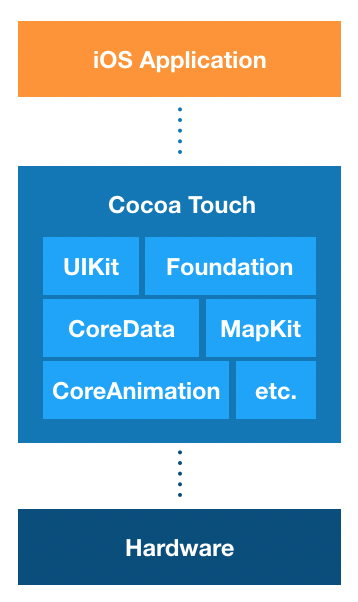
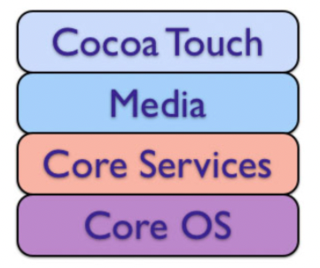

# Cocoa Touch 란?
코코아 터치 계층은 iOS 애플리케이션 개발에 주 축을 이루는 개발환경으로, 애플리케이션의 다양한 기능 구현에 필요한 여러 프레임워크를 포함하는 최상위 프레임워크 계층입니다. 참고로 코코아 계층은 macOS 애플리케이션 제작에 사용합니다.  

- '코코아'라는 단어는 Objective-C 런타임을 기반으로하고, NSObject를 상속받는 모든 클래스 또는 객체를 가리킬 때 사용합니다.
- '코코아 터치' 또는 '코코아'는 iOS 또는 macOS의 전반적인 기능을 활용해 애플리케이션을 제작할 때 사용하는 프레임워크 계층입니다.
- '코코아 터치'는 핵심 프레임워크인 UIKit과 Foundation을 포함합니다.

  

  

## Cocoa Framwork 계층 구조
기본적인 코코아 프레임워크는 아래와 같은 계층 구조를 갖습니다.   
   
하위 계층일수록 하드웨어에 가깝고, 상위 계층일수록 사용자에게 가깝습니다. 

 

### Cocoa Touch 계층

하위 계층의 프레임워크를 사용하여 애플리케이션을 직접 구현하는 프레임워크 

- UIKit, GameKit, MapKit

 

### Media 계층

상위 계층인 코코아 터치 계층에 그래픽 관련 서비스나 멀티미디어 관련 서비스를 제공    

- Core Graphics, Core Text, Core Audio, Core Animation, AVFoundation

 
 
### Core Services 계층

문자열 처리, 데이터 집합 관리, 네트워크, 주소록 관리, 환경 설정 등 핵심적인 서비스들을 제공

또한 GPS, 나침반, 가속도 센서나, 자이로스코프 센서와 같이 디바이스의 하드웨어 특성에 기반한 서비스도 제공

- Foundation, Core Foundation, Core Location, Core Motion, Core Animation, Core Data
 
 

### Core OS 계층

커널, 파일 시스템, 네트워크, 보안, 전원 관리, 디바이스 드라이버 등이 포함

iOS가 운영체제로서 기능을 하기 위한 핵심적인 영역

  

#### 참고 링크
1. [애플 공식 문서 - Cocoa (Touch)](https://developer.apple.com/library/archive/documentation/General/Conceptual/DevPedia-CocoaCore/Cocoa.html)