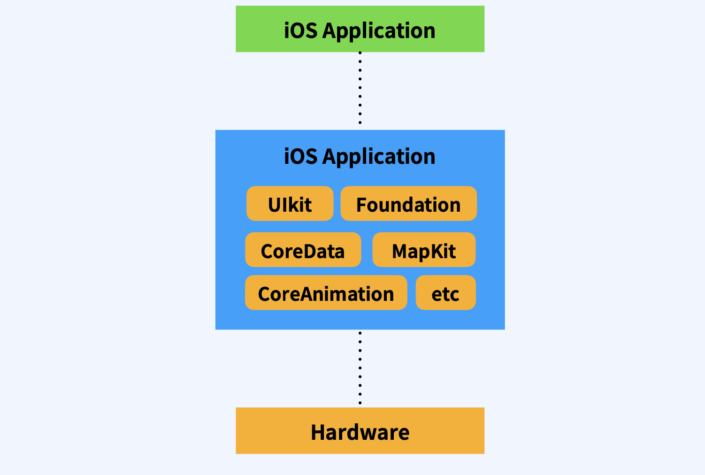
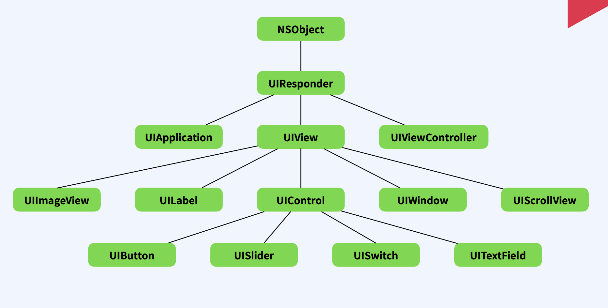
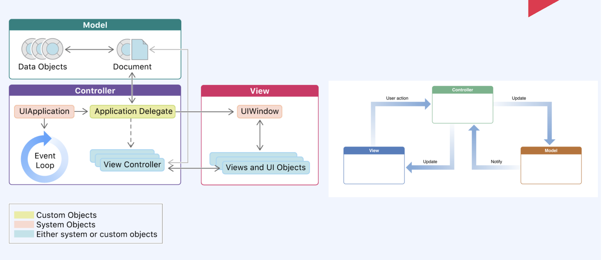

## 1. Cocoa touch Framework

- IOS 개발환경을 구축하기 위한 최상위 프레임워크, 일반적으로 Objc-c 혹은 Swift 에서 사용되는 UI킷 Foundation등 대부분의 클래스 객체들이 모두 포함된다고 생각하면 됩니다.

- 가장 많이 사용되는 것이 UIKit 과 Foundation인데요, Foundation Framework는 가장 기본적인 데이터 타입부터 자료구조, 각종 구조체, 타이머, 네트워크통신, 파일관리등 기본적인 프로그램의 중심을 담당합니다.

  

## 2. UIKit

- 사용자의 인터페이스를 관리하고 이벤트를 처리하는 것이 주 목적인 Framework
- 사용자 이벤트와 어플리케이션의 화면을 구성하는 요소를 포함하고 있습니다.
- UI가 붙는 클래스를 사용하기 위해서는 Import를 시켜야한다.

## 3. Code Structure of a UIKit App

- 기본적으로 MVC 패턴을 사용합니다
- `Model` : 앱의 데이터와 비즈니스로직을 가지고 있습니다
- `View` : 사용자에게 데이터를 보여주는 UI를 담당합니다
- `Controller` : Model과 View의 중간다리 역할로 View로 부터 사용자 액션을 전달받아 Model이 어떤작업을 해야하는지 알려주거나 Model의 데이터 변화를 View를 어떻게 업데이트 할지 알려줍니다

## 4. 현실 MVC

- 현실의 MVC 패턴은 View와 Controller가 강하게 연결되어있어 거의 모든일을 담당합니다.
- 프로젝트가 거대해 질수록 Controller가 비대해지고 내부구조는 복잡하게 되어 유지보수가 힘들어지는 상황이 됩니다.
- 이러한 문제를 해결하기 위해서 MVVM 이나 다른 디자인 패턴으로 이러한 문제를 해결할 수 있습니다.
