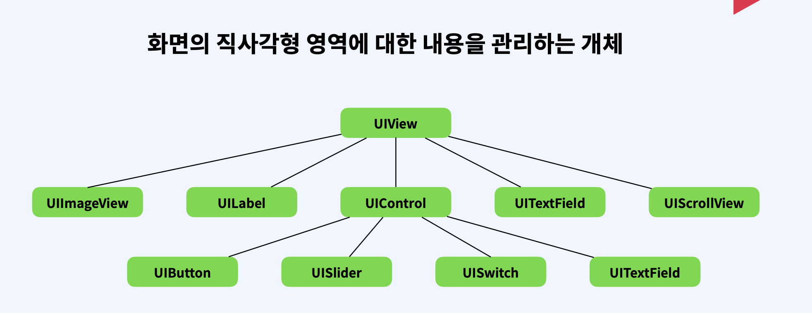
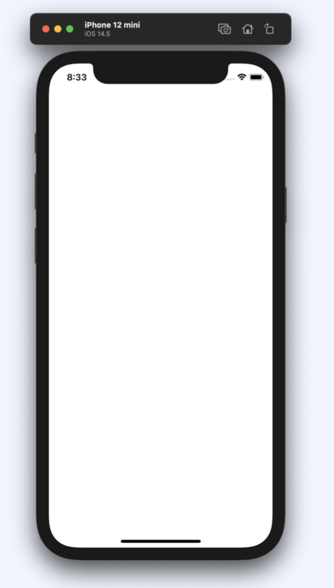

## 1. UIView

화면의 직사각형 영역에 대한 내용을 관리하는 개체입니다. 

화면을 구성하는 요소에 기본클래스라고 생각하시면 됩니다.

## 2. ViewController

앱의 근간을 이루는 객체로 모든 앱은 최소한 하나 이상의 뷰 컨트롤러를 가지고 있습니다.

{: width="100" height="200"}  

한마디로 사용자가 화면을 보는것에 대한 관리기능을 제공하는 것입니다. 그림과 같은 화면이 ViewController라고 생각하시면 됩니다

## 3. ViewController의 주요역할

- 데이터 변화에에 따라서 view 컨텐츠를 업데이트
- view들과 함께 사용자 상호작용에 응답
- view를 리사이징하고 전체적인 인터페이스의 레이아웃 관리
- 다른 뷰컨트롤러 들과 함께 앱을 구성한다.

우리가 앱을 사용할때 화면마다 다른 콘텐츠가 표시되고 화면을 터치해서 다른화면으로 이동할 수 있습니다. 이것이 바로 ViewController의 역할입니다. 화면하나를 관리하는 단위라고 이해하면 됩니다.

