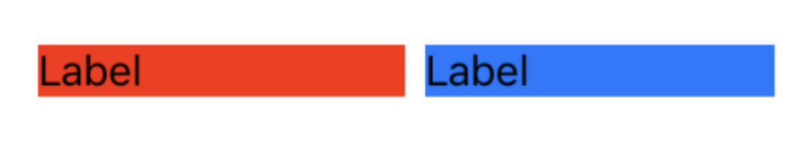
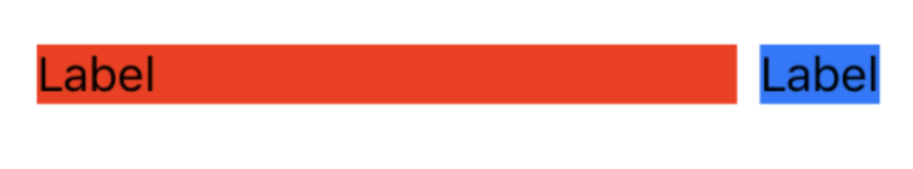
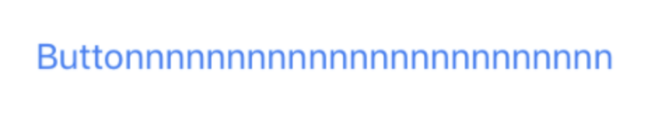

## 1. AutoLayout

제약 조건(Constraints) 을 이용해서 뷰의 위치를 지정하는 것

아이폰의 다양한 해상도 비율에 대응하기 위해 나온 개념입니다. 아이폰의 크기가 다양해지면서 해상도가 달라지기 때문에 다른 크기에서도 같게 보이게 하기 위해 AutoLayout을 사용합니다. 세로보기 화면 뿐만아니라 가로보기 화면까지 가능합니다.

## 2. Storyboard

IOS의 AutoLayout을 이용한 화면구성은 Storyboard에서 해주시면 됩니다. 아이폰같은 화면이 보이고 UI를 개발할 수 있는 도구처럼 생겼습니다. 아이폰 앱의 사용자인터페이스를 시각적으로 표현하여 화면간의 연결을 보여줍니다. 여러 화면들을 스토리보드를 이용해 만드시는 것이라고 생각하시면 됩니다.

오른쪽 하단에는 다양한 제약조건을 설정할 수 있습니다.

## 3. Add New Constraint

view의 너비와 높이등 다양한 제약조건을 설정할 수 있습니다.

## 4. Align

View간의 정렬을 설정할 수 있는 메뉴입니다. 정렬 제약조건을 추가할 수 있습니다.

## 5. Resolve Auto Layout Issues

AutoLayout 제약조건의 Issue를 해결할 수 있습니다. 

## 6. IBAction & IBOutlet

이 둘의 역할은 StoryBoard와의 연결고리를 담당합니다. 변수나 함수를 정의할 때 앞에 @IBAction 또는 @IBOutlet 키워드를 통해 StoryBoard에서 버튼이나 레이블같은 컴포넌트와 연결이 가능합니다.

IBAction은 Event가 일어난 경우 호출되는 Action을 정의해둔 것이고, IBOutlet은 값에 접근하기위한 변수라고 보면 됩니다.

## 7. Content hugging

- `intrinsicContentSize` : view 자체의 본질의 크기입니다. 이 크기가 존재함으로써 UILabel, UIButton, UISwitch 등등 **기본적으로 제공되는 view 들이 width와 height**를 가질 수 있습니다.
- `Content hugging`: **최대 크기**에 대한 제한 / 주어진 크기보다 **작아질 수 있다**
- `Compression resistance`:**최소 크기**에 대한 제한 / 주어진 크기보다 **커질 수 있다**

### 1) Content Hugging

 각 Label의 content hugging이 251일 때는 서로 priorty 가 같아, 같은 width를 유지합니다. 하지만 여기서 **빨간색 Label의 content hugging을 250**으로 바꾸면 아래와 같이 변합니다.

**우선순위가 높으면 내 크기 유지, 우선순위 낮으면 크기 늘어남 (늘어난다 = 당겨진다 = 커진다)**

Content hugging은 **작아질 수 있다**로 해석 할 수 있습니다. 그래서 파란색 Label의 content hugging priority가 높으므로 작아질 수 있어서 파란색 Label의 width가 줄어들었습니다.

Content hugging은 숫자가 클수록 작아질 수 있습니다.

### 2) Compression Resistance

먼저 버튼의 width의 Constraint와 Compression resistance가 둘 다 1000일 때입니다. 둘 다 Priority가 같지만 둘의 width 제약이 44(UIButton의 기본 width)를 가리키므로 버튼 타이틀이 다 보이지 않습니다.

여기서 **width의 Constraint만 999**로 바꿔보겠습니다.

Compression resistance는 **커질 수 있다**로 해석 할 수 있습니다. 그래서 주어진 width보다 크기가 커져 버튼의 타이틀이 전부 보이게 됩니다.

**우선순위가 높으면 내 크기 유지, 우선순위가 낮으면 크기 작아짐 (밀린다 = 찌그러진다 = 작아진다)**

- 두 오브젝트 중 하나가 커져야 하는 상황 -> Hugging priority 
- 두 오브젝트 중 하나가 작아져야하는 상황 -> Resistance priority

