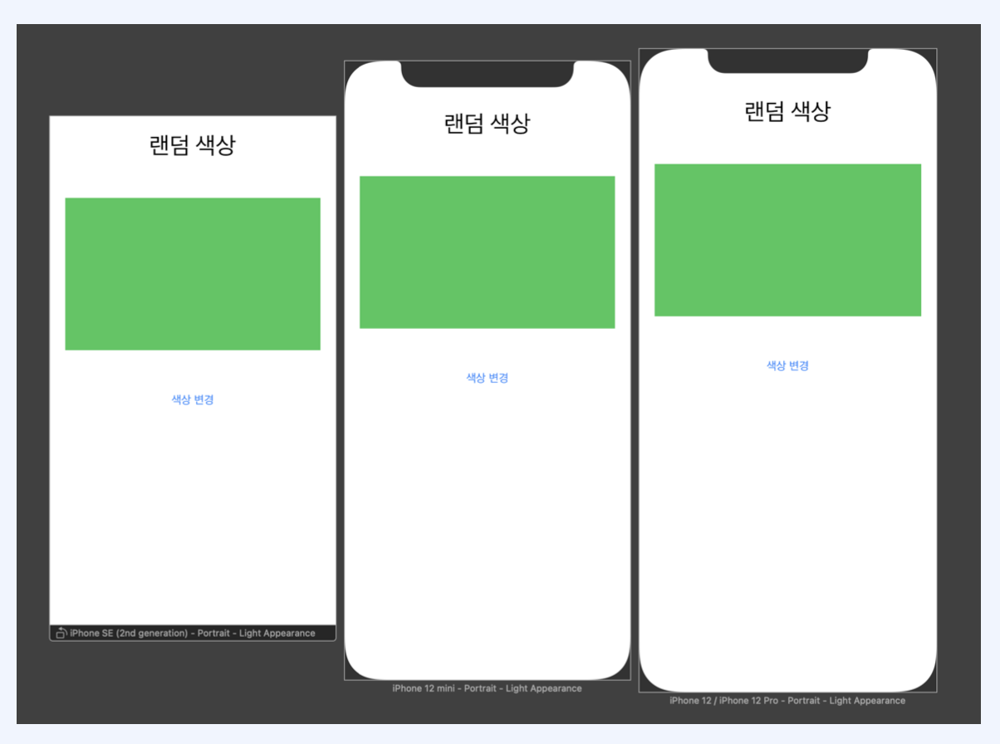
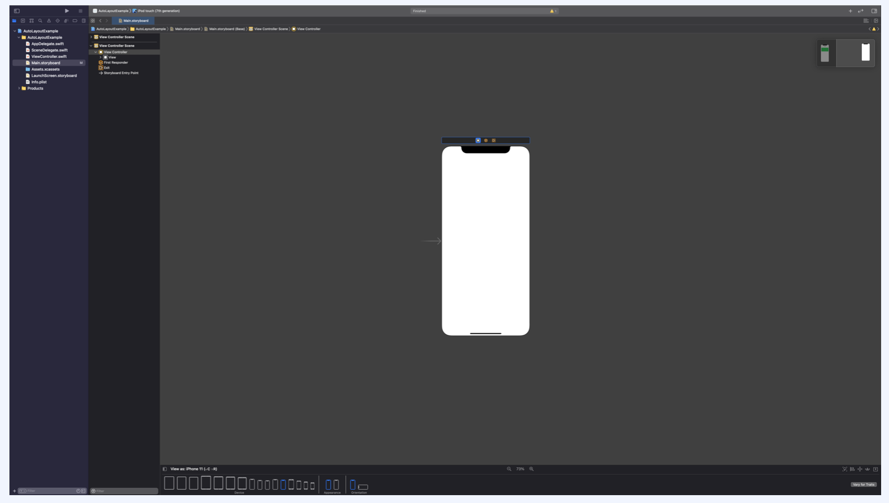
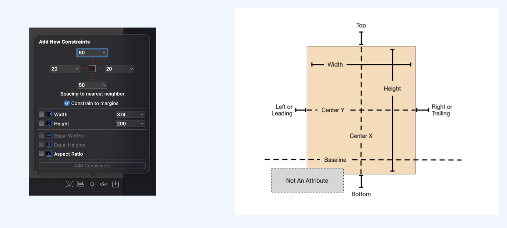
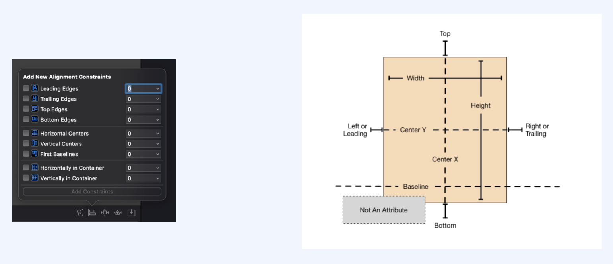
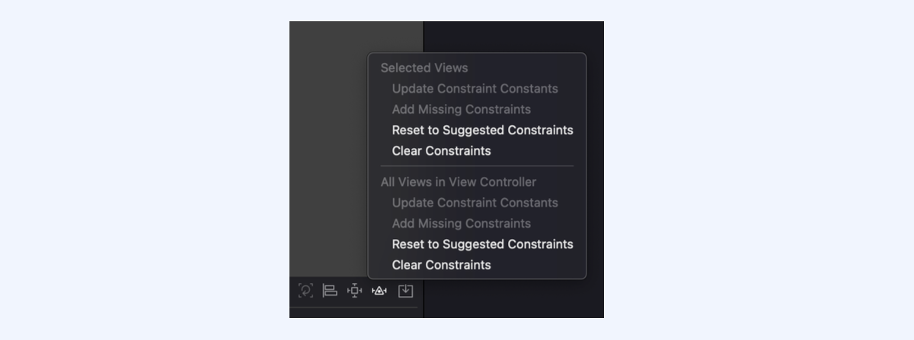

## 1. AutoLayout

제약 조건(Constraints) 을 이용해서 뷰의 위치를 지정하는 것

아이폰의 다양한 해상도 비율에 대응하기 위해 나온 개념입니다. 아이폰의 크기가 다양해지면서 해상도가 달라지기 때문에 다른 크기에서도 같게 보이게 하기 위해 AutoLayout을 사용합니다. 세로보기 화면 뿐만아니라 가로보기 화면까지 가능합니다.

## 2. Storyboard

IOS의 AutoLayout을 이용한 화면구성은 Storyboard에서 해주시면 됩니다. 아이폰같은 화면이 보이고 UI를 개발할 수 있는 도구처럼 생겼습니다. 아이폰 앱의 사용자인터페이스를 시각적으로 표현하여 화면간의 연결을 보여줍니다. 여러 화면들을 스토리보드를 이용해 만드시는 것이라고 생각하시면 됩니다.

오른쪽 하단에는 다양한 제약조건을 설정할 수 있습니다.

## 3. Add New Constraint

view의 너비와 높이등 다양한 제약조건을 설정할 수 있습니다.

## 4. Align

View간의 정렬을 설정할 수 있는 메뉴입니다. 정렬 제약조건을 추가할 수 있습니다.

## 5. Resolve Auto Layout Issues

AutoLayout 제약조건의 Issue를 해결할 수 있습니다. 

## 6. IBAction & IBOutlet

이 둘의 역할은 StoryBoard와의 연결고리를 담당합니다. 변수나 함수를 정의할 때 앞에 @IBAction 또는 @IBOutlet 키워드를 통해 StoryBoard에서 버튼이나 레이블같은 컴포넌트와 연결이 가능합니다.

IBAction은 Event가 일어난 경우 호출되는 Action을 정의해둔 것이고, IBOutlet은 값에 접근하기위한 변수라고 보면 됩니다.
