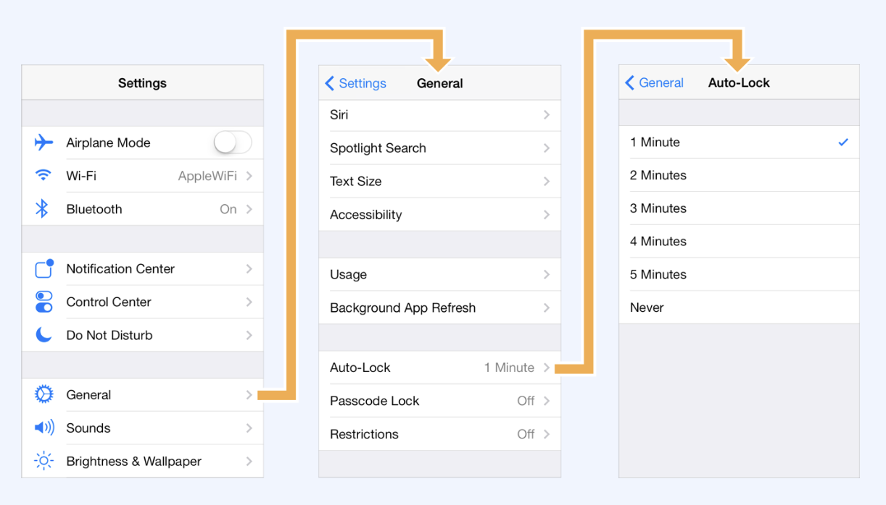
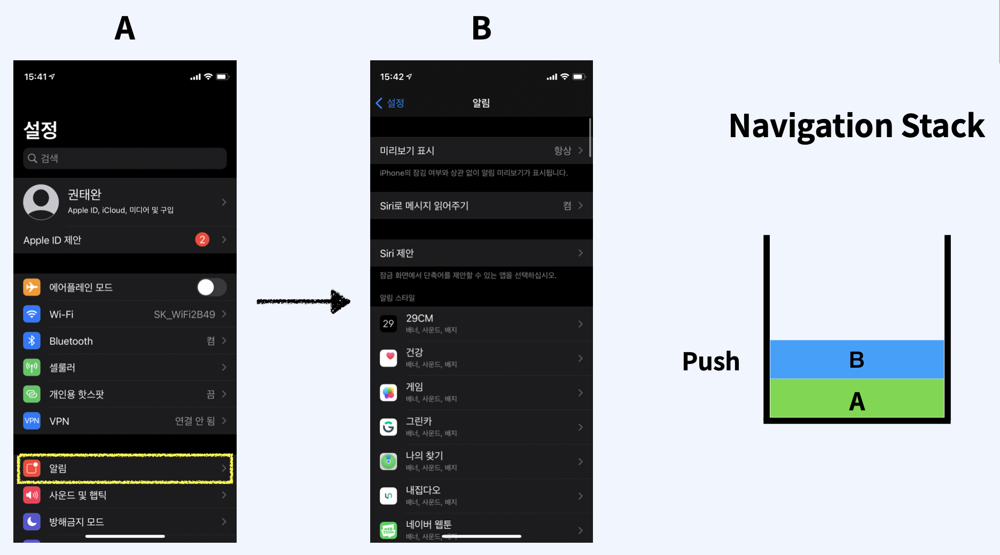
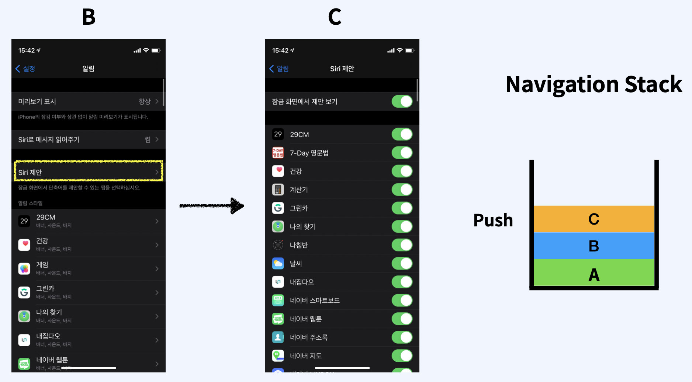
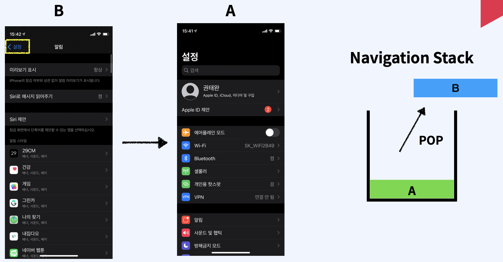
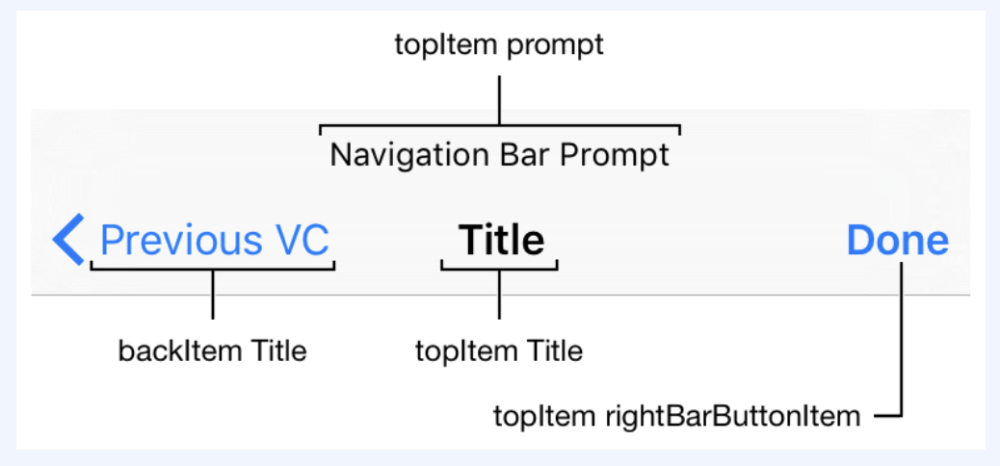

## 1. Content View Controller, Container View Controller

- `Content View Controller`: 화면을 구성하는 뷰를 직접 구현하고 관련된 이벤트를 처리하는 뷰 컨트롤러
- `Container View Controller`
  - 하나 이상의 Child View Controller 를 가지고있습니다.
  - 하나 이상의 Child View Controller 를 관리하고 레이아웃과 화면 전환을 담당합니다.
  - 화면 구성과 이벤트 관리는 Child View Controller 에서 한다
  - Container View Controller 는 대표적으로 Navigation Controller 와 TabBar Controller 가 있습니다.

​    

   

## 2. UINavigationController

계층구조로 구성된 content 를 순차적으로 보여주는 container view controller

​    

​    

## 3. Navigation Stack

​    

​    

## 4. Navigation Bar

