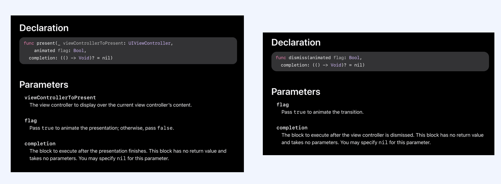
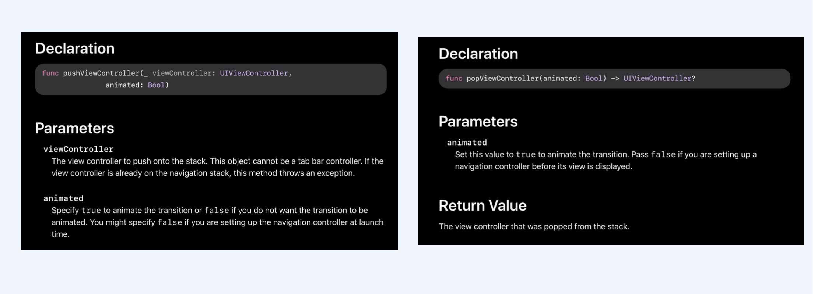
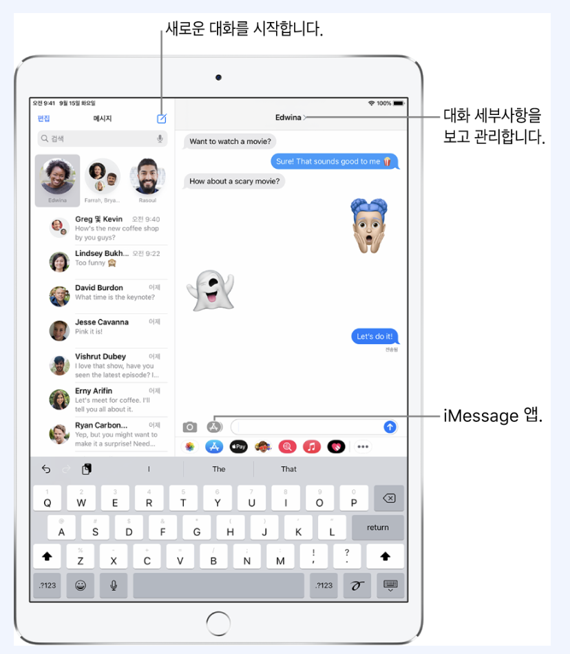

## 1. 화면 전환 방법

- 소스코드를 통해 전환하는 방식
- Storyboard를 통해 전환하는 방식

​     

​    

​    

- View Controller의 View 위에 다른 View를 가져와 바꿔치기

- View Controller에서 다른 View Controller 를 호출하여 전환하기

  

- Navigation Controller 를 사용하여 화면 전환하기

  

- 화면 전환용 객체 세그웨이(Sequeway)를 사용하여 화면 전환하기

  - Action Segueway
  - Manual Segueway

  

​     

​     

​     

​     

## 2. Action Segueway 종류

- Show
- Show Detail
- Present Modally
- Present As Popover
- Custom

