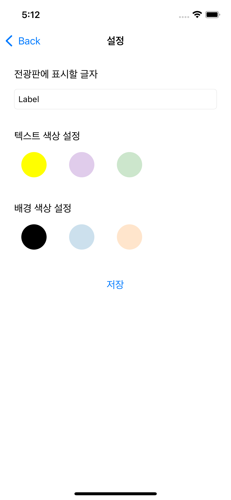

## LEDboard

### 1. 기능 상세

- LED 전광판 화면을 표시합니다
- LED 전광판에 표시할 텍스트, 텍스트 컬러, 배경 색상을 설정 화면에서 설정 할 수 있습니다.

​    

### 2. 활용 기술

- UINavigationController
- 화면 전환 개념
- ViewController Life Cycle
- 화면간 데이터 전달 하는 방법
- 에셋 카탈로그

### 3. 구현 화면

|                  메인화면                   |                  설정화면                   |
| :-----------------------------------------: | :-----------------------------------------: |
|  |  |

