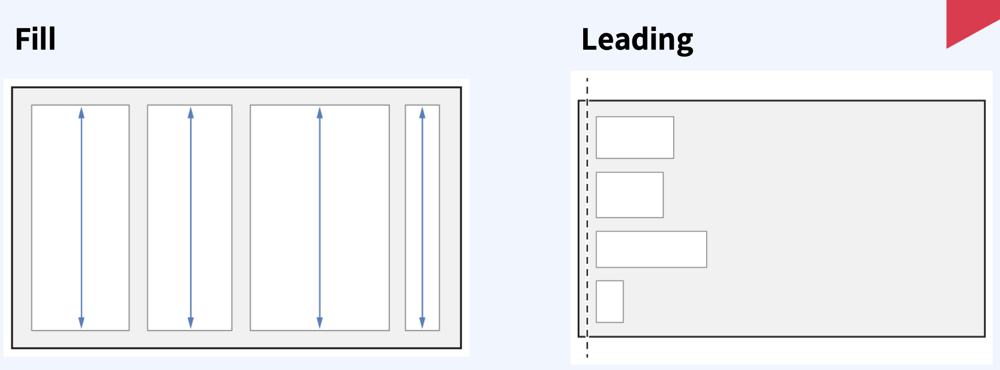

## 1. UIStackView?

열 또는 행에 View 들의 묶음을 배치할 수 있는 간소화된 인터페이스.   

​    

### UIStackView를 사용 안 하면

​    

​    

### UIStackView를 사용하면

​    

### UIStackVIew Attribute

​     

​      

### UIStackViewAxis

StackView 의 방향을 결정 ( 가로 또는 세로 )

​     

​     

### UIStackView Distribution

Stack View 안에 들어가는 뷰들의 사이즈를 어떻게 분배할지 설정하는 속성

​    

​    

### UIStackView Alignment

StackView 의 subView 들을 어떤식으로 정렬할지 결정하는 속성

​     

​     

### UIStackView Spacing

Stack View 안에 들어가는 뷰들의 간격을 조정하는 속성

