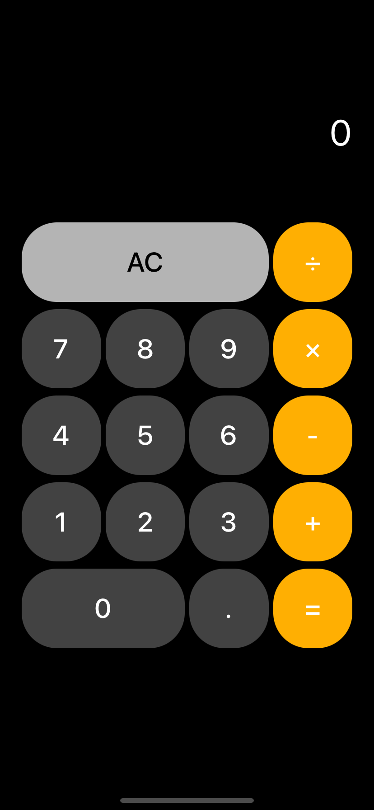

## Calculator

### 1. 기능 상세

- 계산기 키패드 UI를 구성합니다.
- 계산기를 통해 나누기 곱하기, 빼기, 더하기 연산이 가능합니다.
- 누적 연산이 가능합니다
- AC 버튼을 누르면 계산이 초기화됩니다.

​    

### 2. 활용 기술

- UIStackView
- IBDesignables
- IBInspectable

​       

​       

### 3. 구현 화면

