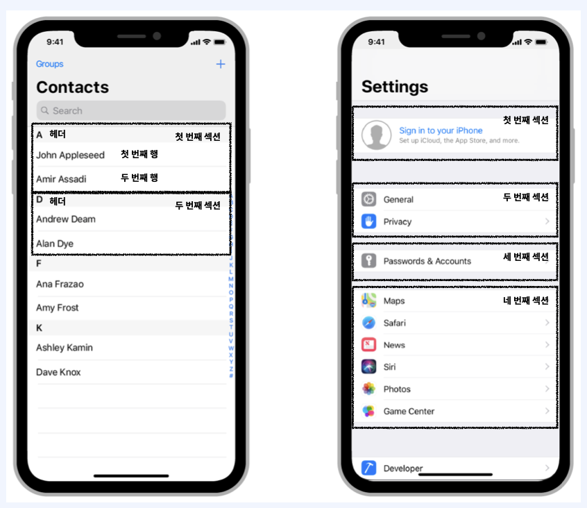

## 1. UITableView?

데이터들 목록 형태로 보여 줄 수 있는 가장 기본적인 UI 컴포넌트.   

​    

​    

- 여러 개의 Cell을 가지고 있고 하나의 열과 여러 줄의 행을 지니고 있으며, 수직으로만 스크롤 가능합니다.
- 섹션을 이용해 행을 그룹화하여 콘텐츠를 좀 더 쉽게 탐색할 수 있습니다.
- 섹션의 헤더와 푸터에 View 를 구성하여 추가적인 정보를 표시할 수 있습니다.

​    

​     

​    

## 2. UITableViewDataSource

UITableViewDataSource는 테이블 뷰를 생성하고 수정하는데 필요한 정보를 테이블 뷰 객체에 제공

​    

   

​    

   

## 3. UITableViewDelegate

UITableViewDelegate 는 테이블 뷰의 시각적인 부분을 설정하고, 행의 액션 관리, 엑세서리 뷰 지원 그리고 테이블 뷰의 개별 행 편집을 도와 줌

