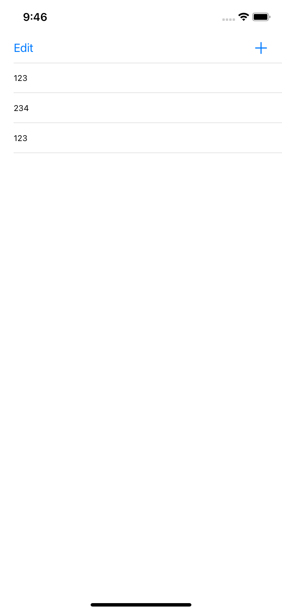
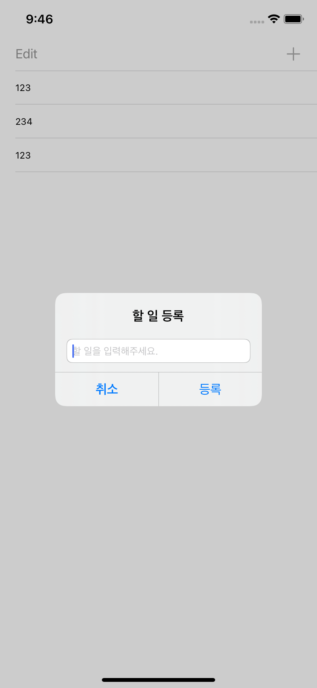
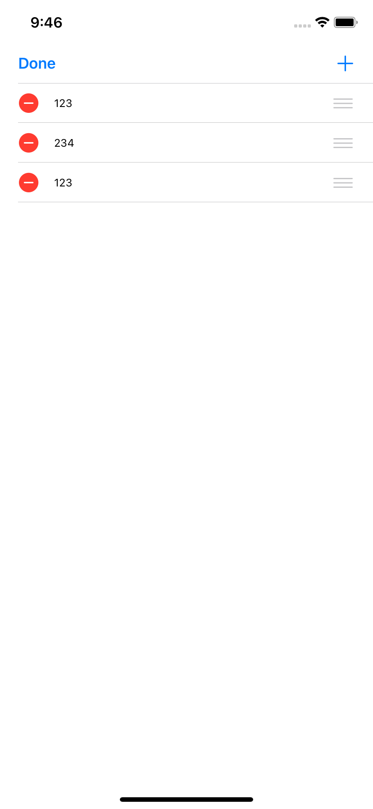

## ToDoList

### 1. 기능 상세

- TableView 에 할 일을 추가할 수 있습니다.
- TableView 에서 할 일을 삭제할 수 있습니다.
- TableView 에서 할 일을 재정렬할 수 있습니다.
- 할 일들을 데이터 저장소에 저장을 하여 앱을 재실행하여도 데이터가 유지되게 합니다.

​    

### 2. 활용 기술

- UITableView
- UIAlertController
- UserDefaults

​     

​    

### 3. 구현 화면

|                   목록화면                   |                    등록화면                    |
| :------------------------------------------: | :--------------------------------------------: |
|  |    |
|                 **편집화면**                 |                  **선택화면**                  |
|  |  |

