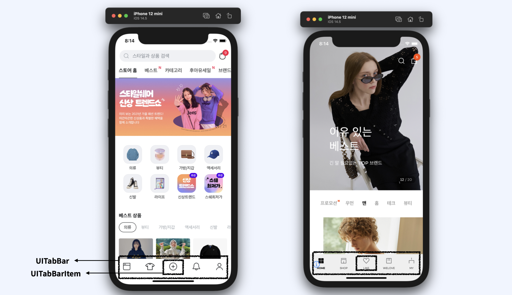
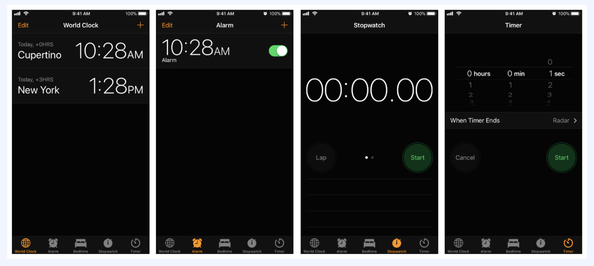
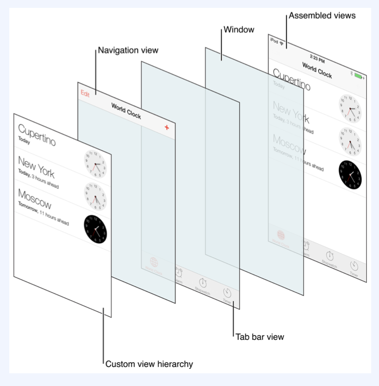
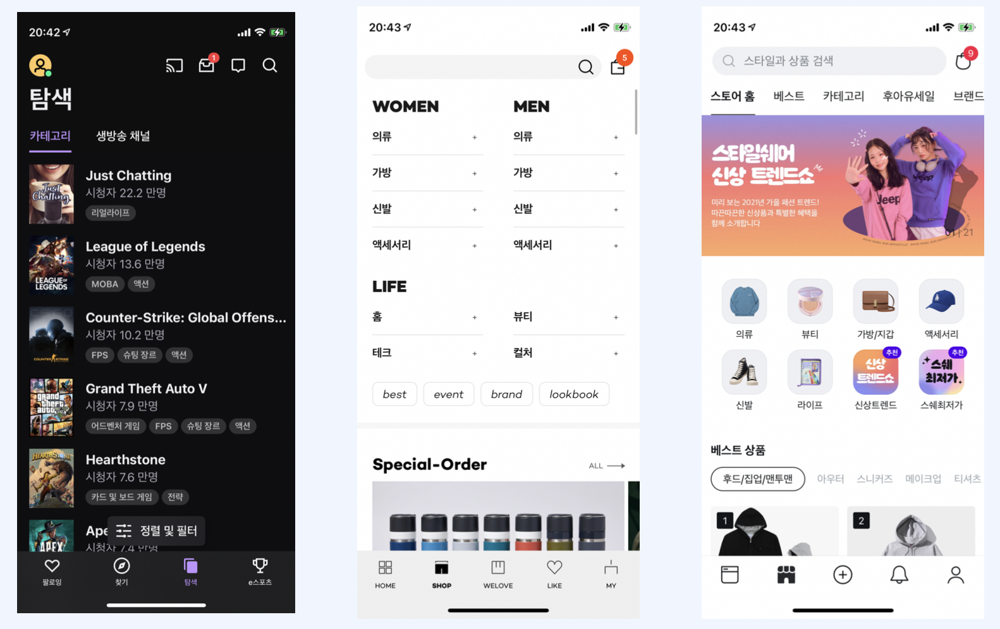

## 1. UITabBar

앱에서 서로 다른 하위작업, 뷰, 모드 사이의 선택을 할 수 있도록, 탭바에 하나 혹은 하나 이상의 버튼을 보여주는 컨트롤입니다.

- 앱에서 독립적인 컨트롤로도 사용할 수 있습니다.
- 하나 혹은 하나 이상의 TabBar 아이템을 표현할 수 있습니다.

- 스크린 하단의 버튼들을 TabBar라고 하며 안의 아이콘을 UITabBarIcon이라고 합니다. Icon은 원하는 이미지로 변경할 수 있으며, Tab하게 되면 아이템이 선택되고 강조되게 표시됩니다. Icon의 선택에 따라 다른 기능을 부여할 수 있습니다.

  

## 2. UITabBarController

다중 선택 인터페이스를 관리하는 컨테이너 뷰 컨트롤러로, 선택에 따라 어떤 자식 뷰 컨트롤러를 보여줄 것인지가 결정됩니다.

- 하단의 버튼을 선택했을때 상응하는 컨텐츠를 보여줍니다. `TabBarController`로 구현되어 있고 각 Tab은 `CustomViewController`에 연관되어 있습니다.

- 유저가 선택할 수 있는 TabBar를 제공하여 유저가 선택한 컨텐츠가 보여지게 됩니다. TabBar마다 다른화면을 보여주는 경우에 아주 유용하게 다룰 수 있습니다.

많은 어플리케이션에서 TabBar가 사용되고 있습니다.

