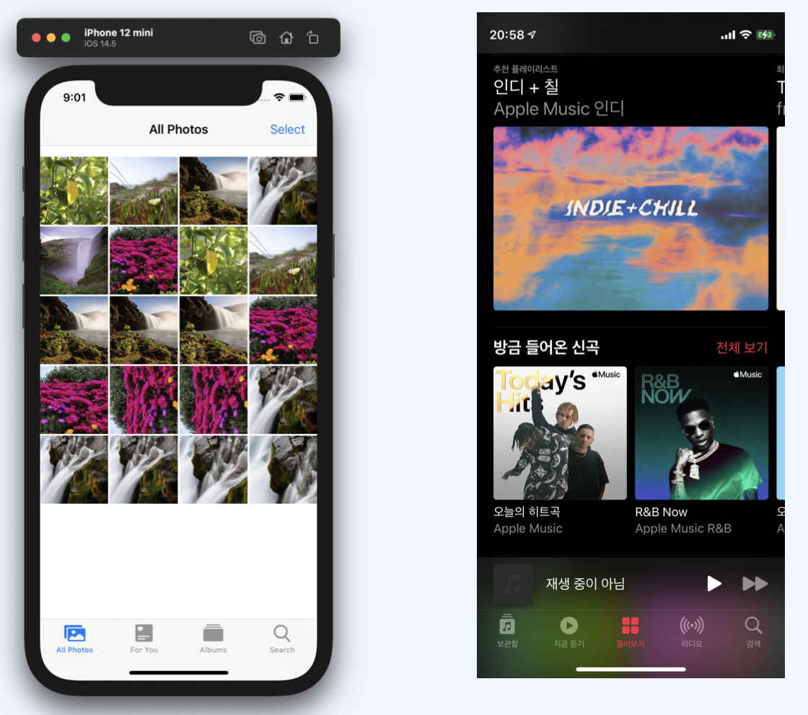
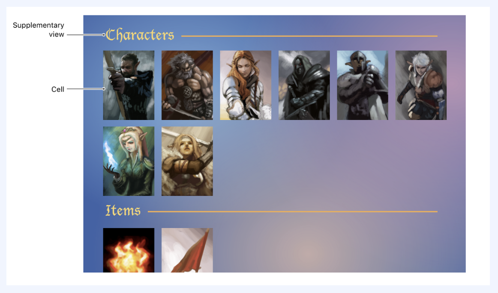
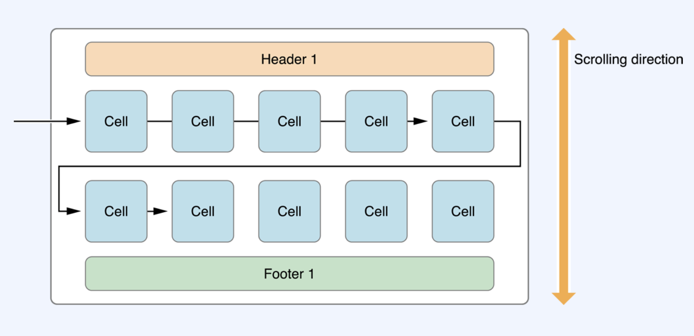
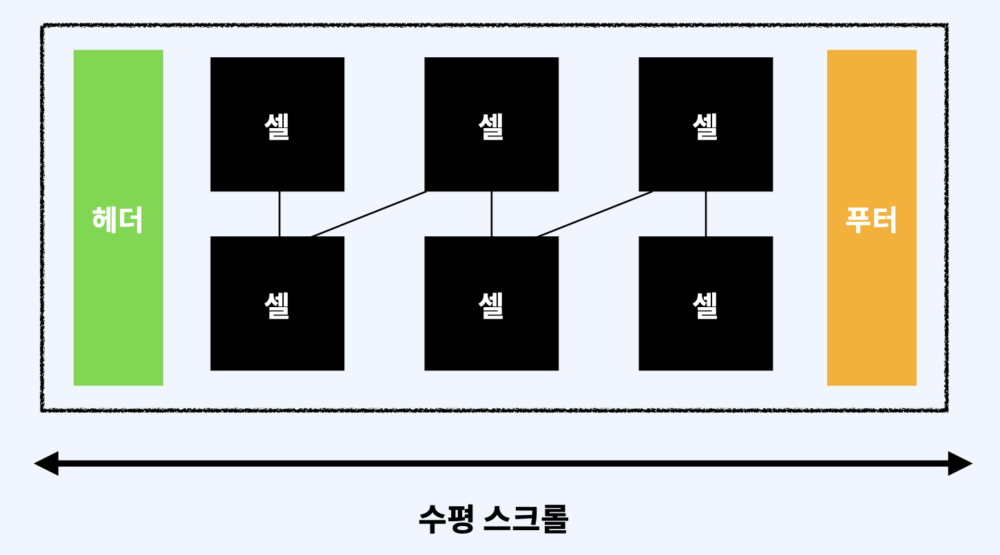
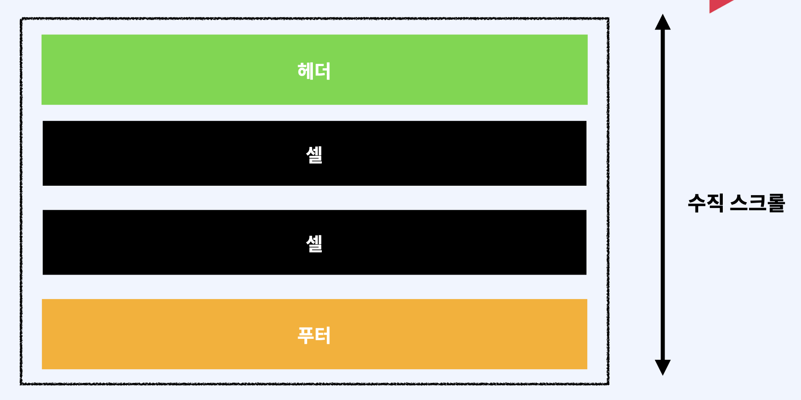
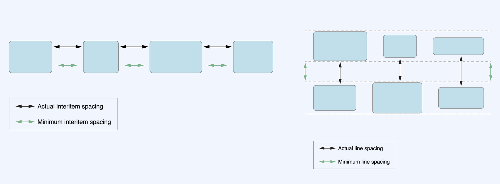
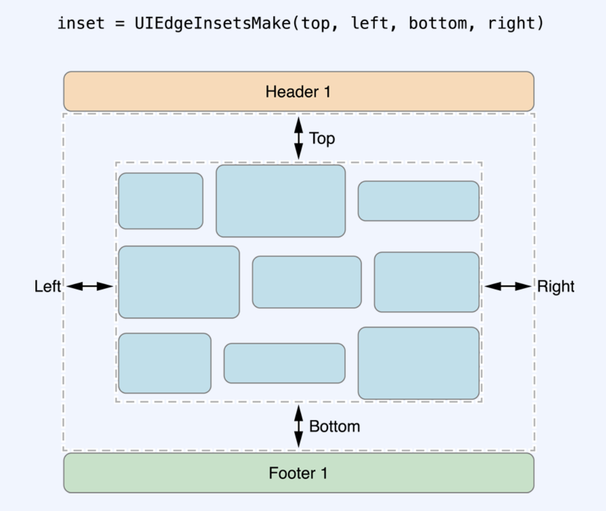
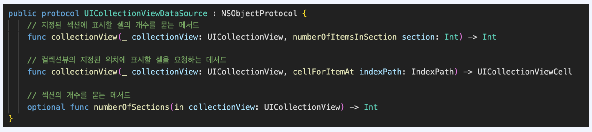
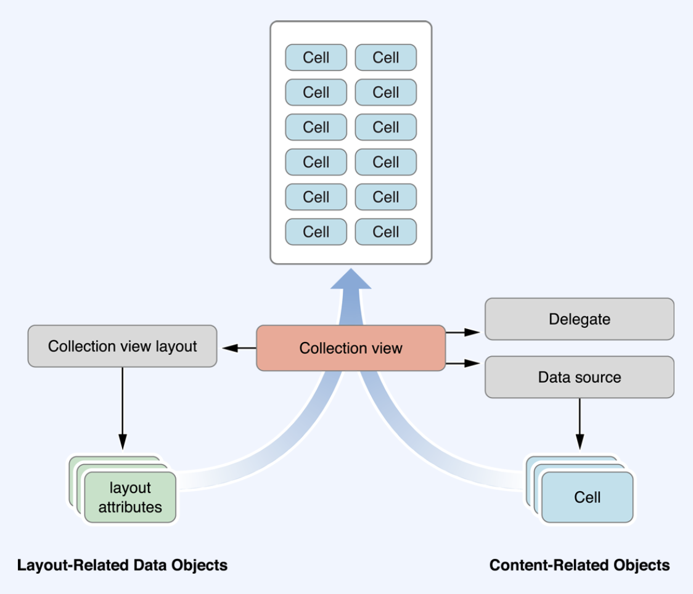

## 1. UICollectionView

데이터 항목의 정렬된 컬렉션을 관리하고 커스텀한 레이아웃을 사용해 표시하는 객체입니다.

`tableView`처럼 `scrollView`를 상속받고 있고 다양한 레이아웃을 구현하기 위해 사용됩니다.



`tableView`는 리스트 형태로만 사용이 가능하지만 `collectionView`는 리스트 형태뿐만 아니라 슬라이드와 같이 다양한 형태로도 사용이 가능합니다.  

​    


## 2. UICollectionView의 구성요소



- `Cell`:  layout에 의해 위치되는 주요 요소이다. 각 cell은 collection에 하나의 데이터를 표시합니다. Collection view는 하나의 cell 그룹을 가지거나 cell을 여러개의 섹션으로 나눌 수 있습니다. layout 객체의 주업무는 cell을 collection view의 정보 영역(content area)에 배열하는 것입니다.
- `Supplementary View`: 데이터를 의미하지만 cell과는 다르다. Supplementary view는 사용자에 의해 선택될 수 없습니다. 대신 supplementary view를 특정 섹션 또는 전체 collection view의 header와 footer 구현하기 위해 사용할 수 있습니다. Supplementary view는 선택적이며 사용하고 배치하는 일은 layout 객체가 처리합니다.
- `Decoration View`: 선택될 수 없는 장식품이며 본질적으로 collection view의 데이터와 연관이 없습니다. Decoration view는 supplementary view의 다른 타입입니다. supplementary view처럼, 선택적이며 사용하고 배치하는 일은 layout 객체가 처리합니다.


   

## 3. CollectionView Latouts

CollectionView는 레이아웃 객체를 통해 컬렉션 뷰 내의 아이템 배치 및 시각적 스타일을 결정합니다.  

​    

### 1) UICollectionViewLayout

CollectionView의 layout 정보를 생성하는 추상적인 **'기반클리스' (base class)**

`UICollectionViewLayout`는 추상적이기 때문에 직접 사용할 수 없습니다. 처음에 `UICollectionViewController` 인스턴스를 생성할 때 `UICollectionViewLayout` 인스턴스를 생성해서 인자로 넣었지만 계속해서 에러가 발생하는데, `UICollectionViewLayout`는 비어있는 추상적인 클래스이기 때문입니다.

```swift
class UICollectionViewLayout : NSObject
```

layout 객체가 하는 일은 cell, supplementary view, 그리고 collection view의 바운드 내부에 있는 데코레이션 뷰(decoration view)의 위치를 결정하는 것이며 요청을 하면 위 정보들을 **collection view**에게 전달한다.

**사용하기 위해서는 `UICollectionViewLayout`을 서브클래싱 해야한다.** 그러나 서브클래싱을 하기 전, `UIColelctionViewFlowLayout` 클래스를 보고 레이아웃 요구에 맞게 조정할 수 있는지 확인해야한다.   

   

### 2) UICollectionViewFlowLayout

각 섹션에 대해 선택적인 header와 footer view와 함께 그리드의 아이템을 정리하는 **구체적인(concrete) layout** 객체이다.

```swift
class UICollectionViewFlowLayout : UICollectionViewLayout
```

collection view의 아이템들은 하나의 행 또는 열(스크롤 방향에 따라)에서 다음 아이템으로 흐르는데, 각 행(또는 열)에는 가능한 많은 cell이 들어간다. Cell들은 사이즈가 서로 같거나 다를 수도 있다.

**Flow layout**은 collection view의 **delegate 객체**를 통해 각 섹션과 그리드의 아이템, header 그리고 footer의 사이즈를 결정합니다. 이 delegate 객체는 반드시 `UICollectionViewDelegateFlowLayout` 프로토콜을 채택해야합니다. delegate의 사용은 layout 정보를 다이나믹하게 조절할 수 있게 해줍니다. 예를 들면, 그리드에 있는 아이템의 사이즈를 다르게 하고싶다면 delegate 객체를 사용해야합니다. Delegate를 제공하지 않으면, flow layout은 이 클래스의 프로퍼티를 사용해 우리가 세팅해놓은 default 값을 사용합니다.



Flow layout은 내용을 보여주기 위해 수직과 수평 중 하나는 **고정된 거리(fixed distance)** 를 사용하고, 다른 곳에서는 **스크롤 가능한 거리(scrollable distance)** 를 사용합니다. 예를 들어, 수직으로 스크롤하는 그리드에서는 그리드 컨텐츠의 가로길이가 collection view의 가로길이 의해서 제한되는데 반면에 컨텐츠의 높이는 그리드의 섹션과 아이템에 맞게 다이나믹하게 조절된다. Layout은 기본적으로 수직으로 스크롤되게 설정되지만 `scrollDirection` 프로퍼티를 사용하여 스크롤 방향을 설정할 수 있다.



Flow layout의 각 섹션은 자신의 커스텀 header와 footer를 가질 수 있다. View에 header와 footer를 설정하기 위해서는 header와 footer 사이즈가 0이 되지 않도록 설정해줘야한다. 적절한 **delegate 메소드** 를 사용하거나 적당한 값을 [`headerReferenceSize`](https://developer.apple.com/documentation/uikit/uicollectionviewflowlayout/1617710-headerreferencesize)와 [`footerReferenceSize`](https://developer.apple.com/documentation/uikit/uicollectionviewflowlayout/1617703-footerreferencesize) 프로퍼티에 할당함으로써 사이즈를 설정해줄 수 있다. 만약 header와 footer의 사이즈가 0이라면, collection view에 추가되지 않을 것이다.



리스트 형태의 구현도 가능합니다.

1. Flow 레이아웃 객체를 작성하고 컬렉션 뷰에 이를 할당합니다.

2. 셀의 width, height 를 정합니다 (반드시 진행)

3. 필요한 경우 셀들 간의 좌우 최소 간격, 위아래 최소 간갹을 설정합니다

4. 섹션에 header와 footer가 있다면 이것들의 크기를 지정합니다

5. 레이아웃의 스크롤 방향을 설정합니다.  

      



셀의 행과 열사이의 간격을 설정할 수 있습니다. 셀들의 크기가 같으면 최소로 설정한 간격을 지킬수 있지만 셀들의 크기가 다르면 실제간격이 다를 수 있습니다.   

   



셀과 행간의 간격이외에도 섹션자체의 공간을 줄 수 있습니다 `UIEdgeInsetsMake` 메서드를 사용하여 top, left, bottom. right의 공간을 줄 수 있습니다.  

   


## 4. UICollectionViewDataSource

컬렉션 뷰로 보여지는 콘텐츠들을 관리하는 객체입니다.

데이터 소스를 정의하기 위해서는 `UICollectionViewDataSource` 프로토콜을 준수해야 합니다. 



- `numberOfItemsInSection`: 지정된 섹션에 표시할 셀의 개수를 묻는 메서드
- cellForItemAt : 컬렉션뷰의 지정된 위치에 표시할 셀을 요청하는 메서드
- numberOfSections : 섹션의 개수를 묻는 메서드

옵셔널이 아닌 메서드는 필수로 구현해야 합니다.  

   


## 5. UICollectionViewDelegate

콘텐츠의 표현, 사용자와의 상호작용과 관련된 것들을 관리하는 객체입니다.

데이터 소스와 다르게 필수로 구현하지 않아도 됩니다.  

 

`Collection view`는 `Data source`에서 보여줄 `Cell`에대한 정보를 가져오고 `layout`객체에서 해당셀이속하는 위치를 결정하고 하나이상의 `layout attribute`객체로 `Collection view`에 전송을합니다.  

그런다음 `Collection view`는 레이아웃정보를 실제 셀이나 다른뷰들과 결합하여 최종적으로 사용자에게 보여주게 됩니다.