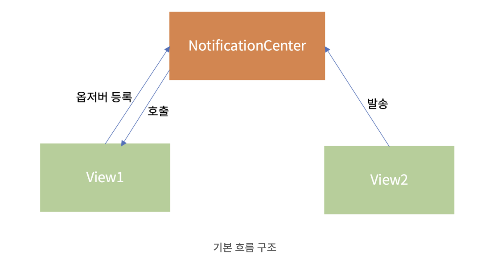

## NotificationCenter

NotificationCenter 에 등록된 event 가 발생하면 해당 event에 대한 행동을 취합니다.

앱 내에서 메세지를 던지면 아무데서나 이 메세지를 받을 수 있게 하는 역할을 합니다. 

보통 백그라운드 작업의 결과, 비동기 작업의 결과 등 현재 작업의 흐름과 다른 흐름의 작업으로부터 이벤트를 받을 때 사용합니다.



​    

​    

## 1. Notification

NotificationCenter 를 통해 정보를 저장하기 위한 구조체입니다.

```swift
var name: Notification.Name // 알림을 식별하는 태그
var object: Any? // 발송자가 옵저버에게 보내려고 하는 객체. 주로 발송자 객체를 전달하는 데 쓰임
var userInfo: [AnyHashable : Any]? // Notification과 관련된 값 또는 객체의 저장소
```

   

   

## 2. NotificationCenter

등록된 observer 에게 동시에 notification 을 전달하는 클래스입니다.

NotificationCenter 는 notification 을 발송하면 NotificationCenter에서 메세지를 전달한 observer를 처리할 때까지 대기합니다.

즉, 흐름이 동기적으로 흘러갑니다.

​       

```swift
// 노티피케이션 발송
 NotificationCenter.default.post(name: NSNotification.Name("TestNotification"), object: nil, userInfo: nil)
```

.post 가 핵심입니다. Name의 해당자들에게(옵저버) 일을 수행하라고 시킵니다.

​     

​     

```swift
// 옵저버 등록
NotificationCenter.default.addObserver(self, selector: #selector(didRecieveTestNotification(_:)), name: NSNotification.Name("TestNotification"), object: nil)

@objc func didRecieveTestNotification(_ notification: Notification) {
         print("Test Notification")
 }
 
```

`addObserver` : 관찰자를 대기시킵니다.

`selector` : 관찰자가 수행해야 할 업무를 의미합니다.

​    

​    

## Name 등록 방식

### 1) addObserver 할 때 한 번에 하기

```
// Post
NotificationCenter.default.post(name: Notification.Name("doItSomeThing"), object: nil)
// Add Observer
NotificationCenter.default.addObserver(self, selector: #selector(printSomeThing(_:)), name: Notification.Name("doItSomeThing"), object: nil)
```

​      

​     

### 2) Extension 으로 property 추가

```
extension Notification.Name {
    static let doItSomeThing = Notification.Name("doItSomeThing")
}
```

이 방법이 더 깔끔하고 쉬운 것 같네용

​    

   

## Post 값 전달하기

Post메소드 파라미터에 object가 있습니다. 위 예시에서는 nil을 넣었지만, 이 부분을 통해 값을 보낼 수도 있습니다.

```swift
NotificationCenter.default.post(name: .testnoti, object: "testobject")
```

object 부분에 "testobject" 라는 string 값을 넣어 post 해줍니다.

​    

```swift
@objc func getValue(_ notification: Notification){
	let getValue = notification.object as! String
	print(getValue)
}
```

notification.object 로 값을 받아옵니다.


​      

 출처: https://silver-g-0114.tistory.com/106?category=1094592
