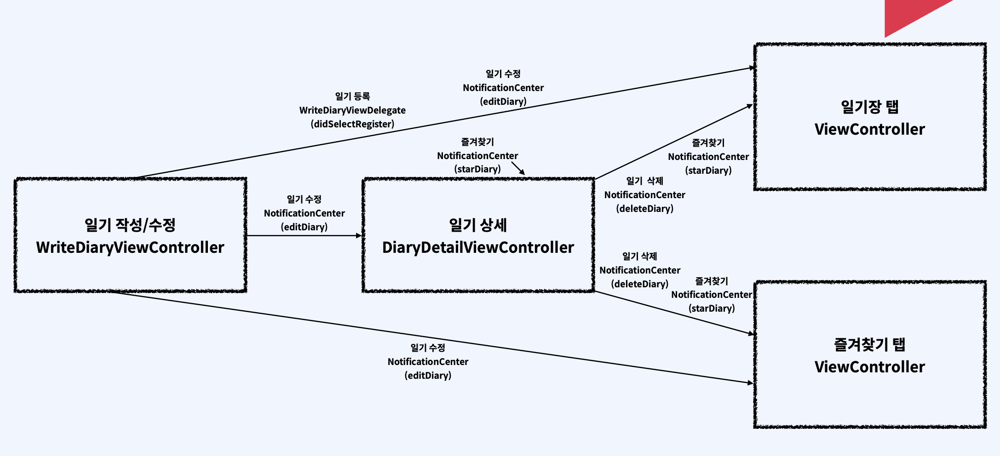
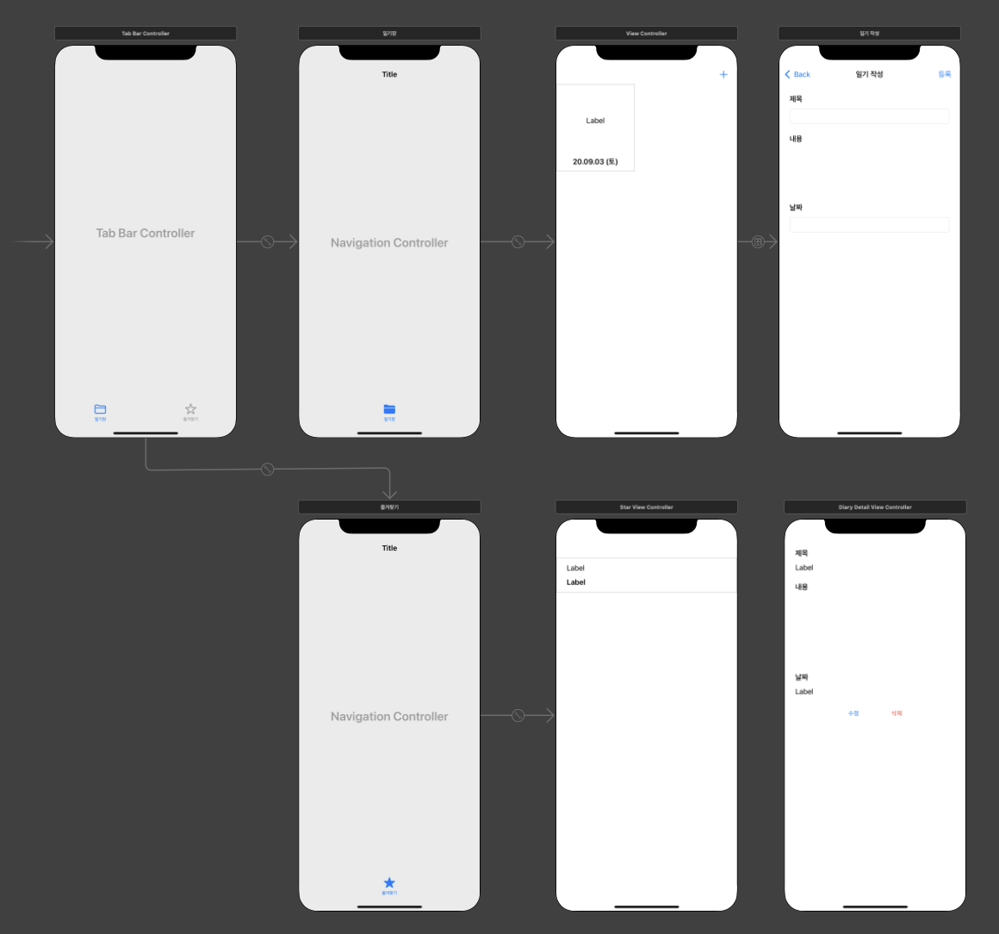
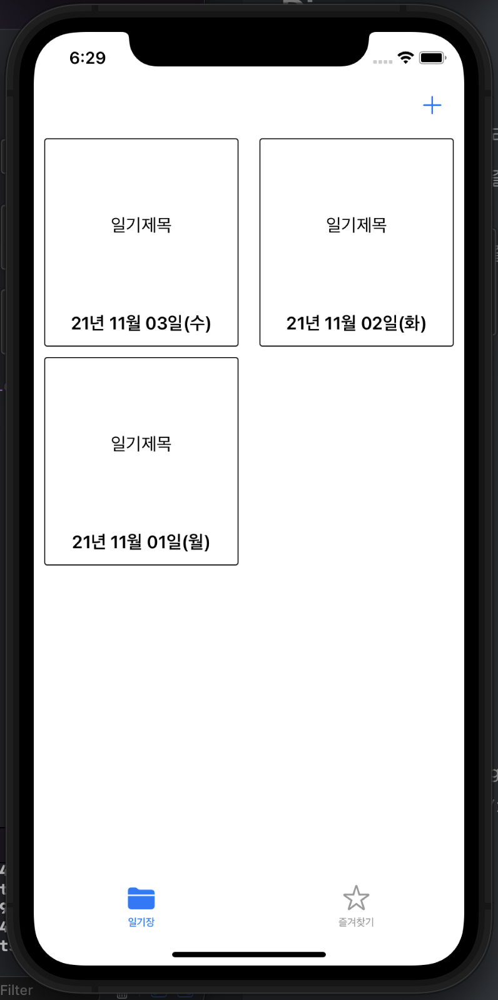
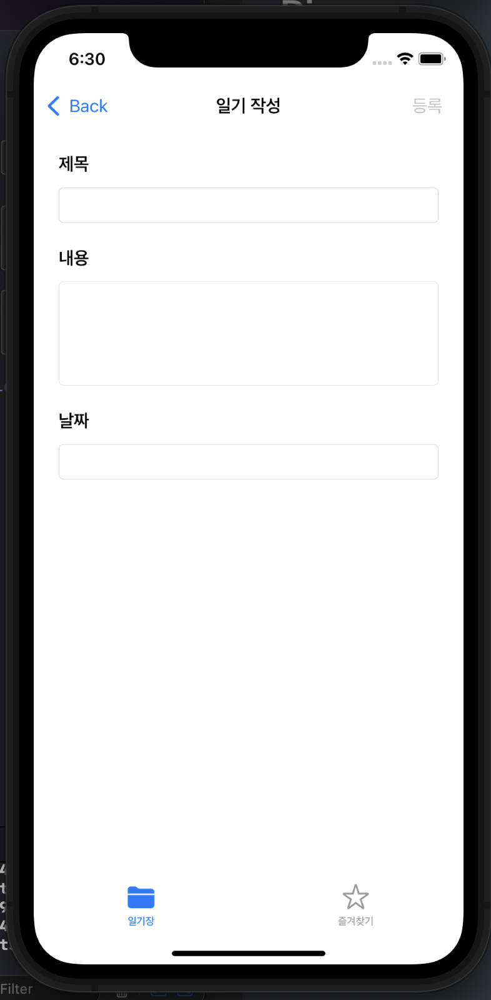
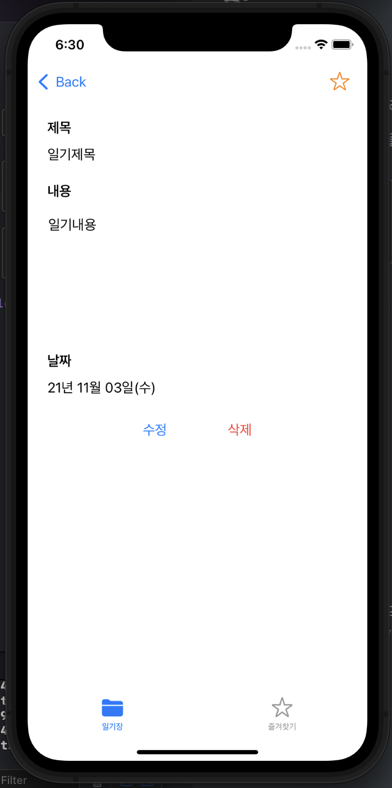
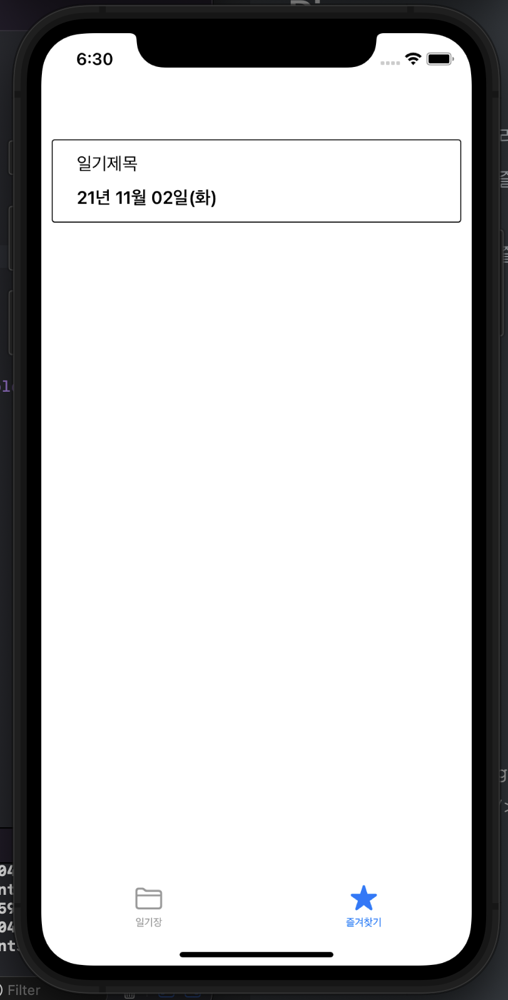

## Diary

### 1. 기능 상세

- 일기장탭을누르면일기리스트를표시할수있습니다.
- 즐겨찾기 탭을 누르면 즐겨찾기한 일기 리스트를 표시할 수 있습니다.
- 일기를등록,수정,삭제,즐겨찾기할수있습니다.

​    

### 2. 활용 기술

- UITabBarController
- UICollectionView
- NotificationCenter

### 3. 구현 화면

|                일기장 목록화면                |                  일기 작성화면                  |
| :-------------------------------------------: | :---------------------------------------------: |
|  |    |
|            **일기 상세보기 화면**             |           **일기 즐겨찾기 목록화면**            |
|  |  |

