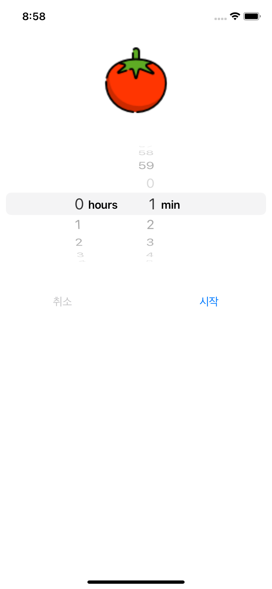

## Pomodoro

### 1. 기능 상세

- DatePicker 를 통해 타이머 시간을 설정할 수 있습니다.
- 시작 버튼을 누르면 타이머가 시작되고 일시 정지를 누르면 타이머가 일시정지됩니다.
- 취소 버튼을 누르면 타이머가 종료됩니다.
- 카운트 다운이 완료되면 알람이 울립니다.

​    

### 2. 활용 기술

- DispatchSourceTimer
- UIView Animation

   

​     

### 3. 구현 화면

|                  시간설정 화면                   |                   타이머 화면                    |
| :----------------------------------------------: | :----------------------------------------------: |
|  |  |

