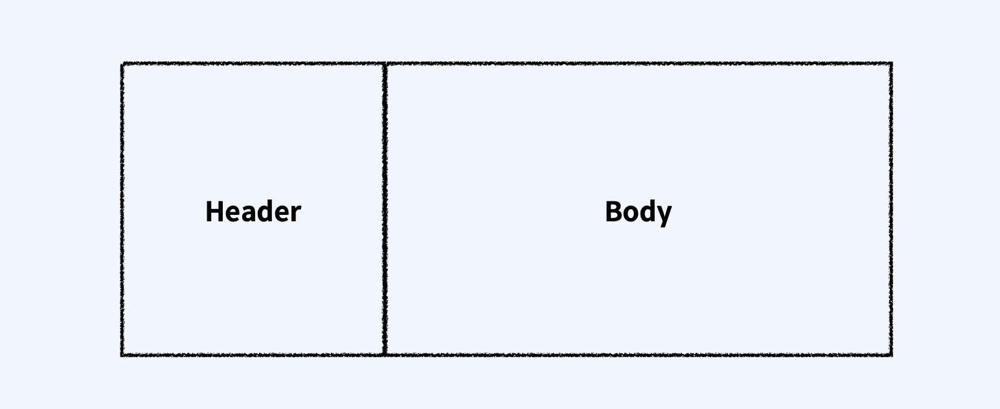

## 1. 웹 통신과 Protocol

- 인터넷 상에서의 통신을 말합니다.
- 많은 정보들이 주고 받기에 인터넷에서는 엄격한 규약이 존재합니다. 이것을 Protocol 이라고 부릅니다.

​    

## 2. Hyper Text Transfer Protocol

Hyper Text를 전송하기 위한 프로토콜

​       

## 3. Http 통신

기본적으로 `request` 와 `response`로 구성되어있습니다. 기본적으로 서버와 클라이언트가 연결되어 있지 않습니다. 서버는 요청한 정보를 전송하고 연결을 종료시킨다는 것을 의미합니다.

계속 연결되어 있지 않다는것이 Http 통신의 특징입니다.

​     

## 4. Http 패킷

요청을 보내거나 응답을 받을때 패킷을 이용하는데 패킷은 Header와 Body로 이루어져있습니다.

- `Header`: 보내는사람주소, 받는사람주소, 패킷생명시간 등 
- `Body`: 전하고자 하는 실제 내용

​    

## 5. Http Method

서버에서는 메서드에 따라 어떤요청인지 확인할 수 있습니다.

- `GET`: 클라이언트가 서버에 리소스를 요청할 때 사용
- `POST`: 클라이언트가 서버의 리소스를 새로 만들 때 사용
- `PUT`: 클라이언트가 서버의 리소스를 전체 수정 할 때 사용
- `PATCH`: 클라이언트가 서버의 리소스를 일부 수정 할 때 사용
- `DELETE`: 클라이언트가 서버의 리소스를 삭제 할 때 사용 
- `HEAD`: 클라이언트가서버의정상작동여부를확인할때사용
- `OPTIONS`: 클라이언트가 서버에서 해당 URL 이 어떤 메소드를 지원하는지 확인 할 때 사용 CONNECT: 클라이언트가 프록시를 통하여 서버와 SSL 통신을 하고자 할 때 사용
- `TRACE`: 클라이언트와 서버간 통신 관리 및 디버깅을 할 때 사용 

​    

## 6. Http Status

요청에 대한 상태코드를 함께 보내게 됩니다.

- 100번 대 Informational: 요청 정보를 처리 중
- 200번 대 Success: 요청을 정상적으로 처리함
- 300번 대 Redirection: 요청을 완료하기 위해 추가 동작 필요
- 400번 대 Client Error : 서버가 요청을 이해하지 못함
- 500번 대 Server Error : 서버가 요청 처리 실패함 

​      

## 7. URLSession

iOS 앱에서 서버와 통신하기 위해 애플은 `URLSession`이라는 API를 제공하고 있습니다. `URLSession`은 iOS 앱 통신에서 유명한 라이브러리인 `Alamofire`, `SDWebImage` 등의 기반이 되는 API로 서버와의 데이터 교류를 위해서는 필수적으로 알아야 하는 API입니다. `URLSession`은 HTTP를 포함한 몇 가지 프로토콜을 지원하고, 인증, 쿠키 관리, 캐시 관리 등을 지원합니다.   

​     

​    

### URLSession의 Request와 Response

`URLSession`은 다른 HTTP 통신과 마찬가지로 `Request`와 `Response`를 기본 구조로 가지고 있습니다. 먼저 `Request`는 `URL` 객체를 통해 직접 통신하는 형태와, `URLRequest` 객체를 만들어서 옵션을 설정하여 통신하는 형태가 있습니다. 다음으로 `Response`는 설정된 `Task`의 `Completion Handler` 형태로 `response`를 받거나, `URLSessionDelgate`를 통해 지정된 메소드를 호출하는 형태로 `response`를 받는 형태가 있습니다.    

​    

일반적으로 간단한 response를 작성할 때에는 `Completion Handler`를 사용하지만, 앱이 background 상태로 들어갈 때에도 파일 다운로드를 지원하도록 설정하거나, 인증과 캐싱을 default 옵션으로 사용하지 않는 상황과 같은 경우에는 `Delegate` 패턴을 사용해야 합니다.

​     

​     

### URLSession의 기본 컨셉

`URLSession`은 기본적으로 다음과 같은 순서(Life Cycle)로 진행됩니다.

1. `Session` configuration을 결정하고, `Session`을 생성한다.
2. 통신할 URL과 Request 객체를 설정한다.
3. 사용할 `Task`를 결정하고, 그에 맞는 `Completion Handler`나 `Delegate` 메소드들을 작성한다.
4. 해당 `Task`를 실행한다.
5. Task 완료 후 `Completion Handler`가 실행된다.

​     

### 1) Session

`URLSession`은 크게 3가지 종류의 Session을 지원합니다.

1. `Default Session`: 기본적인 Session으로 디스크 기반 캐싱을 지원합니다.
2. `Ephemeral Session`: 어떠한 데이터도 저장하지 않는 형태의 세션입니다.
3. `Background Session`: 앱이 종료된 이후에도 통신이 이뤄지는 것을 지원하는 세션입니다.

​      

### 2) Request

`URLRequest`를 통해서는 서버로 요청을 보낼 때 어떻게 데이터를 캐싱할 것인지, 어떤 HTTP 메소드를 사용할 것인지(Get, Post 등), 어떤 내용을 전송할 것인지 등을 설정할 수 있습니다.

​      

### 3) Task

Task 객체는 일반적으로 Session 객체가 서버로 요청을 보낸 후, 응답을 받을 때 URL 기반의 내용들을 받는(retrieve) 역할을 합니다. 3가지 종류의 Task가 지원됩니다.

1. `Data Task` - Data 객체를 통해 데이터 주고받는 Task입니다.
2. `Download Task` - data를 파일의 형태로 전환 후 다운 받는 Task입니다. 백그라운드 다운로드 지원
3. `Upload Task` - data를 파일의 형태로 전환 후 업로드하는 Task입니다.

 

​    

### URLSession dataTask 사용하기

`URLSession`과 같은 네트워킹용 API는 일반적으로 앱 전역에서 사용됩니다. 그렇기 때문에 ViewController에 메소드를 작성하기보다는 하나의 모듈(class)을 만들고 그 안에 static 함수들을 만들어 사용하는 것이 좋습니다.

​     

​      

출처 : https://hcn1519.github.io/articles/2017-07/iOS_URLSession
