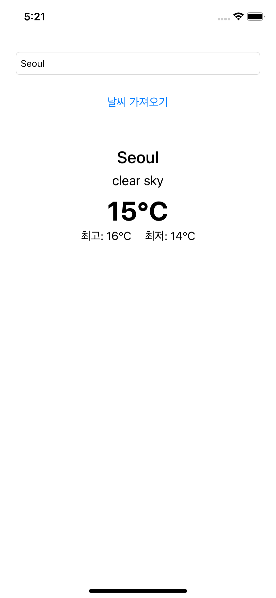
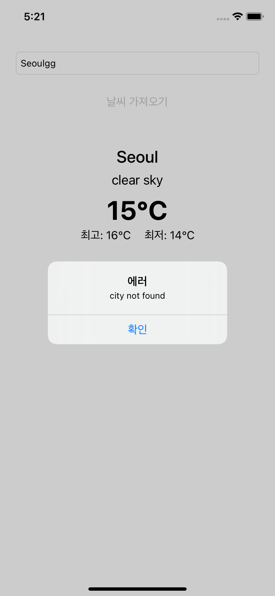

## Weather

### 1. 기능 상세

- 도시 이름을 입력하면 현재 날씨 정보를 가져와 화면에 표시되게 만들어야 합니다.
- 도시 이름을 잘못 입력하면 서버로부터 응답받은 에러 메시지가 알럿으로 표시되어야 합니다. 

​    

### 2. 활용 기술

- Current Weater API

- URLSession

   

​     

### 3. 구현 화면

|                    날씨 화면                    |                    에러 화면                    |
| :---------------------------------------------: | :---------------------------------------------: |
|  |  |

