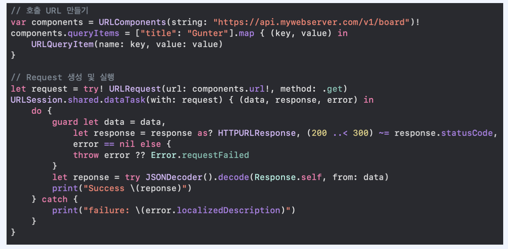
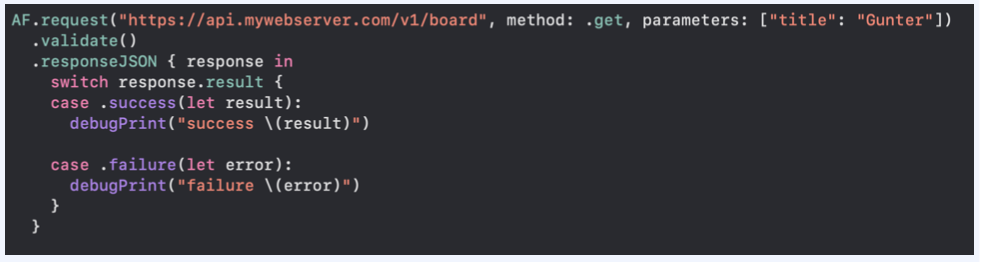
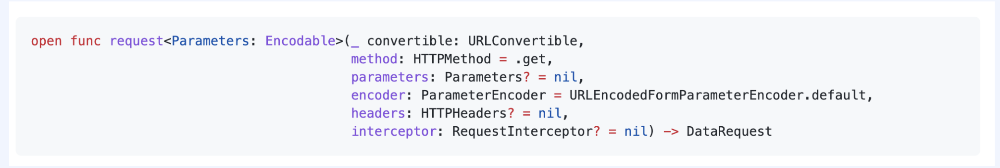
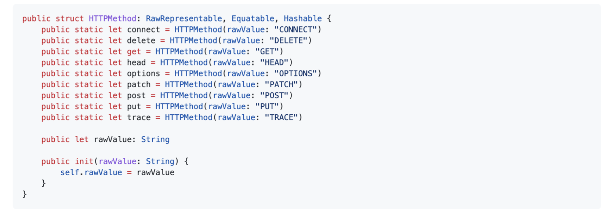
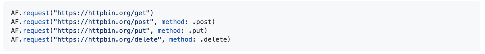
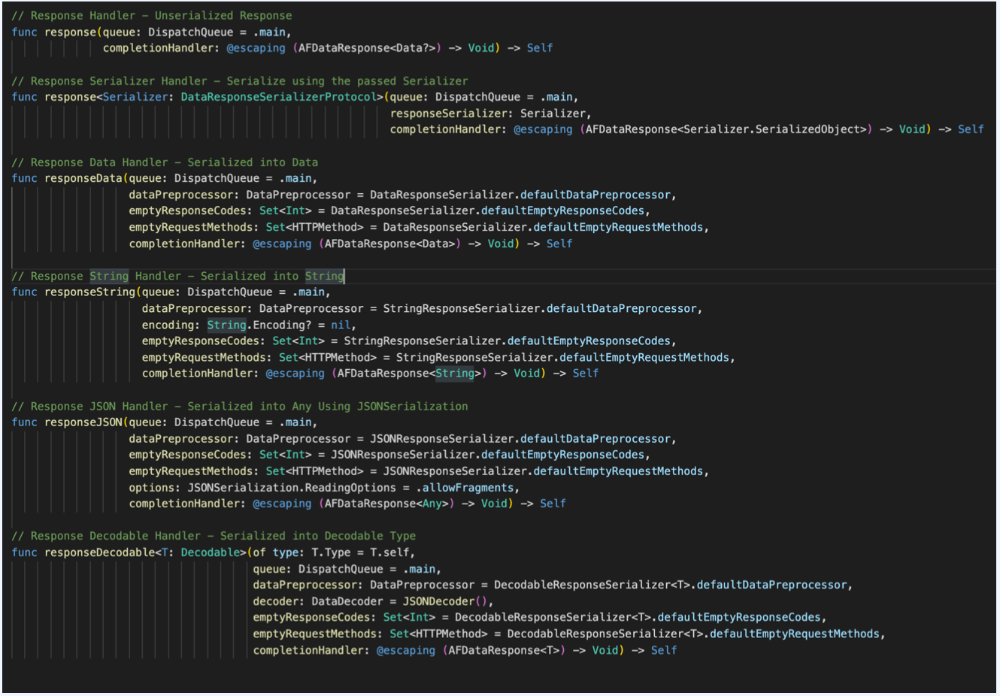
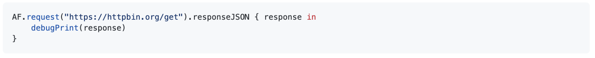

## 1. Alamofire

- Alamore란 iOS, macOS를 위한 Swift 기반의 HTTP 네트워킹 라이브러리
- Alamofire는 URLSession 기반이며 URLSession은 네트워킹 호출에서 모호한 부분이 많은데 Alamofire를 사용한다면 데이터를 접근하기 위한 노력을 줄일 수 있으며 코드를 더 깔끔하고 가독성 있게 쓰는 것이 가능해집니다.

​    

​    

## 2. URLSession 대신 Alamofire을 사용하는 이유

코드의 간소화, 가독성 측면에서 도움을 주고 여러 기능을 직접 구축하지 않아도 쉽게 사용할 수 있습니다.

예를들어 Get 방식의 요청 코드를 비교해 보겠습니다.

|              URLSession               |               Alamofire               |
| :-----------------------------------: | :-----------------------------------: |
|  |  |

URLSession은 호출할 API의 URL을 생성하고 쿼리와 유알엘맵핑을 해야하지만 Alamofire는 메서드 파라미터에 url과 파라미터를 넘겨주면 내부에서 자동으로 url의 파라미터를 맵핑 시켜줍니다.

에러의 검열에서도 간편하게 적용할 수 있습니다.

​    

​        

## 3. Alamofire Request

   request 메서드를 이용하여 요청에 필요한 정보를 파라미터로 주어 쉽게 요청을 할 수 있습니다.

   

​    

## 4. Alamofire HTTP Method

HTTP Method가 정의 되어있으며 request를 생성할때 method를 같이 전달 할 수 있습니다.

​    

​    

## 5. Alamofire Response

 

응답에 관련된 메서드가 있습니다.

응답을 사용하는 방법입니다.
