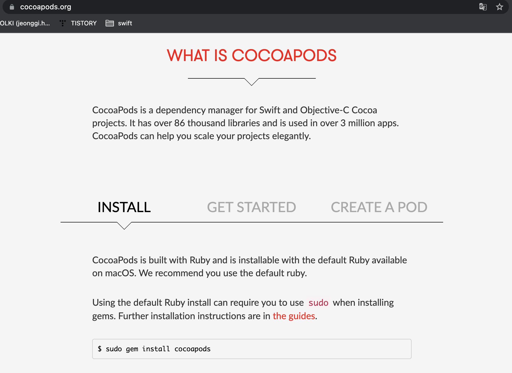

## CocoaPods

iOS 및 macOS, tvOS 등 애플 플랫폼에서 개발을 할 때, 외부 라이브러리를 관리하기 쉽도록 도와주는 의존성 관리 도구들이 있습니다. CocoaPods는 애플 플랫폼을 위한 의존성 관리도구의 일종입니다.

애플 플랫폼에서 사용할 수 있는 의존성 관리 도구의 대표적인 예로는 [[CocoaPods](https://cocoapods.org/)], [[Carthage](https://github.com/Carthage/Carthage)], [[Swift Package Manager](https://swift.org/package-manager/)] 등이 있습니다.

   

   

### CocoaPods install

터미널에 해당 명령어를 입력하면 설치가 진행됩니다.

M1 Mac 인경우 에러가 발생하기 때문에 검색을 통하여 방법을 찾아봐야 합니다.

  

먼저 해당 프로젝트의 폴더에 `pod init`을 통하여 `Podfile`을 생성합니다.

사용할 라이브러리를 입력하면됩니다.

해당하는 라이브러리의 문서를 참고하여 명령어를 넣어주겠습니다.

#### Alamofire

https://github.com/Alamofire/Alamofire

#### Charts

사용할 라이브러리를 입력한후 `pod install`을 입력합니다.

라이브러리를 사용하기 위해서는 프로젝트 폴더안에 생성된 `xcworkspace`를 통하여 프로젝트를 작업해야 합니다.

