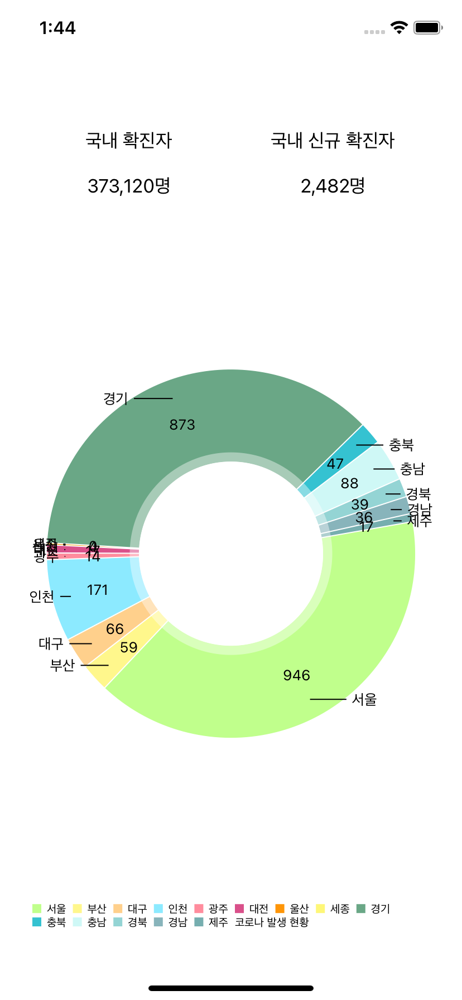

## COVID19 

### 1. 기능 상세

- 시도별 신규 확진자 수가 파이 차트로 표시되어야 합니다.
- 도시 항목을 선택하면 상세 현황을 볼 수 있는 화면으로 이동되어야 합니다. 

​    

### 2. 활용 기술

- 굿바이 코로나 19 API

- Alamofire

- Cocoapods

   

​     

### 3. 구현 화면

|                 전체 차트 화면                  |                 상세 보기 화면                  |
| :---------------------------------------------: | :---------------------------------------------: |
|  |  |

