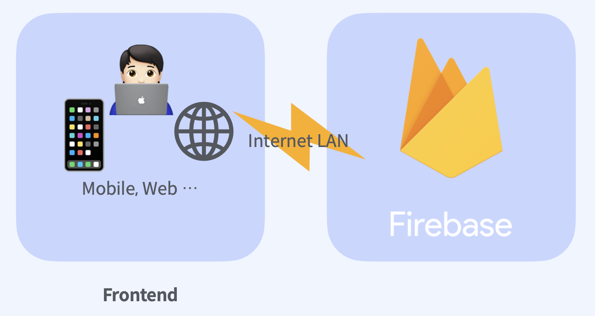

## 1. Firebase 란?

Firebase는 Frontend 개발에 필요한 여러 플랫폼을 제공하는 서비스입니다. https://firebase.google.com/

IOS앱과 같은 모바일 및 웹 어플리케이션 개발 플랫폼이라고 할 수 있습니다. 백엔드의 여러기능들을 별도의 백엔드 개발없이 서버리스로 대체할수 있는 여러 플랫폼을 제공하는 서비스입니다.

   

   

우리가 앞으로 살펴볼 Firebase Platforms 입니다.

