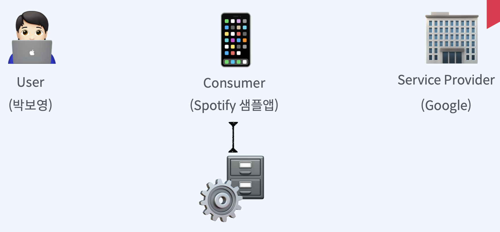
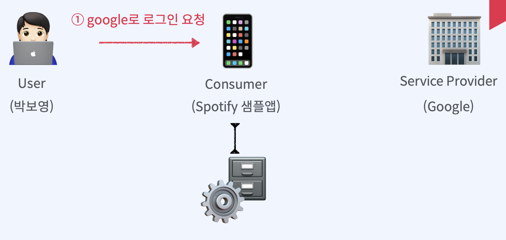
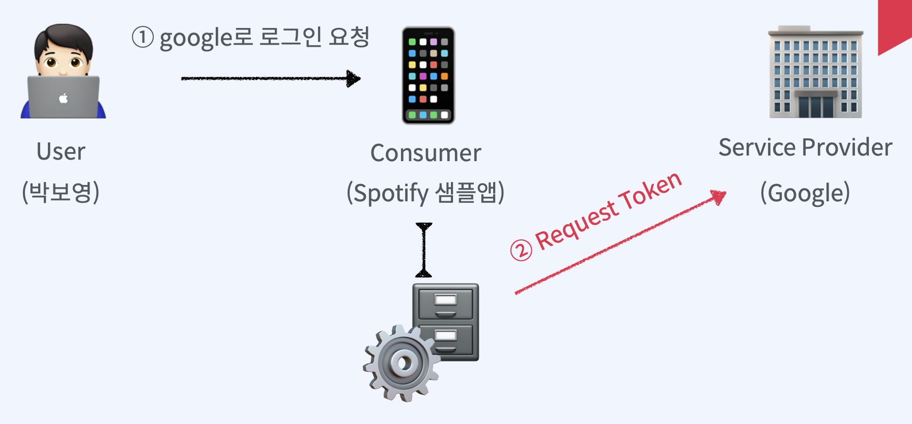
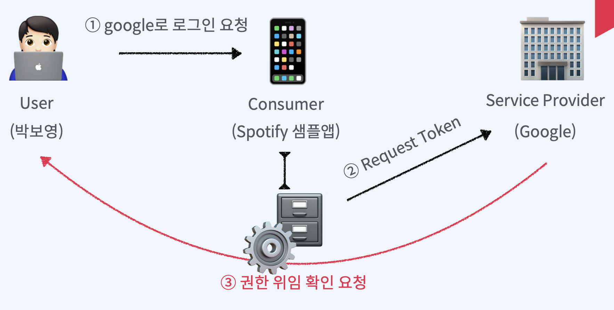
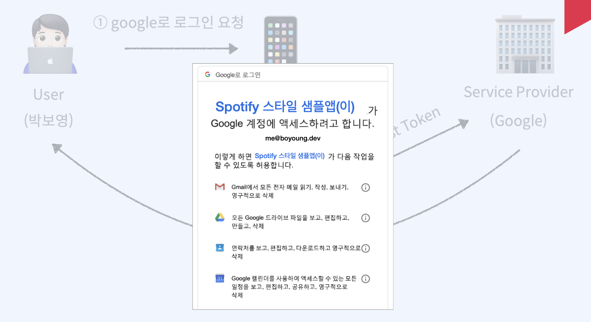
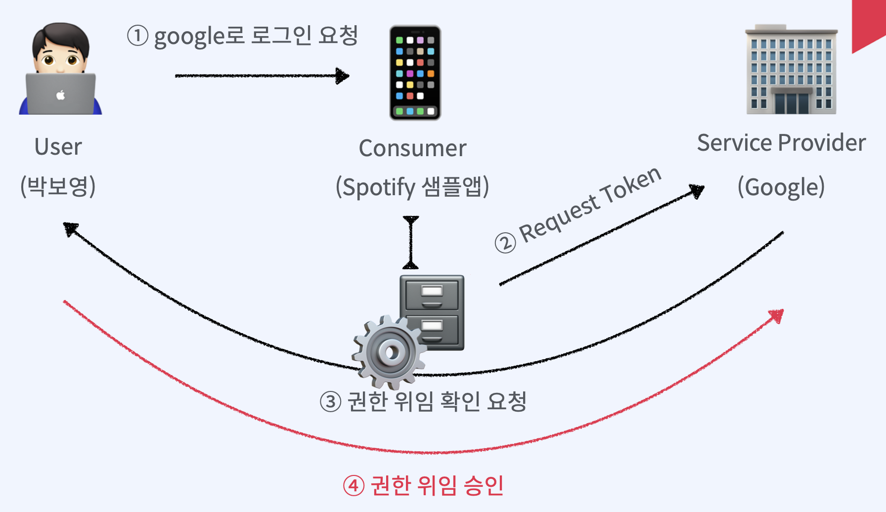
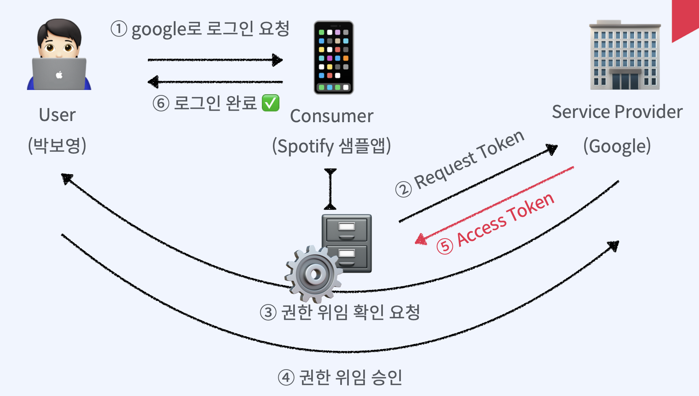
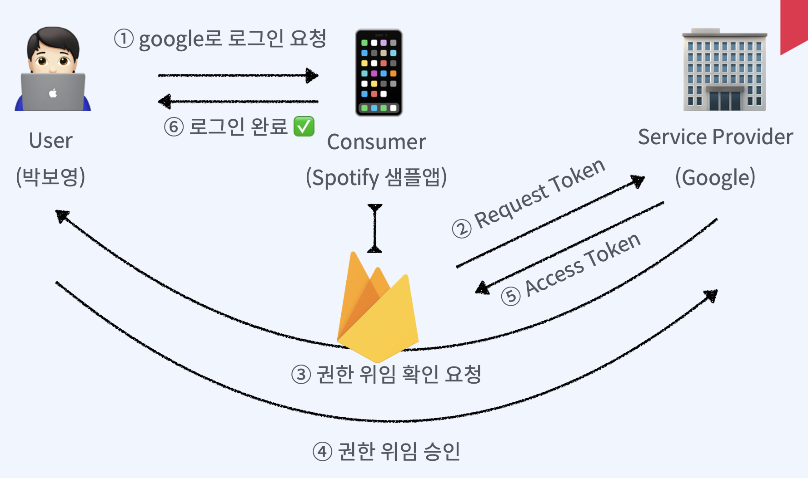
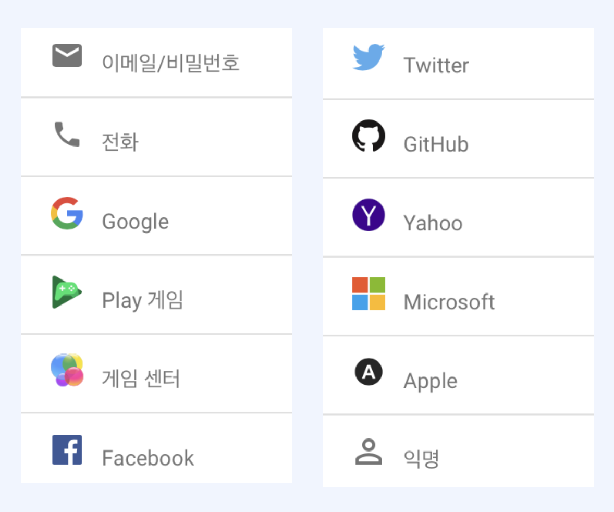

## 1. OAuth란?

- 사용자 인증 방식에 대한 업계 표준
- ID/PW를 노출하지 않고 OAuth를 사용하는 업체의 API 접근 권한을 위임 받음
- 기본 개념
  1. `User`: Service Provider에 계정을 가지고 있는 사용자
  2. `Consumer`: Service Provider의 API(제공 기능)를 사용하려는 서비스 (앱, 웹 등)
  3. `Service Provider`: OAuth를 사용하여 API를 제공하는 서비스
  4. `Access Token`: 인증 완료 후 Service Provider의 제공 기능을 이용할 수 있는 권한을 위임받은 인증 키

​       

​     

### Flow를 살펴 보겠습니다.

사용자가 샘플앱을 켜고 google로 로그인 요청을 합니다.

권한을 위임하는것을 요청하게 됩니다.

권한 위임 확인 요청을 하게 됩니다.

권한 위임 확인 요청하는 화면입니다.

허용을 누르게 되면 권한 위임을 승인한 것입니다.

승인을 받은 google은 access token을 넘겨줍니다.

사용자의 정보 일부를 샘플앱이 사용할 수 있도록 권한을 위임했기 때문에 키를 포함하게 됩니다.

이 토큰은 로그인 서버에서 관리를 하게 됩니다.

우리에게는 이런 중요한 서버가 없기 때문에 그 역할을 Firebase가 그 역할을 대신하게 됩니다.

## 2. Firebase 인증 제공업체

