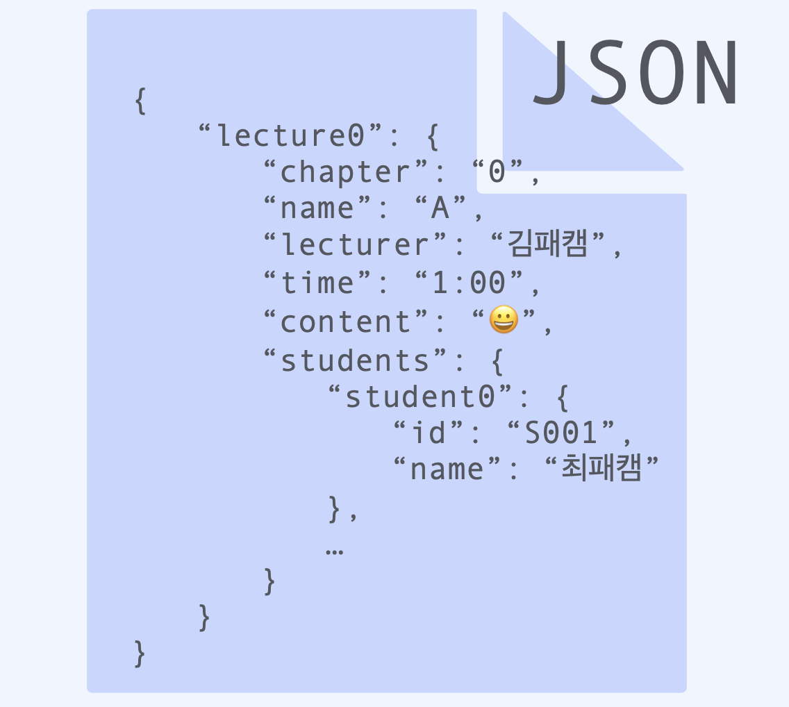
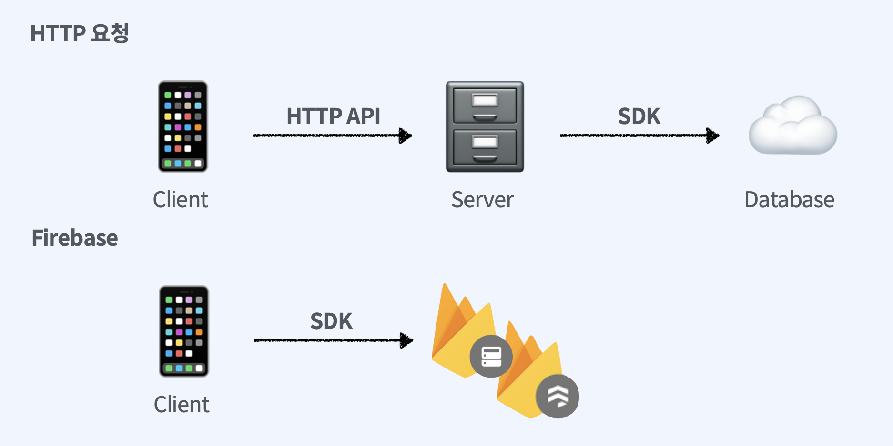
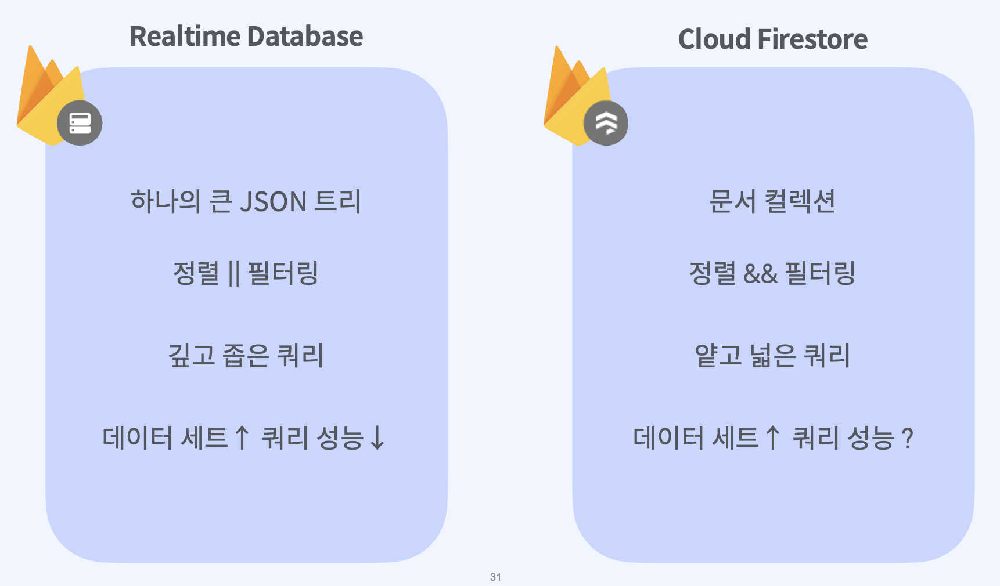
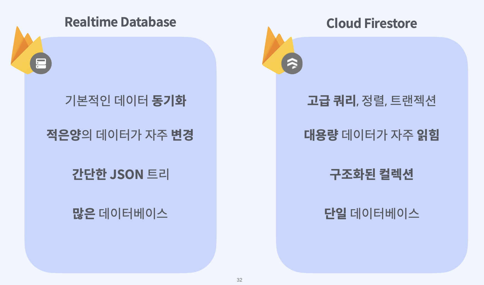

## 1. Firebase Realtime Database?

​    

​    

### 1) 비관계형 클라우드 데이터베이스

   

​    

​    

### 2) HTTP 요청이 아닌 동기화 방식 : 실시간

​    

​    

​    

### 3) 로컬에 저장 후 네트워크 연결시 동기화 : 오프라인

   

   

### 4) 서버없이 데이터베이스와 클라이언트 직접 엑세스

   

   

   

## 2. Realtime Database & Cloud Firestore

  

  

Firebase는 실시간 데이터 동기화를 지원하며 클라이언트에서 액세스할 수 있는 2가지 클라우드 기반 데이터베이스 솔루션을 제공합니다.

- **Cloud Firestore**는 모바일 앱 개발을 위한 Firebase의 최신 데이터베이스로서 실시간 데이터베이스의 성공을 바탕으로 더욱 직관적인 새로운 데이터 모델을 선보입니다. 또한 실시간 데이터베이스보다 풍부하고 빠른 쿼리와 원활한 확장성을 제공합니다.
- **실시간 데이터베이스**는 Firebase의 기존 데이터베이스로, 여러 클라이언트에서 실시간으로 상태를 동기화해야 하는 모바일 앱을 위한 효율적이고 지연 시간이 짧은 솔루션입니다.

  

  

### 데이터 모델

실시간 데이터베이스와 Cloud Firestore는 모두 NoSQL 데이터베이스입니다.

| 실시간 데이터베이스                                          | Cloud Firestore                                              |
| :----------------------------------------------------------- | :----------------------------------------------------------- |
| **데이터를 하나의 큰 JSON 트리로 저장합니다.**단순한 데이터를 매우 쉽게 저장합니다.복잡한 계층적 데이터를 대규모로 정리하기는 보다 어렵습니다.[실시간 데이터베이스 데이터 모델](https://firebase.google.com/docs/database/web/structure-data?hl=ko) 자세히 알아보기 | **데이터를 문서 컬렉션으로 저장합니다.**JSON과 매우 비슷하게 단순한 데이터를 문서에 쉽게 저장합니다.문서에 있는 하위 컬렉션을 사용하여 복잡한 계층적 데이터를 대규모로 쉽게 정리할 수 있습니다.비정규화 및 데이터 평면화가 덜 필요합니다.[Cloud Firestore 데이터 모델](https://firebase.google.com/docs/firestore/data-model?hl=ko) 자세히 알아보기 |

  

  

### 실시간 및 오프라인 지원

두 제품 모두 모바일 위주의 실시간 SDK를 보유하며 오프라인 대응 앱을 위한 로컬 데이터 저장소를 지원합니다.

| 실시간 데이터베이스                              | Cloud Firestore                                      |
| :----------------------------------------------- | :--------------------------------------------------- |
| **iOS, Android 클라이언트를 위한 오프라인 지원** | **iOS, Android, 웹 클라이언트를 위한 오프라인 지원** |

  

  

### 접속 상태

클라이언트가 온라인인지 오프라인인지를 알면 유용합니다. Firebase 실시간 데이터베이스는 클라이언트 연결 상태를 기록하고 클라이언트의 연결 상태가 변경될 때마다 업데이트를 제공할 수 있습니다.

| 실시간 데이터베이스    | Cloud Firestore                                              |
| :--------------------- | ------------------------------------------------------------ |
| **접속 상태가 지원됨** | **기본적으로 지원되지 않음.** Cloud Functions를 통해 Cloud Firestore와 실시간 데이터베이스를 동기화하여 실시간 데이터베이스의 접속 상태 지원을 활용할 수 있습니다. [Cloud Firestore에서 접속 상태 구현](https://firebase.google.com/docs/firestore/solutions/presence?hl=ko)을 참조하세요. |

  

  

### 쿼리

쿼리를 통해 두 가지 데이터베이스에서 데이터를 검색, 정렬, 필터링합니다.

| 실시간 데이터베이스                                          | Cloud Firestore                                              |
| :----------------------------------------------------------- | :----------------------------------------------------------- |
| **제한적인 [정렬 및 필터링 기능](https://firebase.google.com/docs/database/web/lists-of-data?hl=ko#sorting_and_filtering_data)을 갖춘 딥 쿼리**쿼리에서 속성을 정렬 *또는* 필터링할 수 있으며 두 가지를 함께 진행할 수는 없습니다.기본적으로 깊은 쿼리가 수행되어 항상 전체 하위 트리를 반환합니다.쿼리에서 JSON 트리의 개별 리프 노드 값에 이르는 세부 수준의 데이터에 액세스할 수 있습니다.쿼리에서 색인을 필요로 하지 않지만 데이터 세트가 커짐에 따라 특정 쿼리의 성능이 저하됩니다. | **복합 [정렬 및 필터링](https://firebase.google.com/docs/firestore/client/query-data?hl=ko) 기능을 갖춘 색인이 생성된 쿼리**단일 쿼리에서 속성에 여러 필터를 연결하고 필터링과 정렬을 결합할 수 있습니다.쿼리가 얕아 특정 컬렉션 또는 컬렉션 그룹의 문서만 반환하며 하위 컬렉션 데이터는 반환하지 않습니다.쿼리에서 항상 전체 문서를 반환해야 합니다.기본적으로 쿼리가 색인화되며 쿼리 성능이 데이터 세트가 아닌 결과 세트의 크기에 비례합니다. |

  

  

### 쓰기 및 트랜잭션

| 실시간 데이터베이스                                          | Cloud Firestore                                              |
| :----------------------------------------------------------- | :----------------------------------------------------------- |
| **기본 쓰기 및 트랜잭션 작업**설정 및 업데이트 작업을 통해 [데이터를 씁니다](https://firebase.google.com/docs/database/android/read-and-write?hl=ko#basic_write).[트랜잭션](https://firebase.google.com/docs/database/ios/read-and-write?hl=ko#save_data_as_transactions)이 특정 데이터 하위 트리에서 원자적으로 수행됩니다. | **고급 쓰기 및 트랜잭션 작업**설정 및 업데이트 작업은 물론 배열 및 숫자 연산자와 같은 고급 변환을 통한 [데이터 쓰기 작업](https://firebase.google.com/docs/firestore/manage-data/update-data?hl=ko)입니다.[트랜잭션](https://firebase.google.com/docs/firestore/manage-data/update-data?hl=ko#update_data_with_transactions)이 데이터베이스의 모든 부분에서 데이터를 원자적으로 읽고 쓸 수 있습니다. |

  

  

### 신뢰성 및 성능

| 실시간 데이터베이스                                          | Cloud Firestore                                              |
| :----------------------------------------------------------- | :----------------------------------------------------------- |
| **실시간 데이터베이스는 리전 내 솔루션입니다.**리전 내 구성에서 사용할 수 있습니다. 데이터베이스는 리전 내 영역별 가용성에 따라 제한됩니다.지연 시간이 매우 짧아 상태 동기화가 자주 발생할 때 적합합니다.실시간 데이터베이스의 성능 및 신뢰성에 대한 자세한 내용은 [서비스수준계약](https://firebase.google.com/terms/service-level-agreement?hl=ko)을 참조하세요. | **Cloud Firestore는 자동으로 확장되는 리전 내 및 멀티 리전 솔루션입니다.**데이터가 서로 다른 리전의 여러 데이터 센터에 위치하므로 글로벌 확장성과 견고한 신뢰성이 보장됩니다.전 세계적으로 리전 내 또는 멀티 리전 구성이 가능합니다.[서비스수준계약](https://cloud.google.com/firestore/sla?hl=ko)에서 Cloud Firestore 성능 및 신뢰성에 대해 자세히 알아보세요. |

  

  

### 확장성

| 실시간 데이터베이스                                          | Cloud Firestore                                              |
| :----------------------------------------------------------- | :----------------------------------------------------------- |
| **확장하려면 샤딩을 사용해야 합니다.**단일 데이터베이스에서 동시 연결 약 200,000개, 초당 쓰기 약 1,000회까지 확장됩니다. 추가로 확장하려면 데이터를 여러 데이터베이스로 샤딩해야 합니다.개별 데이터의 쓰기 속도에 적용되는 로컬 제한은 없습니다. | **확장이 자동으로 수행됩니다.**확장이 완전히 자동으로 수행됩니다. 현재 확장 한도는 동시 연결 약 1,000,000개, 초당 쓰기 약 10,000회입니다. 향후 이 한도를 늘릴 계획입니다.개별 문서 또는 색인의 쓰기 속도에 적용되는 [제한](https://firebase.google.com/docs/firestore/quotas?hl=ko)이 있습니다. |

  

  

### 보안

| 실시간 데이터베이스                                          | Cloud Firestore                                              |
| :----------------------------------------------------------- | :----------------------------------------------------------- |
| **승인과 검증이 분리된 캐스케이딩 규칙 언어**모바일 SDK의 읽기 및 쓰기가 [실시간 데이터베이스 규칙](https://firebase.google.com/docs/database/security?hl=ko)으로 보호됩니다.읽기 및 쓰기 규칙이 하위로 전파됩니다.`validate` 규칙을 사용해 별도로 [데이터를 검증](https://firebase.google.com/docs/database/security/securing-data?hl=ko#validating_data)합니다. | **승인과 검증이 결합된 비캐스케이딩 규칙**모바일 SDK의 읽기 및 쓰기가 [Cloud Firestore 보안 규칙](https://firebase.google.com/docs/firestore/security/get-started?hl=ko)으로 보호됩니다.서버 SDK의 읽기 및 쓰기가 [Identity and Access Management(IAM)](https://cloud.google.com/firestore/docs/security/iam?hl=ko)로 보호됩니다.와일드 카드를 사용하지 않는 한 규칙이 하위로 전파되지 않습니다.규칙으로 쿼리를 제한할 수 있습니다. 쿼리 결과에 사용자가 액세스할 수 없는 데이터가 포함되어 있으면 전체 쿼리가 실패합니다. |

  

  

### 가격 책정

두 솔루션 모두 [Spark 및 Blaze 요금제](https://firebase.google.com/pricing?hl=ko)로 제공됩니다.

| 실시간 데이터베이스                                          | Cloud Firestore                                              |
| :----------------------------------------------------------- | :----------------------------------------------------------- |
| **대역폭과 저장용량**에 대해서만 청구되지만 요금이 비교적 높습니다.[실시간 데이터베이스 요금제](https://firebase.google.com/pricing?hl=ko) 자세히 알아보기 | 주로 **데이터베이스에서 수행되는 작업(읽기, 쓰기, 삭제)**에 대해 청구되며 대역폭과 저장용량에 대해서도 비교적 저렴한 요금으로 청구됩니다.Cloud Firestore는 App Engine 프로젝트의 일일 [지출 한도](https://cloud.google.com/appengine/docs/standard/python/console/?hl=ko#setting_a_spending_limit)를 지원하므로 비용의 상한선을 적절하게 설정할 수 있습니다.[Cloud Firestore 요금제](https://firebase.google.com/docs/firestore/pricing?hl=ko) 자세히 알아보기 |
