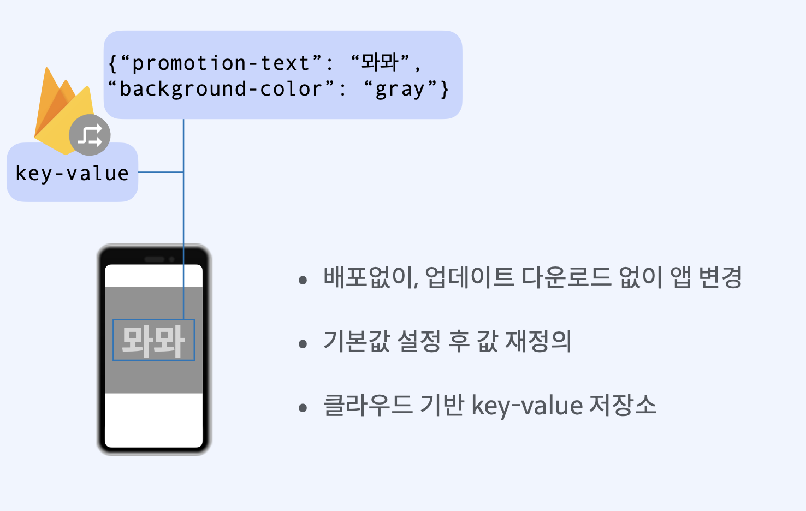
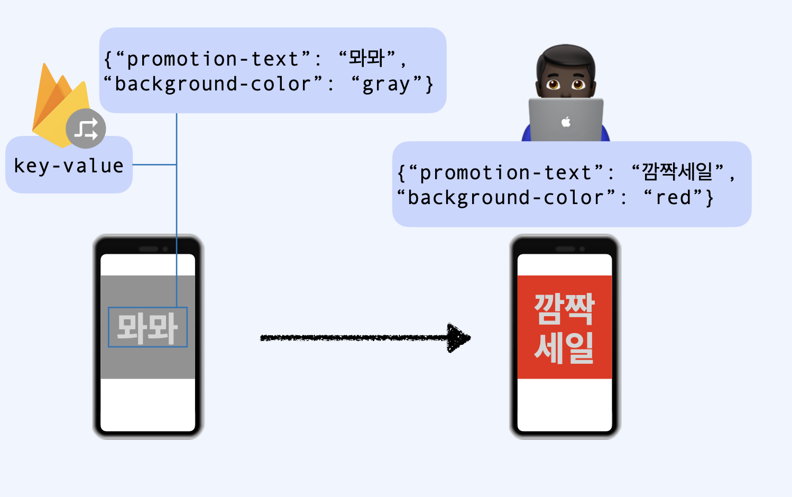
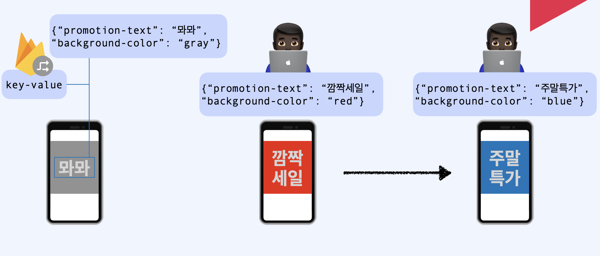
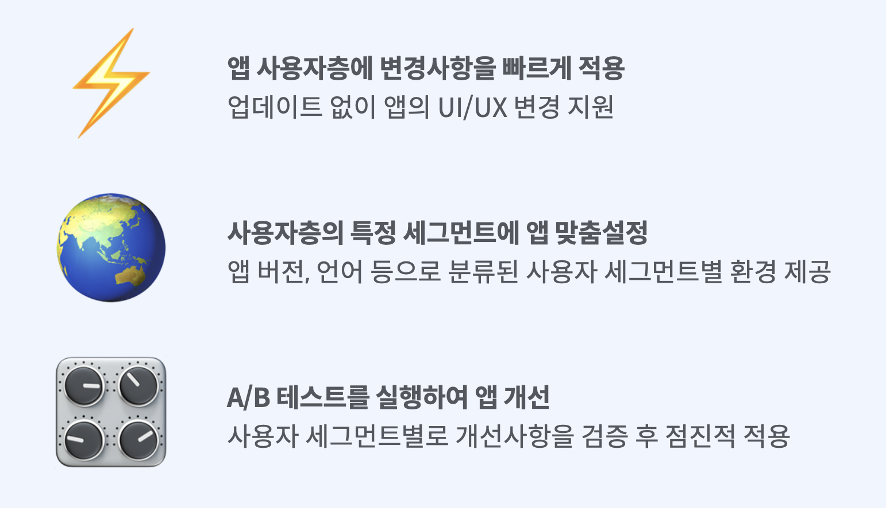

## 1. 원격 구성(Remote Config) 이란?

- 배포없이, 업데이트 다운로드 없이 앱 변경
- 기본값 설정 후 값 재정의
- 클라우드 기반 key-value 저장소

## 2. 사용 예시

뫄뫄라는 글씨와 배경색이 회색을 사용자에게 배포를 했습니다.

프로모션 텍스트 키에 해당하는 값과 배경의 값을 변경하면 별도의 앱 업데이트 심사없이 변경이 가능합니다.

  

  

## 3. 주요기능

