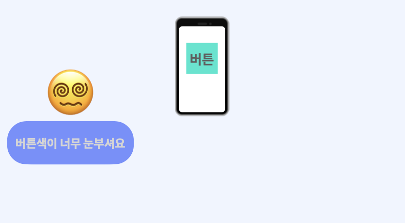
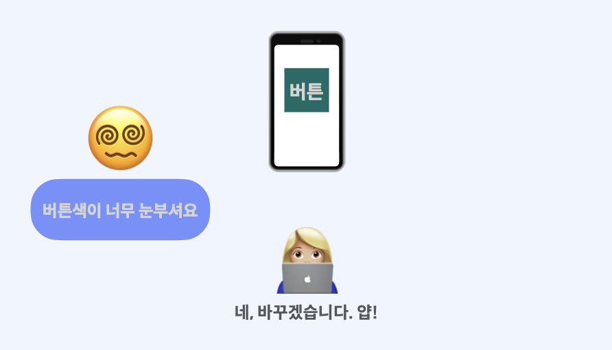
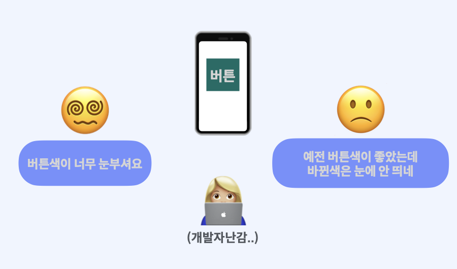
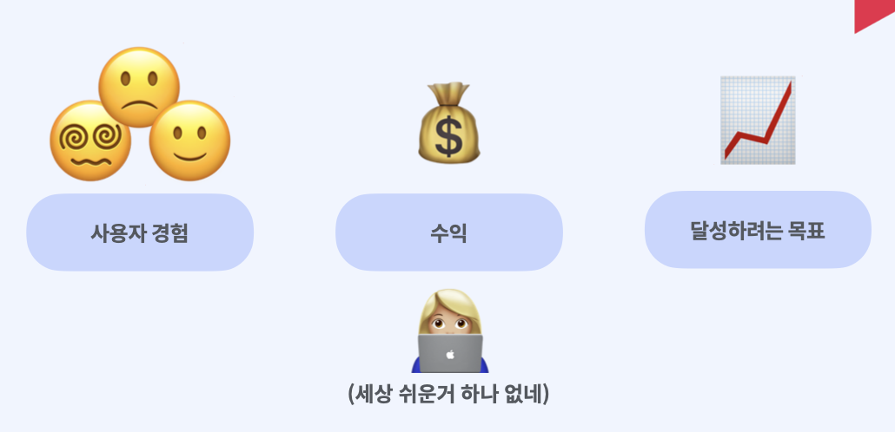
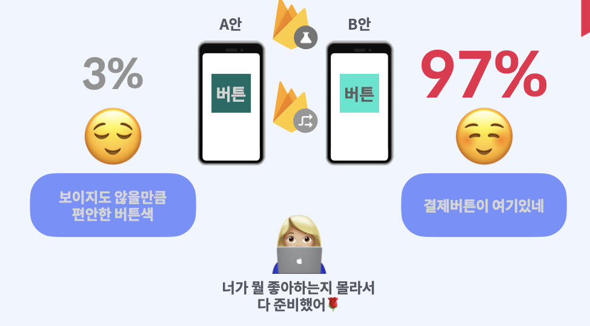
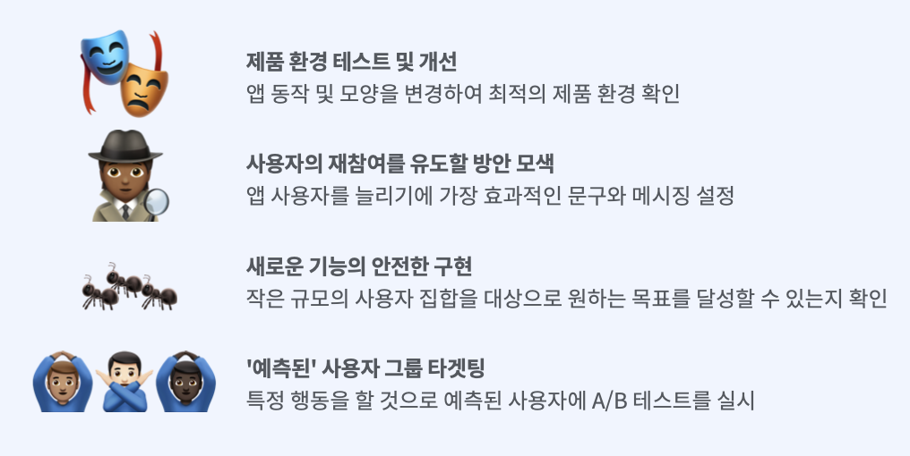

## 1. A/B 테스팅?

- Google Analytics, Firebase 예측을 통한 사용자 타겟팅
- 원격 구성(Remote Config) 또는 알림작성기(Cloud Messaging) 활용
- 제품, 마케팅 실험을 쉽게 실행, 분석, 확장

​    

​     

## 2. 사용 예시

새로운 기능을 배포하는 것은 쉽지 않습니다.

  

## 3. 주요기능

