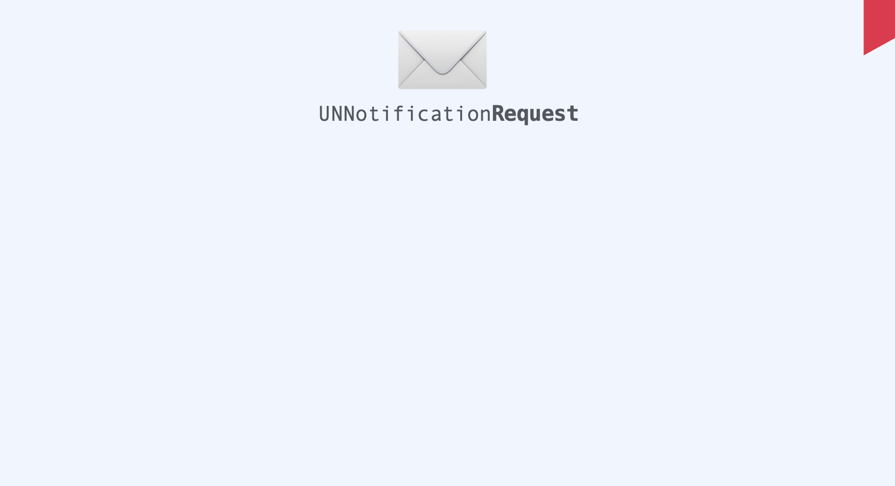
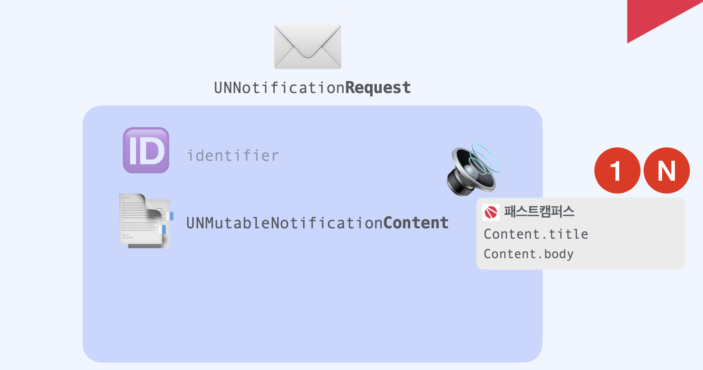

## 1. Local Notification

​    

​    

### 기본 구조

**Local Notification**은 크게 3가지 파트로 나뉩니다. `content`, `trigger`, `request` 입니다. 이 세가지를 통하여 Local Notification을 쉽게 구현할 수 있습니다.    

​    

### Content

`content`는 사용자에게 어떤 내용을 보여줄지에 대한 정보를 담고 있습니다. `title`, `body`, `badge number`, `userInfo`, `attachments` 등이 있습니다. `userInfo`는 예상하다시피 원하는 정보를 모두 담을 수 있는 `Dictionary` 입니다. 알림을 사용자가 눌렀을 때, `userInfo`에 들어있는 정보를 접근하여 활용할 수 있습니다.     

​    

### Trigger

`trigger`에는 3가지 타입이 있습니다. `time`, `calendar`, `location` 입니다. 이름과 같은 역할을 한다고 보면 쉽습니다. 일정 시간이 지난 후에 작동되길 원한다면 `time`, 특정한 날짜에 작동하기 원한다면 `calendar`, 특정 위치에 진입할 경우 혹은 나갈 경우에 작동하기 원한다면 `location`을 활용할 수 있습니다.    

​     

### Request

`request`는 `content`와 `trigger`를 가지고 로컬 푸쉬를 등록하기 위해 생성해야 합니다. 또한 `identifier`를 꼭 지정해야 합니다. 나중에 해당 알림을 취소하거나 핸들링할 때 쓰이게 됩니다.    

​        

​             

### 1) Notification Request

​    

​    

### 2) Notification Request - identifier

​    

​    

### 3) Notification Request - content

​    

​    

### 4) Notificatuon Request - trigger

​    

​    

### 5) Notification Center

​    

​    

### 6) Local Notification

​    

​    

​    

## 2. 물 마시기 알림

