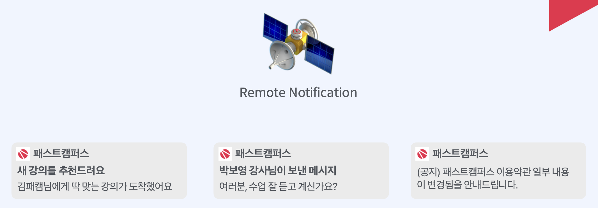
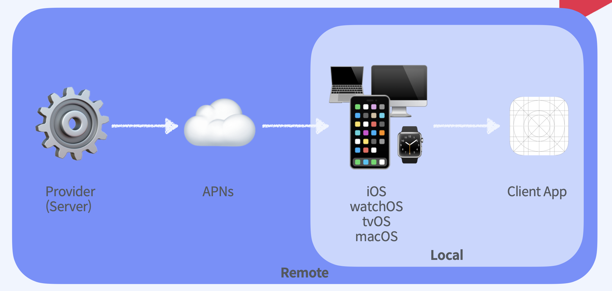

## Local Notification
푸시 알림이라고 생각하면 됩니다.    
앱 내부에서 자체적으로 만든 특정 메세지를 전달하는 알림이며,   
목적은 사용자의 관심을 끄는 데에 있다.       
알림을 재생하거나 앱 아이콘에 배지를 적용 가능하다.
 

### Local Notification 구성
UNNotificationRequest를 작성하여 알림 요청    
UNNotificationCenter에 추가 -> Request를 보관하다가 Request에 정의된 순간에 Trigger
 

### UNNotificationRequest 객체를 생성하기 위한 조건?   
- identifier
- UNMutableNotificationContent (알림에 나타낼 내용!)
- UNCalendarNotificationTrigger / UNTimeNotificationTrigger / UNLocationNotificationTrigger    
(어떠한 기준에서 발생하는지- Local Notification 에는 위의 세 가지 조건 존재)

 

## Remote Notification

우리가 받는 대부분의 알림은 정해진 시간에 동일한 문구로 전해지는    
Local Notification이 아니라 불시에 발생하는 알림이다.     
특정 사용자를 선별해서 해당 사용자에게만 알림을 보내거나    
특정 사용자가 특정 행동을 한 시점에만 알림을 보내거나   
언제 어떤 콘텐츠가 담길지 모르는 불특정 한 상황이 특정이 됐을 때 알림을 보내는 상황   
이런 상황들에는 static한 문구를 미리 작성할 수가 없다.
결국 이런 상황에는 Remote Notification, 말 그대로 원격 알림이 필요하고 백엔드에서 특정 시점에 발송한다.

 
## Remote Notification 전송 방식

Local Notification는 단순히 기기내에서 알림 설정, 관리, 전송까지 가능했다면    
Remote Notification은 provider로 원격 알림을 보내는 자체 sever가 있어야 한다. APNs라는 과정 또한 거쳐야 한다.