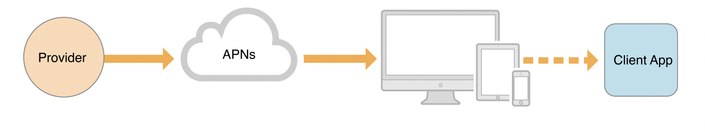

# APNs

### Apple Push Notification Service

Remote Notification을 사용할 때 반드시 거쳐야 하는 핵심으로 서버에서 바로 기기로 알림을 보내지 않고 이 단계를 거쳐야 한다.    
APNs에는 저장 후에 전달 기능을 수행하는 qos 구성요소가 포함되어있다.

APNs가 알림 전달을 시도하고 알림을 전달받을 대상 장치가 오프라인인 경우에는 APNs에는 제한된 시간 동안 알림을 저장하고 장치가 온라인 상태로 전환이 되면 전달을 한다.   

또 APNs는 기기 및 앱 별로 가장 최근의 알림을 저장한다. 따라서 장치가 오프라인인 경우 해당 장치를 대상으로 하는 알림을 보내면 이전에 갖고 있던 알림 요청을 삭제하고 최근의 알림만 저장한다.    

각 provider 앱 서비스의 서버에서 보내는 각종 알림 들을 최신 상태로 하나씩 저장하다 장치가 오랫동안 오프라인 상태를 유지하게 되면 저장된 모든 알림을 삭제한다.    
    

즉, APNs는 각 기기의 상태를 확인하여 상태에 따라 알림을 저장하여 보내주고 최신의 알림 상태를 관리하는 등의 관리 센터 역할을 한다.

   
또 ! APNs는 보안을 관리해준다.    

네트워크로 전달되는 데이터이기 때문에 보안 문제에 노출될 수밖에 없다.      

특정 사용자에게만 전달되는 알림, 정보를 제삼자에 의해 탈취가 될 수 있고 provider가 의도하지 않은 메시지로 변경하여 전달될 수도 있다.   
APNs는 자체 보안 아키텍처를 통해 원격 알림을 안전하게 제어한다.     

 

이렇게 보안 수준을 유지하기 위해 두 가지의 신뢰 수준을 사용하는데 Connection trust와 Device token을 사용한다.    

 

Connection trust는 provider와 APNs 간에, APNs와 장치간에 작동한다.    

provider와 APNs간에 신뢰는 애플과 계약을 맺은 회사가 소유한 승인된 provider만 APNs와 연결을 해서 push 알림 전달을 할 수 있게 하는 연결 신뢰이다. 즉 provider server는 APNs connection trust가 있는지 확인해야 하는데 이 방법에는 token-based(유효한 인증키 이용), cerificate-based(SSL 인증서 이용) 두 가지 방법이 있다. 이 작업은 백엔드 개발자가 한다.

APNs와 장치 간에 신뢰는 승인된 장치만 APNs에 연결해서 알림을 받을 수 있게 하는 것이다.    

 

Device token trust는 각 원격 알림에서 end-to-end로 작동을 한다.

즉, 알림이 올바른 제공자와 장치 사이에서만 라우팅 되도록 한다. 애플이 특정 장치에 특정 앱에 할당한 고유 식별자를 포함하는 NS 데이터 인스턴스인데 이 토큰을 제삼자가 탈취를 하더라도 내용을 이해할 수가 없고 오직 APNs만 device 토큰의 내용을 해독하고 읽을 수 있다.

따라서 각 앱은 원격 알림을 이용하기 위해서 APNs에 등록을 하게 되고 이때 고유한 device 토큰을 갖게 된다.

그다음 해당 provider에게 device 토큰을 전달하고 provider는 연결된 장치를 대상으로 하는 push 알림 요청에 device 토큰을 포함해서 전달해야 한다.  이 device 토큰을 통해서 push 알림이 해당 device 조합에만 전달이 될 수 있게 한다.

device 토큰 device나 앱의 상태가 변경(iOS 업데이트, 앱 새로 설치, 복원 등) 될 때마다 이 토큰을 새로 발급하여 항상 고유한 상태를 바라보게 한다.

