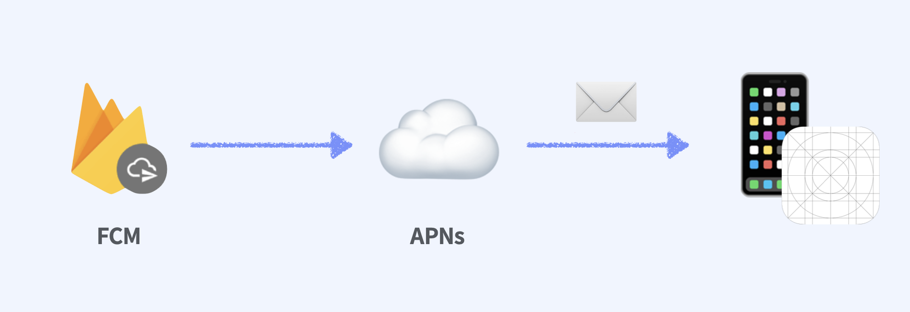
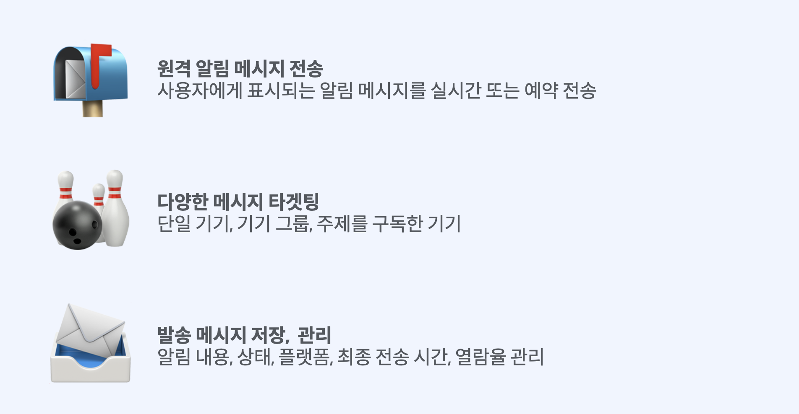
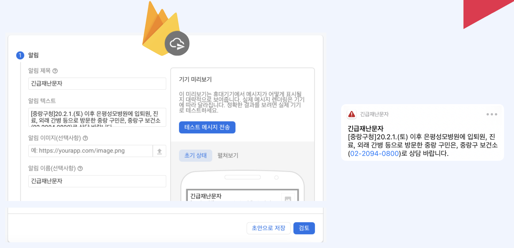

# Firebase Cloud Messaging

   

Firebase 클라우드 메시징(FCM)은 무료로 메시지를 안정적으로 전송할 수 있는 교차 플랫폼 메시징 솔루션입니다.

   

FCM을 사용하면 새 이메일이나 기타 데이터를 동기화할 수 있음을 클라이언트 앱에 알릴 수 있습니다. 이렇게 알림 메시지를 전송하여 사용자를 유지하고 재참여를 유도할 수 있습니다. 채팅 메시지와 같은 사용 사례에서는 메시지로 최대 4,000바이트의 페이로드를 클라이언트 앱에 전송할 수 있습니다.

   

### 작동원리 
FCM 구현에는 송수신을 위한 두 가지 주요 구성요소가 포함됩니다.

1. Firebase용 Cloud Functions 또는 앱 서버와 같이 메시지를 작성, 타겟팅, 전송할 수 있는 신뢰할 수 있는 환경
2.  해당 플랫폼별 전송 서비스를 통해 메시지를 수신하는 Apple, Android 또는 웹(자바스크립트) 클라이언트 앱    

Firebase Admin SDK 또는 FCM 서버 프로토콜을 통해 메시지를 보낼 수 있습니다. 알림 작성기를 사용하면 기본 제공되는 강력한 타겟팅 및 분석 기능이나 커스텀 가져온 세그먼트를 사용하여 마케팅 또는 참여 메시지를 테스트하고 전송할 수 있습니다.   

FCM의 구성요소에 대한 자세한 내용과 중요한 정보는 아키텍처 개요를 참조하세요.

   

