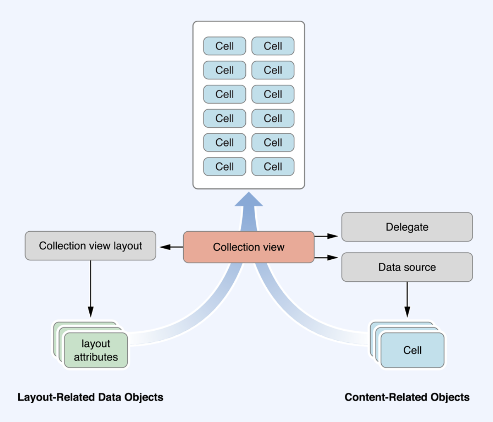

## 1. UICollectionView 알아보기

UICollectionView는 여러 데이터를 관리하고 커스텀 가능한 레이아웃을 사용해서 사용자에게 보여줄 수 있는 객체입니다. 

행과 열의 나열 뿐만아니라 다양한 배열을 표현 할 수 있습니다. 그리드, 스택, 원형, 동적변형 모두 가능합니다.

데이터와 해당 데이터를 표시하는데 사용되는 시각적 요소를 엄격하게 구분하고 있습니다.

즉, 데이터를 어떻게 관리하고 그 데이터를 어떻게 나타낼지 모두 고려하여 개발을 해야합니다.

동시에 사용자에게 어떤 형태의 화면을 보여줄지 뷰를 가져와서 화면에 배치하는 모든 작업또한 개발이 되어야 합니다.

뷰는 어떻게 배치할지 각 뷰는 어떤 속성을 갖게 할것인지 지정하는 `Layout` 객체를 가지고 개발을 하게 됩니다.

즉 `Data`영역과 `Layout`영역을 구분하여 개발을 하게 됩니다.    

​    

​    

## 2. UICollectionView를 구현하기 위한 Class와 Protocol

대부분의 클래스는 하위클래스화 할 필요 없이 있는그대로를 사용하도록 구현하게 되어있습니다.

​    

​    

​    

## 3. Top-level Containment and Management

최상의 레벨에서 관리역할을 하는 `UICollectionView` 그리고 `UICollectionViewController`가 있습니다. `UICollectionView`는 view가 갖는 컨텐츠가 보여지는 영역을 어떻게 할지 정의합니다. `UIScrollview`를 상속하기 때문에 데이터를 쉽게 표현할 수 있도록 도와줍니다. `UICollectionViewController`는 이러한 `CollectionView`를 `ViewController`수준에서 관리할 수 있도록 해줍니다.    

​    

​    

## 4. Content Management

- `UICollectionViewDataSource protocol`
  - 필수 요소
  - Content 관리 및 Content 표시에 필요한 View 생성
- `UICollectionViewDelegate protocol`
  - 선택 요소
  - 특정 상황에서 View 동작 custom

## 5. Presentation

`UICollectionView`에 표시되는 모든 View는 `UICollectionViewReusableView`의 인스턴스 이어야합니다. 이 클래스는 재활용 재사용 메커니즘을 지원합니다. 매번 새로운 view를 만드는 대신에 이 view를 재사용해서 일반적으로 성능이 향상되고 scroll하는 동안 성능적인 요소가 향상이 됩니다. 이것은 tableView와 마찬가지 입니다.    

`UICollectionViewCell`은 주 데이터 항목에 사용하는 재사용 가능한 view로 특정유형의 배열을 가지게 됩니다.   

​    

​    

## 6. Layout

지금까지 `UICollectionView` `DataSource` `Delegate` `Cell`은 `UITableView`와 거의 동일한 역할을 해서 익숙합니다. 하지만 이 `Layout`은 `UICollectionView`에만 가지고 있는 속성입니다 . `Cell`과 `Reusable`의 위치, 크기, 시각적 속성을 정의하는데 사용합니다. 이러한 책임 분리를 통해서 데이터객체를 건드리지 않고도 레이아웃을 동적으로 변경할 수 있습니다.    

`UICollectionViewLayout`은  대상이되는 View를 실제로 소유하지는 않습니다. 데이터 항목 수정시 UpdateItem 인스턴스를 수신합니다.    

​    

​    

## 7. Flow Layout

`UICollectionViewFlowLayout`은 그리드나 기타 선 기반의 레이아웃을 구현하기 위한 객체입니다. 레이아웃 정보를 동적으로 지정할 수 있도록 해줍니다.    

​    

​    

## 8. Layout metric을 나타내는 layout 객체

보시는 그림은 세로스크롤의 Flow Layout이 Cell과 Header, Footer와 같은 이런 supplementary View를 정렬하는 방법을 설명합니다. 세로스크롤 Flow Layout에서는 컨텐츠영역의 너비가 고정이고 높이가 콘텐츠를 수용할수 있도록 유동적으로 커질것입니다. 이러한 면적을 계산하기 위해서 레이아웃객체는 View와 Cell을 한번에 하나씩 배치하고 각각에 가장 적합한 위치를 선택합니다. FlowLayout의 경우에 레이아웃객체 또는 Delegate 를 사용해서 Cell과  supplementary View의 크기가 속성으로 지정되게 됩니다. 레이아웃은 이러한 속성을 사용해서 각뷰를 배치할수 있게 계산하게 됩니다.   

   

   

## 9. 5가지 요소를 합쳐 CollectionView가 표시되는 모습

​     

​     

## 10. CollectionView로 표현할 수 있는 다양한 동작들

