## 1. 오늘 날의 중첩된 레이아웃?

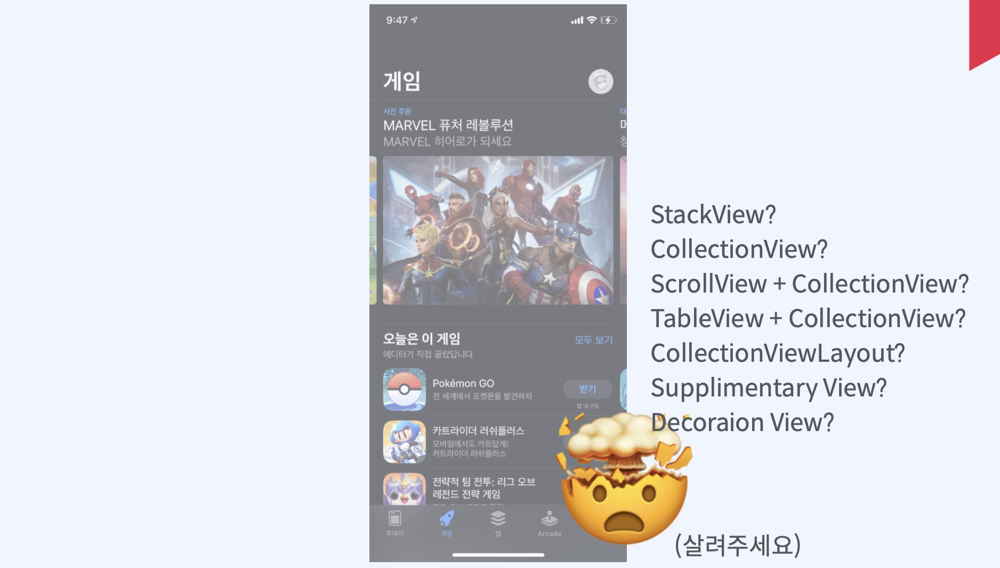

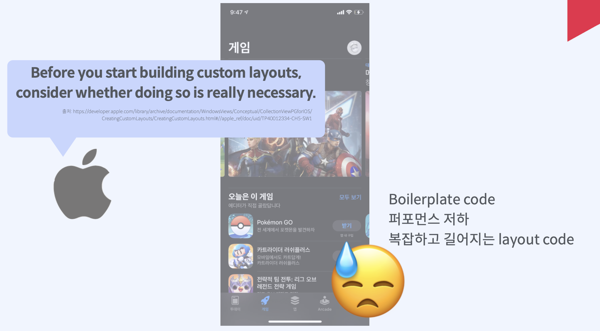

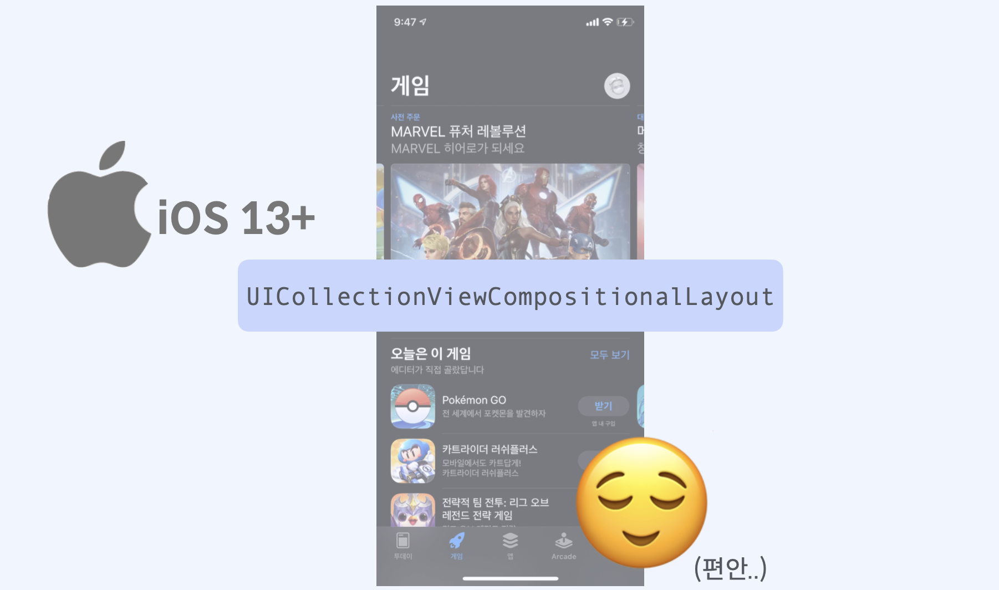

복잡한 구성과 다양한 Cell 크기를 가지는 여러개의 Section을 표현하기 위해서는 복잡해지며 구현하기 편하지 않습니다. 또한 퍼포먼스의 저하와 복잡하고 길어지는 layout code의 원인이 됩니다. 심지어 애플에서도 커스텀을 통한 길어지는 코드를 지양하고 있습니다.

이러한 문제를 해결하기 위해서 iOS 13버전 부터 `UICollectionViewCompositionalLayout`을 이용하는 방법이 있습니다.    

​    

​     

## 2. Compositional Layout

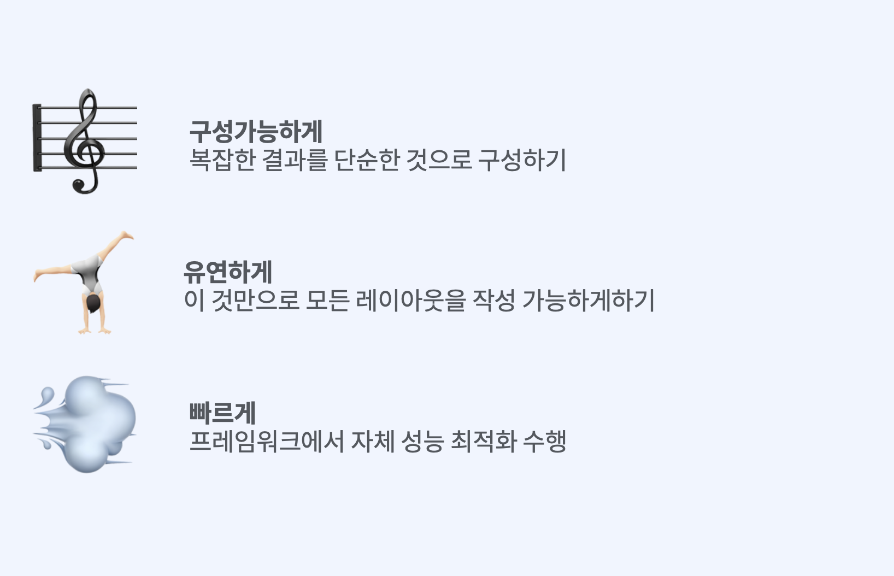

복잡한 결과를 단순하고 유연하고 빠르게 구현할 수 있습니다.   

   

   

## 3. Code

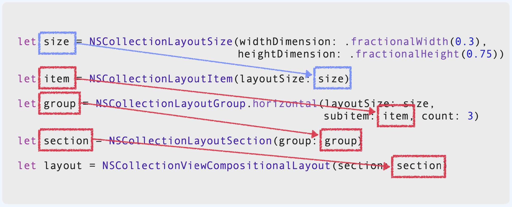

세가지의 메인 구성요소가 필요합니다. `Item` `group` `section`이 필요합니다. 이 각각의 구성요소는 사다리처럼 layout size를 통해서 custom하게 `size`를 지정하고 이렇게 만들어진 size객체는 `item`, `group`에 initial객체로 들어가게 됩니다. 그리고 layout `item` 객체는 `group` 생성에 기여하고 `group`은 `section` 생성에 기여합니다. 마지막으로 `section`은 `compositional layout` 생성에 들어가는 구조로 구성되어 있습니다.    

​    

​    

## 4. Item

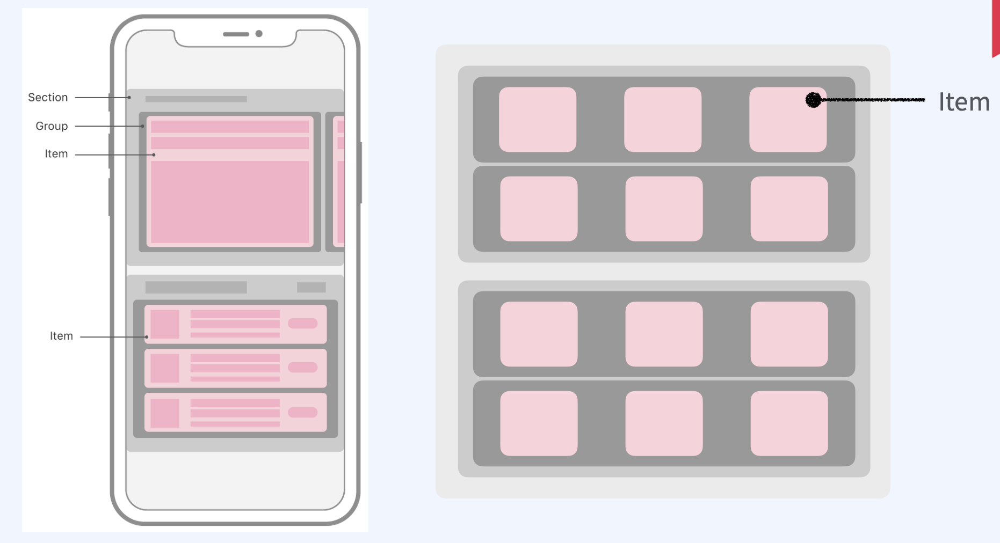

화면에 렌더링 되는 단일 뷰를 타다나게 됩니다. 일반적인 item은 cell 하나를 지정합니다. item은 고유한 size를 지정하게 됩니다. 상대적인 치수를 절대값으로 표현하거나 시스템 글꼴크기 변경에 대한 응답으로 런타임시에 변경될수 있는 추정값, 여러가지 방식으로 값을 표현할 수 있습니다.   

   

   

## 5. Size

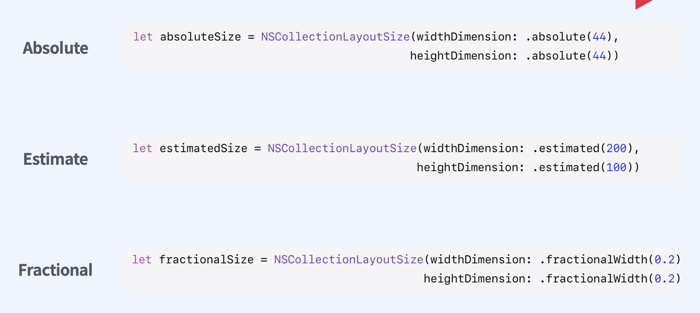

- `Absolute`: 절대적인 값, 정확한 치수

- `Estimate`: 추정 값, 예상 값, 데이터가 로드되거나 시스템 글골 끄기가 변형될때 사용합니다. 초기 추정 크기를 제공하면 시스템이 반영하여 나타내줍니다.
- `Fractional`: 분수, 비율의 의미, 분수와 비율을 이용하여 아이템 컨테이너를 기준으로 값을 정의합니다. 컨테이터의 크기가 변경되면 그에 따라 변경이 됩니다.

​    

​      

​    

## 6. Item > Group

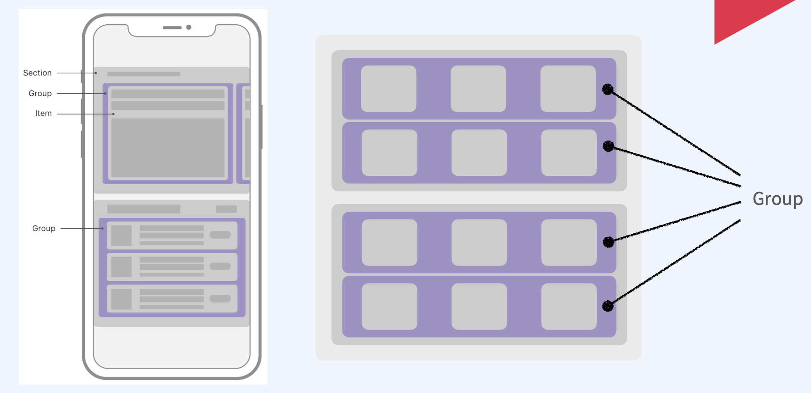

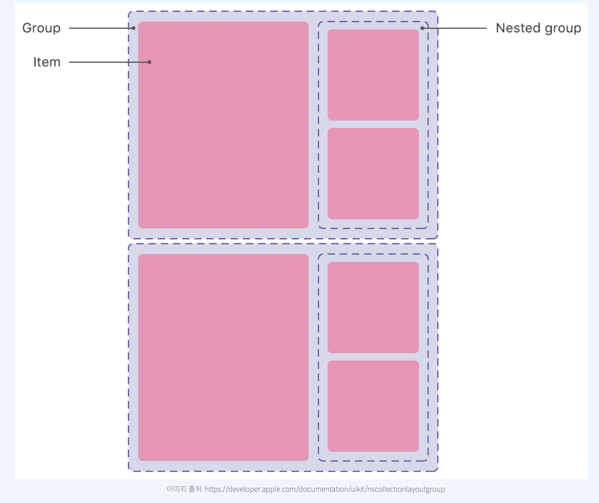

item들이 서로 관련하여 배치되는 방식을 결정해서 결합하는 역할을 합니다. 가로형 세로형 사용자 지정으로 배열 가능합니다. 

각 group은 자신의 사이즈를 구성할 때 절대값과 추정값, 상대값으로 지정할 수 있습니다. 왜냐하면 group은 컬렉션레이아웃 아이템의 하위클래스 이기 때문입니다. 따라서 item처럼 작동할 수 있습니다. group은 item만 포함하는게 아니라 다른 group을 포함할 수 있습니다. 스텍 뷰와 비슷합니다. 다른 항목의 그룹과 결합하여 복잡하게 구성 가능합니다.

​    

​    

## 7. Item > Group > Section

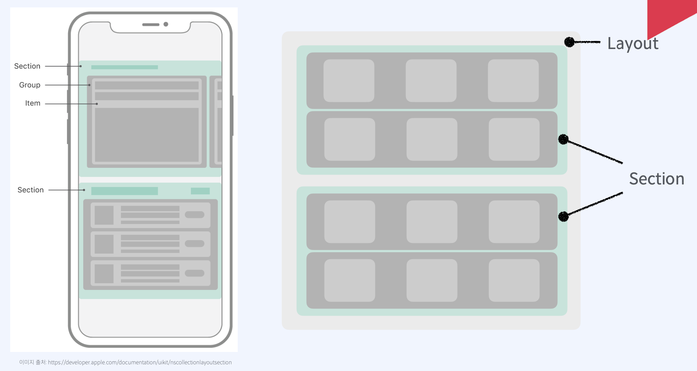

section은 group으로 이루어져 있습니다. 컬렉션뷰 레이아웃에서는 하나이상의 섹션이 있는데요 각각의 영역을 분리하는데 사용됩니다. 각 섹션은 레이아웃이 같거나 다를 수 있습니다. 그룹의 속성에 의해서 결정이됩니다. 구분하기 위해 고유한 header나 footer를 구성할 수 있습니다.       

​         

​          

## 8. Item > Group > Section > Layout

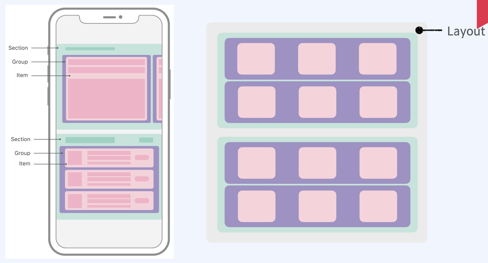

Layout은 지금까지 모든 구성요소를 반영하게 됩니다. 
