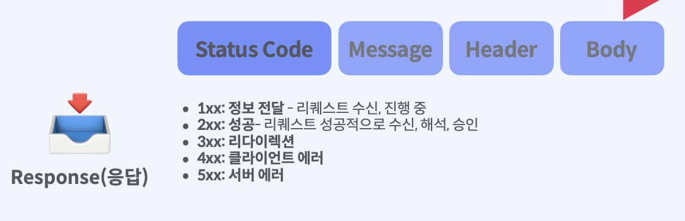

## 1. OSI 모델

Open Systems Interconnection

개방형 시스템 상호연결, 우리가 사용하는 네트워크의 기본이 되는 모델, 각 시스템 호환에 문제가 발생하지 않도록 국제 표준으로 만든것

iOS개발자는 응용계층의 HTTP 프로토콜을 주고 다루게 됩니다. 다른 계층에 대해서도 간략하게 알아보겠습니다.

OSI 모델의 캡슐화와 디캡슐화를 표현 한 것입니다. 각 데이터가 전달할때 Header를 붙여 자신만의 메세지를 담아 보낼 수 있습니다.

데이터를 받는 입장에서는 붙여진 Header를 하나하나 살펴보면서 데이터를 보게 되는데 이것을 디 캡슐화라고 합니다.    

​    

### 1 레벨 : 물리 계층 Physical Layer

- 네트워크에서 통신장비를 연결하는데 사용되는 물리적 사양
- 전압 레벨, 데이터 속도, 최대 전송 거리, 커넥터...
- 케이블, 모뎀, 리피터

​     

​    

### 2 레벨 : 데이터 링크 계층 Data Link Layer

- 앞선 물리계층의 데이터의 오류를 감지하고 복구하는 계층
- MAC 주소

​    

   

### 3 레벨 : 네트워크 계층 Network Layer

- 논리 주소 정의
- IP 주소

​     

​     

### 4 레벨 : 전송 계층 Transport Layer

- 데이터 흐름 제어
- TCP, UDP

​     

​     

​     

### 5 레벨 : 세션 계층 : Session Layer

- 통신 장치간의 상호작용 설정, 유지, 관리

​    

​    

​    

### 6 레벨 : 표현 계층 Presentation Layer

- 7레벨에 적용되는 데이터 형식, 코딩 변환 기능
- 파일 확장자

​    

​    

   

### 7 레벨 : 응용 계층 Application Layer

- 가장 상단에서 사용자와 상호작용 하는 계층
- 앱 상의 네트워크
- HTTP

​     

​     

   

​     

## 2. URL :Uniform Resource Locator

- `http:// ` : 프로토콜
- `www.fastcampus.com` :  웹 서버명 -> DNS명 -> IP 주소 : 네트워크 계층(IP)
- `:8080` : 포트명 : 전송 계층
- `/ios-lecture.html` : 데이터 출처(리소스) 경로 : 응용 계층 

   

​      

​     

## 3. HTTP

​     

​    

## 4. Request

​     

​    

### Parameter

​     

​     

### GET vs POST

POST 는 전달하고자 하는 값이 외부에 노출되지 않도록 body에 담게 된다.

​    

​     

​     

## 5. RESPONSE

​     

​     

​    

## 6. Status Code

​     

​     

​     

## 7. URLSession

iOS를 포함한 애플의 네트워크를 구축하기 위해서는 URLSession을 이용해야 합니다.

- `URLSession` : URL loading 시스템을 구축할 수 있는 객체입니다. URL을 통해서 상호작용하고 서버와 통신하는 시스템을 의미합니다. 표준 인터넷 프로토콜이라는 것은 HTTP이거나 사용자 고유의 앱에서 제공하는 프로토콜일 수 있습니다. URL형태로 식별되는 엑세스를 제공합니다. 비동기로 수행하기 때문에 오류가 도착하는 즉시 업데이트를 할 수 있습니다.

- `URLSession.shared ` : 세션객체를 만들기 위해서는 캐시 및 쿠키를 사용하거나 셀룰러 네트워크에서 연결을 제어하는 객체를 만들게 되는데 이러한 객체를 만들지 않더라도 shard를 통해 싱글톤을 이용해서 세션을 구축할 수 있습니다.

​    

​    

### URLSessionConfiguration

URLSesstion을 생성하기 위한 설정

- `URLSession(configuration: .default)` 
- `URLSession(configuration: .ephemeral)` : 임시세션으로 캐시 쿠키 자격증명을 디스크에 쓰지 않습니다.
- `URLSession(configuration: .background(withIdentifier: ""))` : 앱이 실행되지 않는 동안에도 백그라운드에서 컨텐츠를 업로드하거나 다운로드하는 것을 수행할 수 있습니다.

​    

​    

### URLSessionTask

세션의 테스크라는 것은 세션내에서 데이터를 서버에 업로드한다음 서버로부터 데이터를 검색하는 작업을 만들게 되는데요 URLSession API는 세션 테스크에 하위 클래스를 제공합니다.

- `URLSessionDataTask` : NS 데이터 객체를 사용해서 데이터를 송신하고 수신합니다.
- `URLSessionUploadTask `: 데이터 테스크와 유사하지만 파일을 전송하고 앱이 실행되지 않는 상황에서 백 그라운드 업로드를 지원합니다. 
- `URLSessionDownloadTask` : 파일 형식 기반으로 데이터를 검색하고 앱이 실행되지 않는 동안에는 백그라운드 다운로드 및 업로드를 지원합니다.
- `URLSessionStreamTask`
- `URLSessionWebSocketTask

​    

​    

​    

### URLSession Life Cycle

URLSession 객체를 생성하고 객체가 가지는 속성들을 정의 합니다. 그리고 나서 Request 객체를 생성하는데요 우리가 통신하고자 하는 URL과 어떤내용 무슨 메서드를 이용할지 작성하게 됩니다. URLSesstionTask를 생성합니다. URL기반의 내용을 받아서 헨들링 하게 됩니다. 이후 반드시 생성한 Task를 실행해줘야 합니다. 우리가 의도한 대로 Task가 완료되면 수신한 Response를 Task객체를 생성할때 설정한 CompletionHandler나 delegate를 통해서 가공하고 앱에 구현을 하게 됩니다.