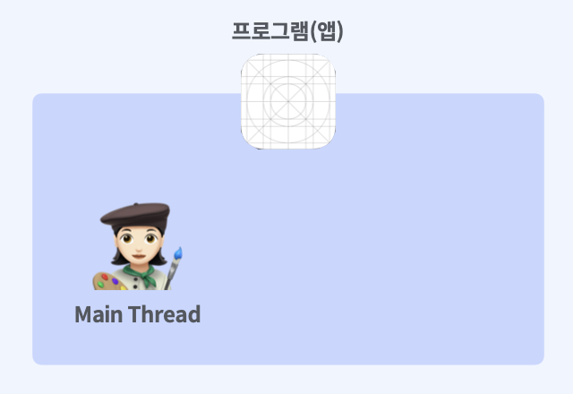
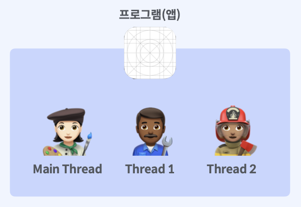
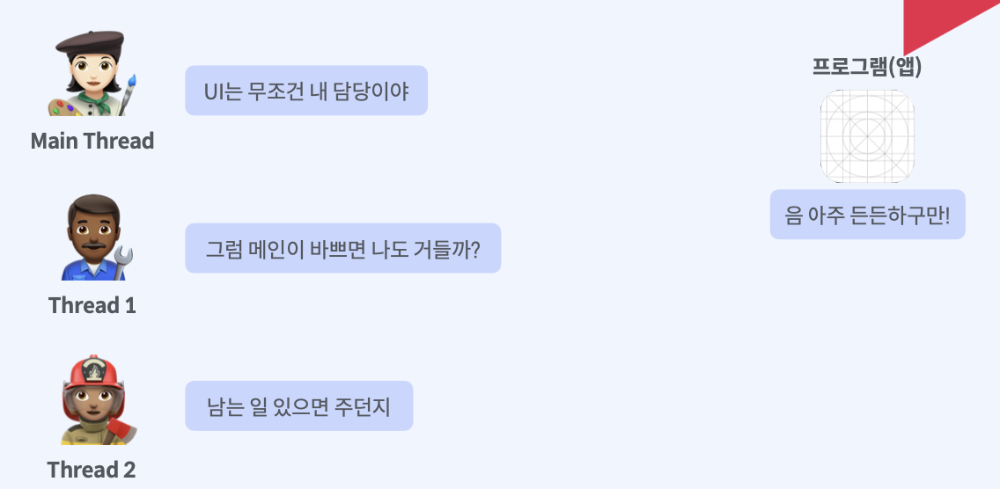
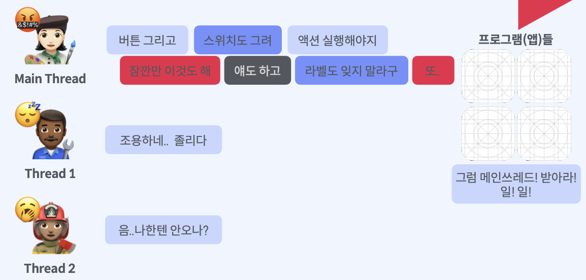
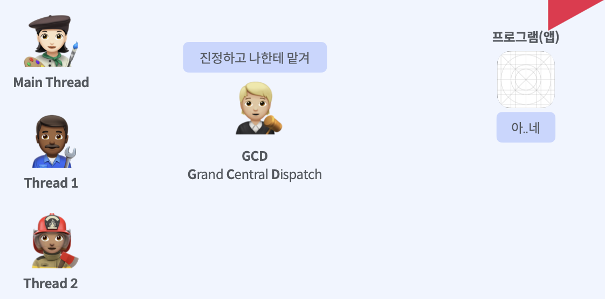
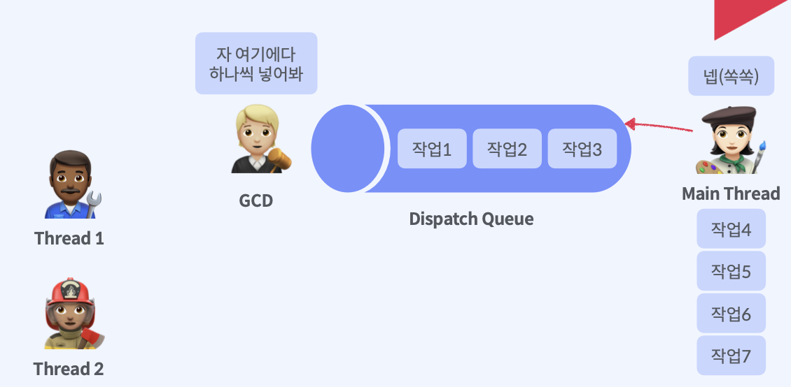
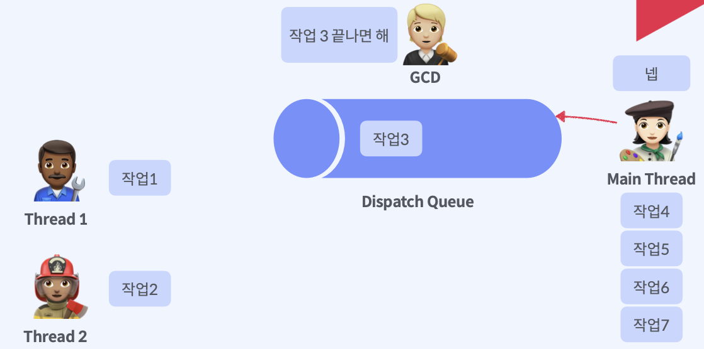
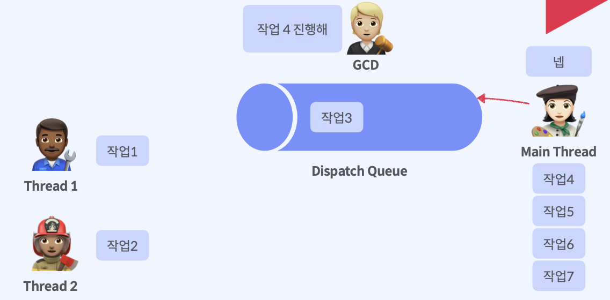
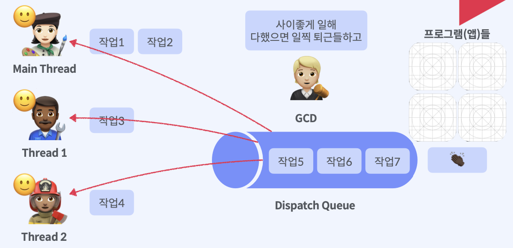
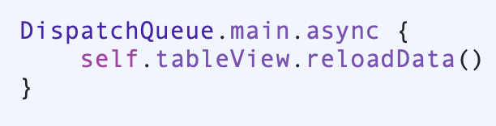

## GCD

   

​      

#### Thread

프로그램 내에서 특히 프로세스 내에서 실행되는 흐름의 단위를 말합니다. 기본적으로 하나의 프로그램은 하나의 스레드를 가지고 있습니다.

우리가 빈번하게 많이 사용하는 UIkit의 클래스들은 오직 이 앱의 메인 쓰레드 에서만 실행됩니다. 

하지만 프로그램 환경에 따라서 둘 이상의 스레드를 동시에 실행할 경우가 생기는데요 이러한 스레드를 멀티스레드 라고 합니다.

동시에 여러작업이 필요한경우 중요한 작업에 방해를 받지 않기위해서 상태를 계속살펴보기 위해서의 경우가 있습니다.

하지만 이렇게 스레드가 많아도 분배를 제대로 하지 않는다면 어떻게 될까요? 그림을 살펴보시면 메인 스레드가 욕을하며 모든일을 다 처리하고 있습니다. 일반적으로 우리가 쓰는 코드에 별도의 설정을 해주지 않으면 대부분의 작업은 사실 메인스레드에서 자동적으로 실행됩니다. 따라서 메인스레드만 작업을 하게 됩니다.

하지만 1초 2초단위 또는 그 이상으로 쏟아지는 프로그램 작업들과 개발자들도 알수없는 작업순서들 개발자가 접근할 수 없는 다른 프로그램들도 스레드를 사용할텐데 엄청난 양과 속도의 작업순서들을 어떻게 배치하고 관리를 할 수 있을까요?     

​     

#### GCD

이런 멀티스레드에서 애플OS가 직관적이고 편리하게 사용하게 해주는것이 GCD, Dispatch 라는 개념입니다.

디스패치는 시스템에서 관리하는 디스패치 대기열에 작업을 배치해서 멀티코어 하드웨어에서 동시에 코드를 실행할 수 있도록 합니다. 디스패치라는 것은 GCD라고도 합니다. 우리가 사용하는 파운데이션, 코코아에이피아이는 모두 이런 멀티스레드를 사용하도록 설계 되어 있습니다. 따라서 시스템과 앱이 더 빠르고 효율적이고 향상된 응답성을 제공하도록 지원을 하고 있습니다.

GCD는 우리앱 뿐만아니라 시스템수준에서 실행중인 모든 앱의 요구를 적절히 받아서 균형을 잡는 역할을 합니다.     

​    

#### Dispatch Queue

Dispatch Queue라는 객체를 활용해서 각각의 작업들을 제어하게 되는데요 Dispatch Queue는 앱의 메인스레드나 백그라운드 스레드에서 순차적으로 또는 동시에 실행되는 작업을 관리하는 객체입니다.

디스패치 큐는 앱이 전달하는 작업을 FIFO으로 전달하는 형태 입니다. 

작업환경을 동기나 비동기식으로 설정할 수 있습니다.    

​    

#### Sync : 동기

동기는 Dispatch Queue에 작업이 남아 있을 경우에 해당작업이 끝날 때 까지 다음 작업을 진행하지 않습니다. 작업의 순서를 보장하기 위해서 한번에 하나의 작업을 하는 것 입니다.    

#### Async : 비동기

비동기의 경우에는 상관없이 작업이 있든 없는 다음작업을 동시에 진행합니다. 따라서 작업항목을 비동기 식으로 예약하면 작업항목을 다른곳에서 실행되는 동안 다음 코드가 계속 실행됩니다.    

​    

​     

이렇게 동기, 비동기 까지 설정해서 우리가 Dispatch Queue에 작업을 추가하면 GCD는 작업에 맞는 스레드를 시스템안에서 자동적으로 생성해서 실행을 합니다. 그리고 작업이 끝나면 스레드를 제거합니다.    

​     

우리가 네트워크 작업을 실행시키는 부분과 반드시 메인 스레드에서 돌아야하는 UI관련된 코드는 분리가 필요합니다. 놀랍게도 URLSession관련 코드는 내부적으로 이미 백그라운드에서 비동기적으로 실행되도록 설정이 되어있어 이미 별도의 스레드에서 작동하고 있습니다. 따라서 우리가 작성한 데이터테스크의 컴플리셔헨들러 내에서 유아이에대해 업데이트하는 부분을 반드시 메인 스레드에서 작업할 수 있도록 설정해줘야 합니다. 그렇지않으면 백그라운드에서 같이 돌게되어 에러가 발생합니다. 따라서 메인큐에서 돌아갈 수 있도록 조정해 주는 코드입니다.
