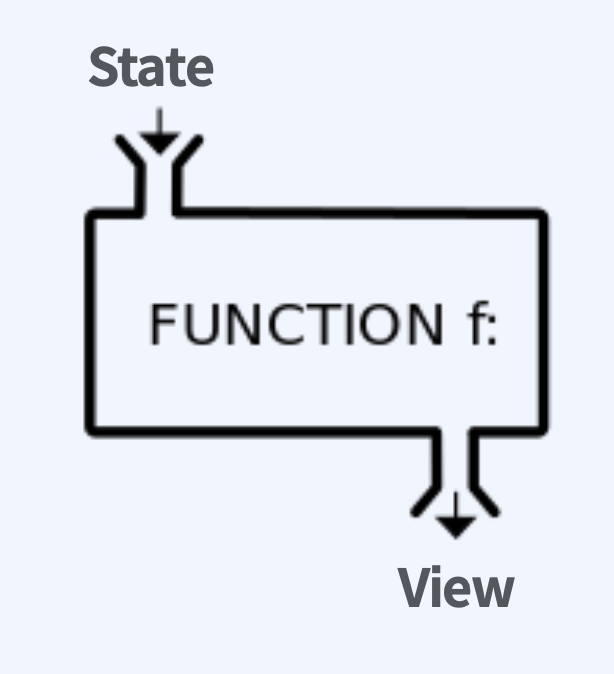
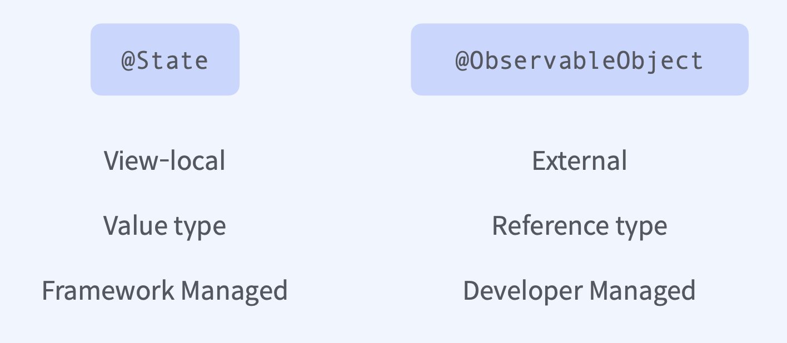
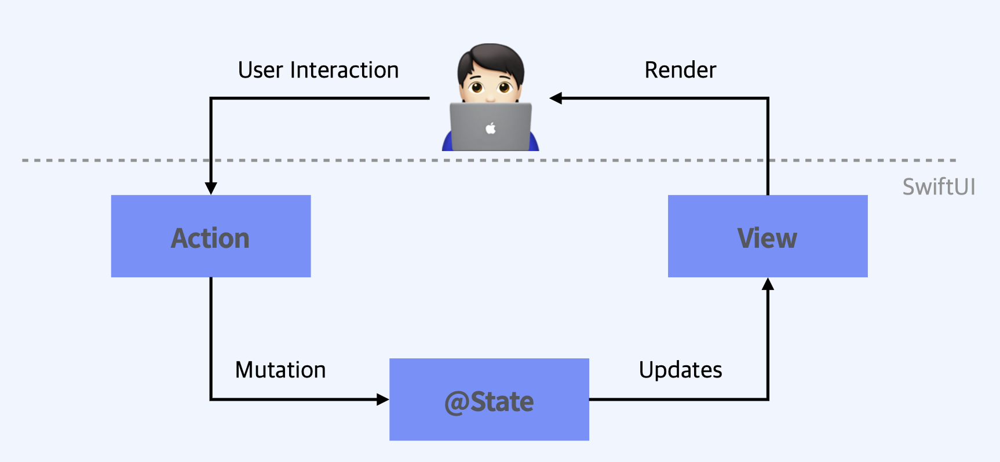

## SwiftUI의 View

애플이 제공하는 모든 플랫폼에서 앱에 사용자 인터페이스와 동작을 선언하게 됩니다. 뷰, 컨트롤, 레이아웃을 구조체 형태로 제공합니다. 이벤트 헨들러와 뷰 컨트롤에대한 관리하는 도구를 제공합니다.   

​    

​    

Views are a **function of state,** not of a sequence of events.     

  

view 의 속성은 상태로 표현되고 이러한 상태를 함수형태의 인자로 전달을 하면 세세한건 SwiftUI Framework가 알아서 해석해서 View로 표현 할것 입니다.    

​    

   

데이터 흐름의 일원화와 그러한 데이터를 뿌려주는 View의 역할은 무엇인가에 대한 개념을 고민을 토대로 디자인 되었다고 합니다.     

​     

​    

## Property Wrapper

  

데이터의 흐름이 View의 내부냐 외부냐에 따라 나눌수 있습니다.

## SwiftUI의 Data Flow

  

외부 Dependency가 없는 단일 View라고 했을때 발생하는 이벤트는 User interation을 통한 Action이 있고 이러한 Action을 통한 변화는 State 상태를 변화시킬 것이고 그에대한 업데이트가 View에 전달되는 방식입니다. 최종적으로 Render를 통해 사용자에게 보여집니다.
