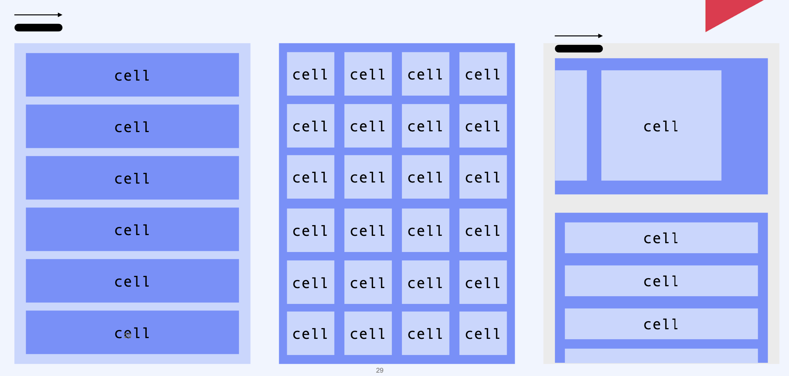
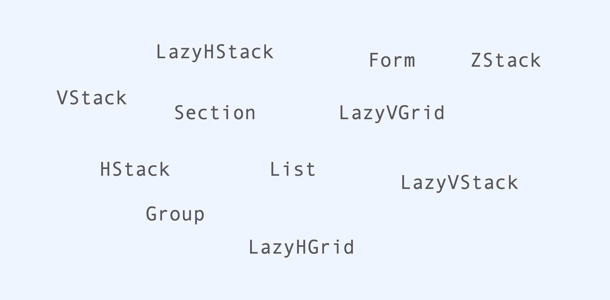
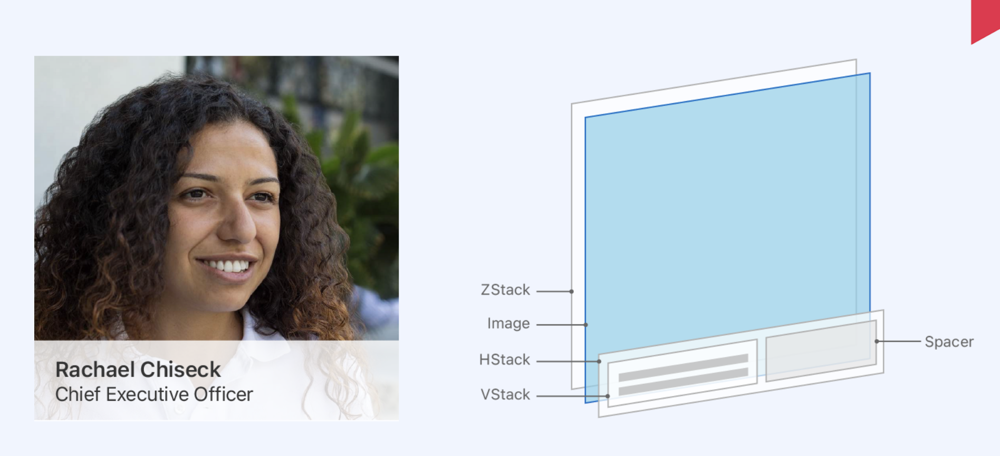
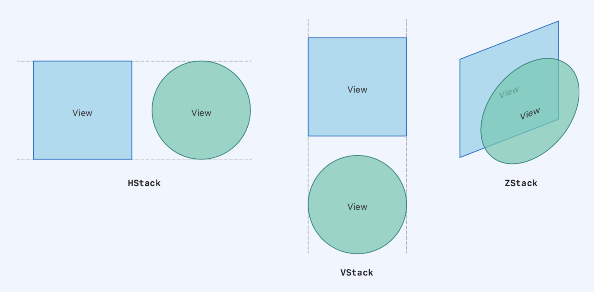
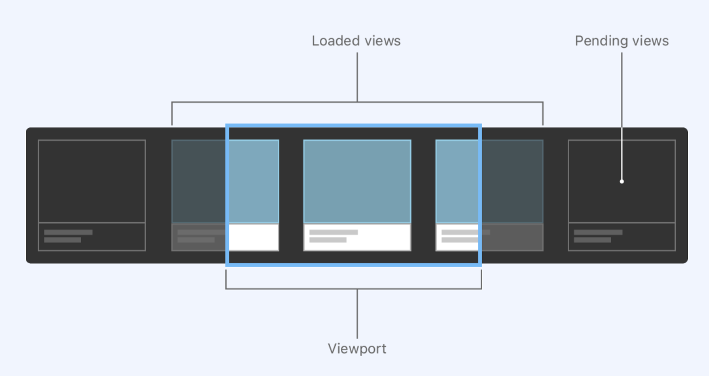
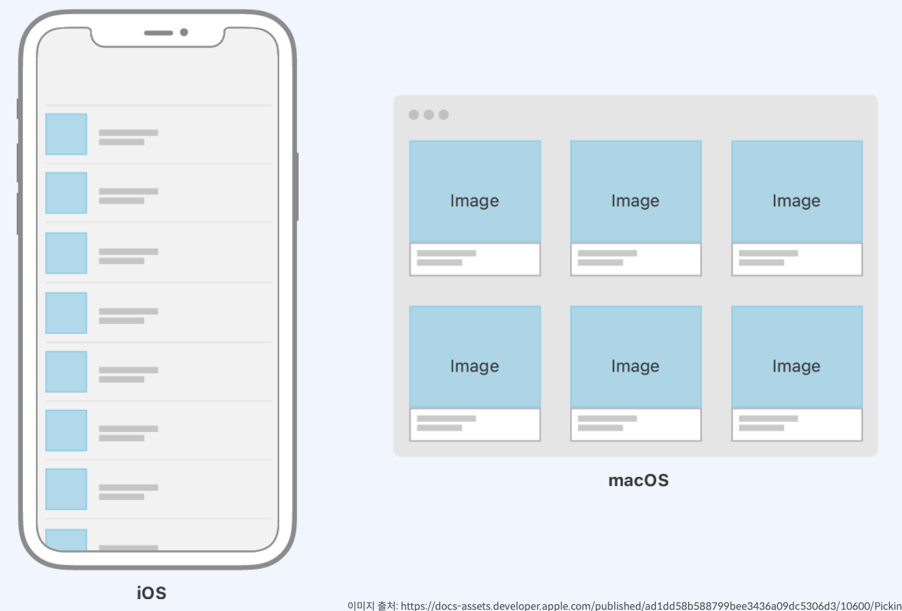
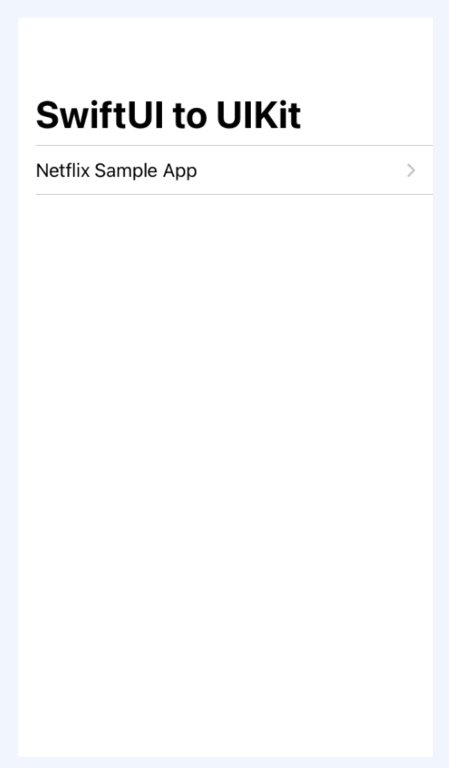
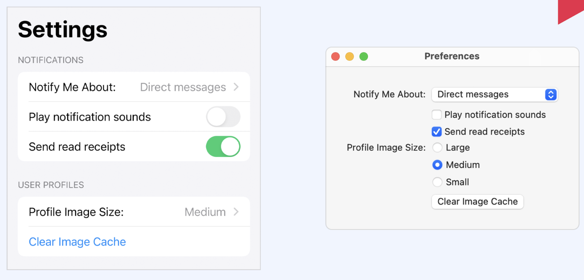

## Container View 선택하기     

​     

### UIKit

UIKit 에서 반복적인 컨텐츠를 그룹핑하고 나타내는 방법들이 있었습니다.    

​     

### SwiftUI

SwiftUI에서도 역시 여러가지 형태의 그룹핑 뷰를 제공합니다.      

​     

인터페이스의 각부분의 특성에 따라서 겉으로 사용자에게 보는 뷰는 똑같더라도 앱의 성능을 모두 고려해서 가장 적합한 컨테이너 뷰를 선택하는 것이 중요합니다.     

​          

### Stack

먼저 StackView는 SwiftUI에서 사용할 수 있는 가장 기본적인 레이아웃 컨테이너 입니다. 스텍을 사용해서 뷰 컬렉션을 수평선 혹은 수직선으로 그룹화하거나 서로의 위에 쌓을 수 있습니다.     

HStack은 수평으로 VStack은 수직으로 ZStack은 곂쳐서 표현합니다. 서로의 간격들은 조정이 가능합니다.     

​     

그림과 같이 이전에 샘플로 작업한 앱을 표현할 수 있습니다.    

   

### Stack, LazyStack

View또는 View 그룹을 반복할 수 있습니다. 컨텐츠가 컨테이너 범위를 넘어서서 확장될 수 있도록 스크롤뷰 내부에 스택뷰를 위치를 합니다. 사용자는 수평 수직 또는 양방향으로 동시에 스크롤을 할 수 있습니다. 각각의 장점이 있습니다

Stack은 자식뷰를 한번에 모두 로드하기 때문에 레이아웃을 한번에 안정적으로 보이게 만들 수 있습니다. 왜냐하면 시스템이 시스템단에서 로드할때 하위뷰의 크기와 모양을 모두 알고 있기 때문입니다. 

반면에 LazyStack은 성능을 위해서 어느정도 레이아웃 정확성을 등가교환 하는 느낌입니다. 하위 뷰가 표시 될 때에만 크기와 위치를 계산하게 됩니다. 그때그때 컨테이너 안에 들어왔을 때만 정확한 크기와 위치를 계산합니다.

애플은 항상 기본적으로 기본 스텍을 사용하며 성능향상의 의미 있는 경우에는 ( 자식뷰가 많거나, 예측 불가능한 경우) LazyStack사용을 권장하고 있습니다.    

​    

### Grid

Grid는 뷰를 수평이나 수직으로 동시에 배치하기 위해서는 그리드를 사용하여야 합니다. 이미지 갤러리처럼 정사각형 컨테이너에 표시하기에 적합합니다. 

본질적으로 스크롤 뷰를 포함하고 있지 않습니다. 만약에 이 넘어서는 범위에 컨텐츠가 더있다면 먼저 스크롤뷰를 설정후 그리드를 사용해야만 스크롤이 가능합니다.    

​    

### List

기본적으로 포함된 항목주변과 항목 사이에 시각적인 효과가 포함되어 있습니다. 구분선과 링크 아이콘과 같은 것이 기본적으로 포함되어 있습니다. Lazy하게 업데이트 된다 자동적으로 스크롤이 됩니다. 스크롤과 데이터 헨들링이 필요할때 리스트를 사용하는 방법이 있습니다.     

​     

### Form

설정화면을 구축하는데 좋습니다. 두가지 모두 자세히 보시면 설정하려는 내용을 같습니다. 이것을 스위프트 유아이를 사용해서 개발을 하게되면은 별도로 표현할 필요없이 각각의 플랫폼에 적합한 형식으로 자동적으로 표현합니다. 플랫폼에 따라서 다르게 표현 될 수 있습니다. 
