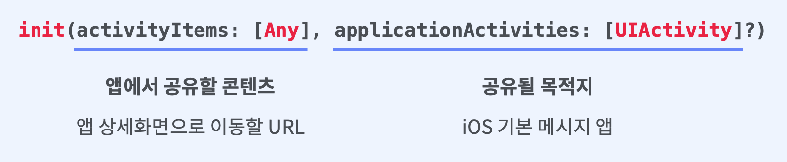

## UIActivityViewController

https://developer.apple.com/documentation/uikit/uiactivityviewcontroller

**AirDrop, SMS,** **이메일 등 다른 앱으로 공유할 수 있는** **Share Sheet UIViewController 입니다**

URL 등 공유할 컨텐츠 **activityItems: [Any]** 와 타입은 개발자가 지정이 가능하고,
 AirDrop, Safari 등 처럼 공유될 목적지 **applicationActivities: [UIActivity]?** 또한 개발자가 지정 가능합니다.     

​     

​     

​     

### 2가지를 꼭 생각해야 합니다.

첫번째, 어떤컨텐츠를 유저가 공유시킬 수 있도록 할 것인가?
두번째, 어떤앱을 우선순위로 공유시킬 것인가?, 아니면 어떤앱으로의 공유를 제외시킬 것인가?

