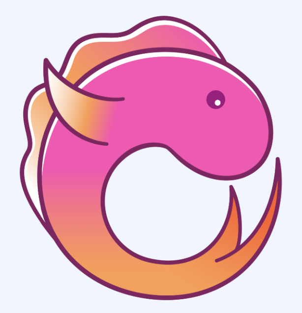
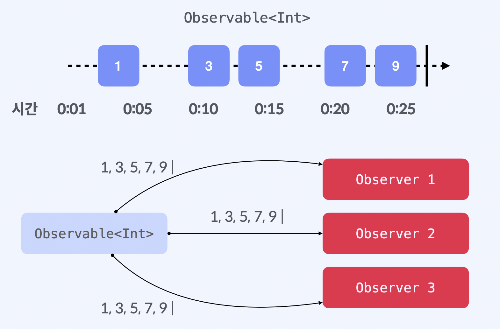
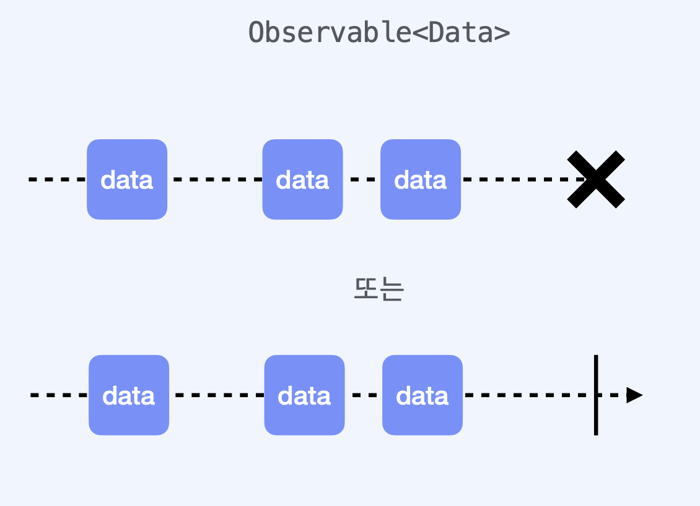
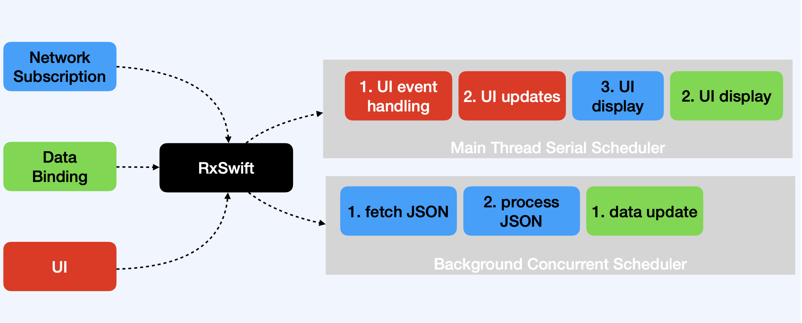

# RxSwift



<br/>
## 기본개념
Every **Observable** instance is just a sequence   
기본적으로 Swift에서 제공하는 시퀀스의 형태입니다. 개개의 요소를 하나씩 순회할 수 있는 타입을 의미합니다.

<br/>

## 구성 요소
- Observable
- Operator : 연산자 ( 다양한 형태로 값을 변한, 합치는 등 ) 
- Scheduler

<br/>

## Observable
`Observable<T>`     
- Rx 코드의 기반   
- T 형태의 데이터 snapshot을 '전달'할 수 있는 일련의 이벤트를 비동기적으로 생성하는 기능   
- 하나 이상의 observers가 실시간으로 어떤 이벤트에 반응   
- 세 가지 유형의 이벤트만 방출

```swift
enum Event<Element> {
	case next(Element) // next element of a sequence
	case error(Swift.Error) // sequence failed with error
	case completed // sequence terminated successfully
}
```

      
Int Element를 하나씩 내보내는 Observable  와 Observer만 있으면     
delegate프로토콜이나 closer를 삽일 할 필요가 없이 이벤트를 수신할 수 있습니다.

<br/>

## Finite Observable
     
만약 네트워크 연결이 끊어지면 에러가 발생하고 멈춰질 것입니다.     
또는 성공적으로 완료되는 것이 있습니다.

```swift
 Network.download(file: "https://www...") 
 	.subscribe(onNext: { data in
		//임시 파일에 데이터 추가
	},
	onError: { error in
		//사용자에게 에러 표현
	},
	onCompleted: {
		//다운로드 된 파일 사용 
	})
```

<br/>

## Infinite Observable
단순하게 무한한 시퀀스가 있을 수 있습니다.    
예를 들어 기기의 가로와 세로모드에 따라 반응해야 하는 코드를 살펴보겠습니다.

```swift
UIDevice.rx.orientation .subscribe(onNext: { current in
	switch current { 
	case .landscape:
		// 가로모드 배치 
	case .portrait:
		// 세로모드 배치 
	}
})
```

<br/>

## Operator
( 2 + 5 ) * 10 - 8   
각각의 연산자는 규칙을 가지고 있습니다.    

가로와 세로화면 예제에 filter와 map을 연산자로 이용해 보겠습니다.   

```swift
UIDevice.rx.orientation 
	.filter { value in
		return value != .landscape 
	}
	.map { _ in
		return "세로로만 볼거예요!"
	}
	.subscribe(onNext: { string in
	        showAlert(text: string)
	})
```
가로방향이 아닌 세로방향이 배출되었을 때만 결과값을 내보내는 것    
연산자를 조합해서 다양한 형태로 사용할 수 있습니다.


<br/>

## Scheduler
    
여러가지 스케쥴러가 정의되어있습니다.

<br/>

## 설치하기
### CocoaPods
`pod 'RxSwift', '6.2.0'`

<br/>

### Swift Package Manager
`https://github.com/ReactiveX/RxSwift.git` 