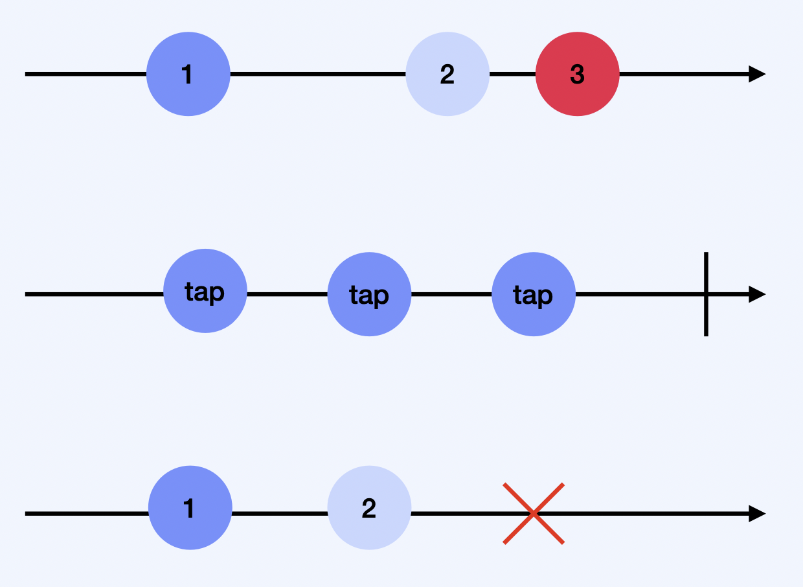

# Observable  

- Rx의 심장
- Observable = Observable Sequence = Sequence 
- 비동기적(asynchronous)
- Observable 들은 일정 기간 동안 계속해서 이벤트를 생성 (emit)
- marble diagram: 시간의 흐름에 따라서 값을 표시하는 방식 
- 참고하면 좋을 사이트: [RxMarbles](https://rxmarbles.com/)

<br/>

## Observable 생명주기
   

- Observable은 어떤 구성요소를 가지는 next 이벤트를 계속해서 방출할 수 있다.
- Observable은 error 이벤트를 방출하여 완전 종료될 수 있다.
- Observable은 complete 이벤트를 방출하여 완전 종료 될 수 있다.

```swift
/// Represents a sequence event. 
///
/// Sequence grammar:
/// **next\* (error | completed)** 
@frozen public enum Event<Element> {
    /// Next element is produced.
	case next(Element)
	
	/// Sequence terminated with an error.
	case error(Swift.Error)
   
   /// Sequence completed successfully.
	case completed 
}
```

