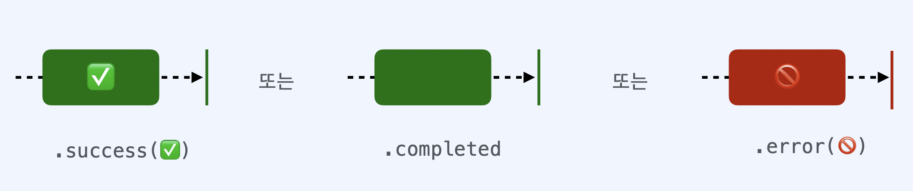

# Single, Maybe, Completable

### Traits?
Traits란 UI처리에 특화된 Observable이라고 할 수 있습니다. Traits는 **직관적이고 작성하기 쉬운 코드**를 작성하는 데 도움이 되는 Observable로, 인터페이스 간 Observable이 소통하는 것을 도와주고 raw observable에 비해 문맥상 의미를 전달하거나 특정 용도로 사용하기에 좋습니다. 따라서 필수가 아닌 **선택적**으로 사용됩니다.

 
## Single
 

- **1개**의 element를 포함하는 Observable Sequence
- success(value) 이벤트 또는 error 이벤트를 **한 번만 방출**합니다.
- success = **next + completed** 로 볼 수 있습니다.
- 즉, success가 발생하면 single은 종료됩니다.
- 파일 저장, 파일 다운로드, 디스크에서 데이터 로딩같이, 기본적으로 값을 산출하는 비동기적 모든 연산에도 유용합니다.
- 사용 예시로, 응답/오류만 반환할 수 있는 HTTP 요청을 수행하는 데 사용되지만 단일요소를 사용하기 때문에 무한 스트림 요소가 아닌 단일 요소만 관리하는 경우에 사용할 수 있습니다.
- 즉, 연속적인 원소를 방출하는 대신 하나의 원소나 에러를 방출하도록 보장된 Observable의 변형

 
## Maybe
    

- **0개 또는 1개**의 element를 포함하는 Observable Sequence
- Maybe는 Single과 유사하지만 **아무런 값을 방출하지 않고 Complete되더라도 오류가 발생하지 않습니다**.
- **success(value), completed, error** 이벤트 3가지를 방출 할 수 있습니다.

 
## Completable
 

- completed 이벤트 또는 error 이벤트를 방출합니다.
- 어느 element도 방출하지 않고 에러나 완료만 가능한 Observable의 변형입니다.
- 어떠한 operation의 성공적인 완료여부만 알고싶을 경우 사용할 수 있습니다. (예: 데이터 저장 성공여부)
- Single, Maybe와 다르게 Observable을 Completable로 바꿀 수 없습니다.
