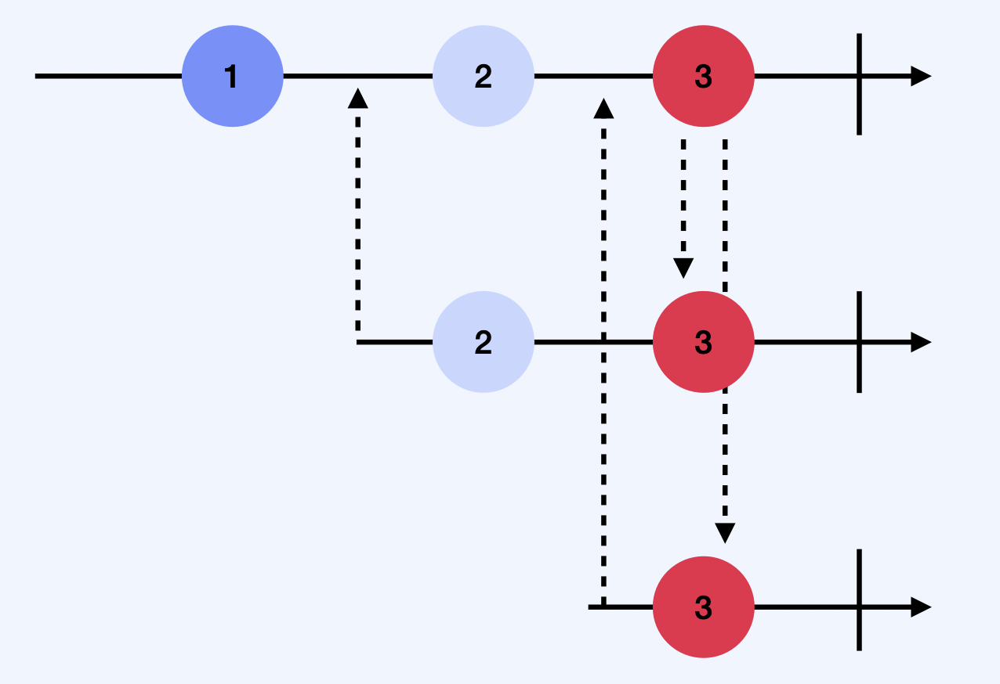
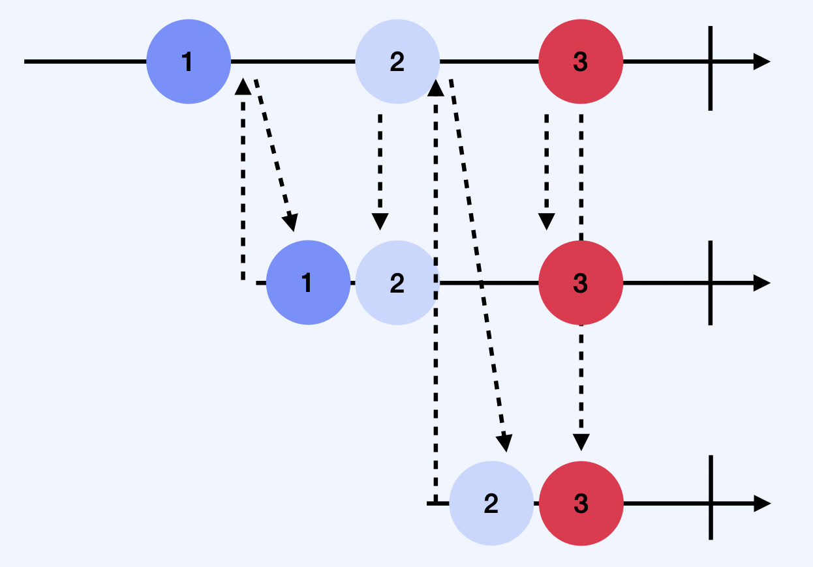
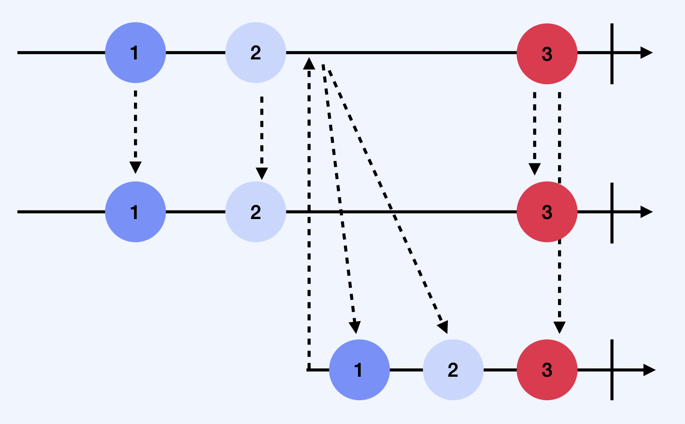

# Subject
  
**Observable 이자 Obserer**

 

## Subject의 종류
### PublishSubject 
빈 상태로 시작하여 새로운 값만을 subscriber에 방출한다.   

  
 

### BehaviorSubject
하나의 초기값을 가진 상태로 시작하여, 새로운 subscriber에게 초기값 또는 최신값을 방출한다.    
 
    
 

### ReplaySubject
버퍼를 두고 초기화하며, 버퍼 사이즈 만큼의 값들을 유지하면서 새로운 subscriber에게 방출한다.     

  
